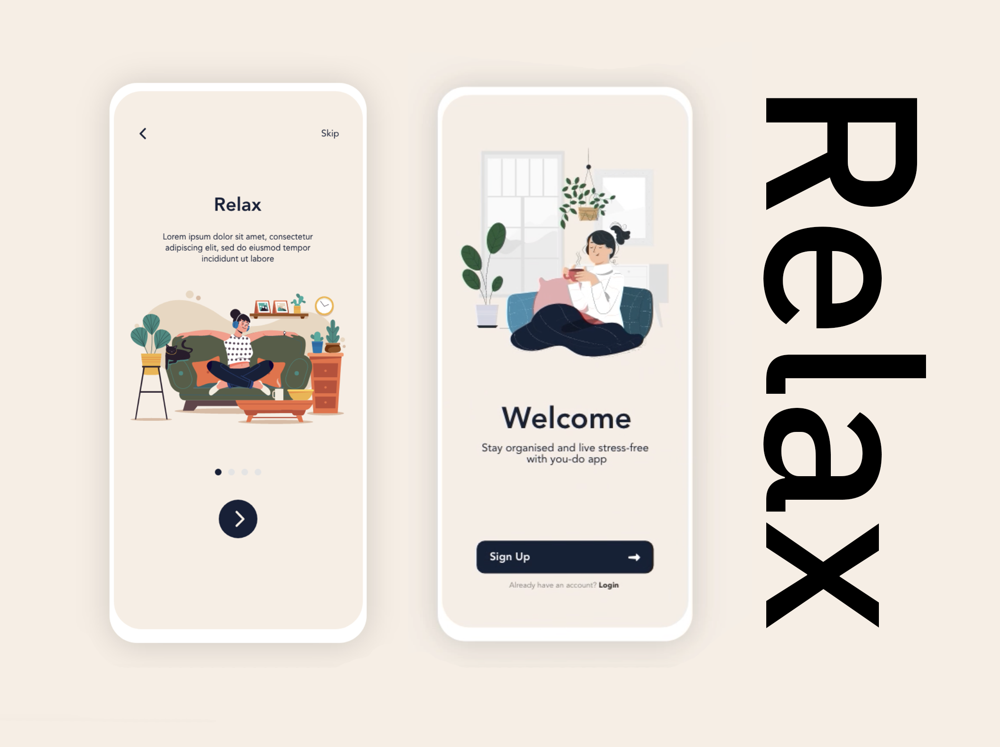
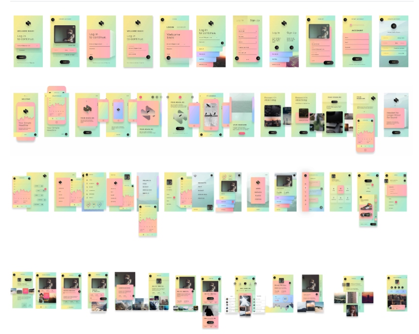
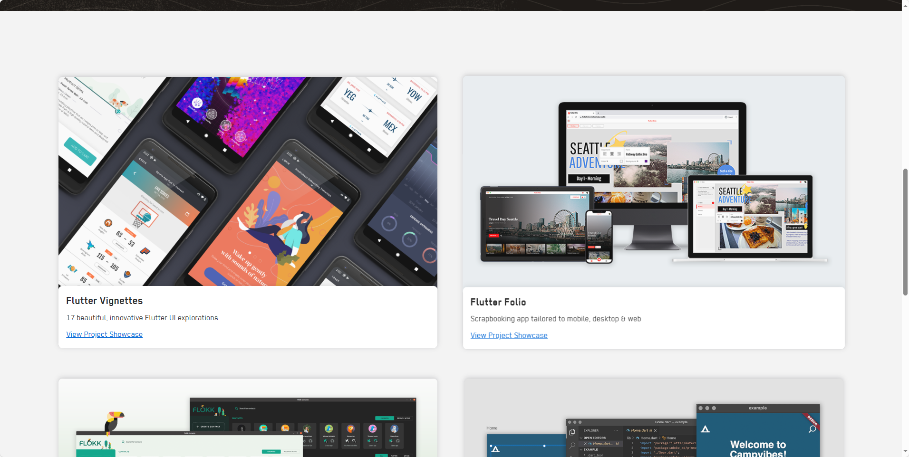
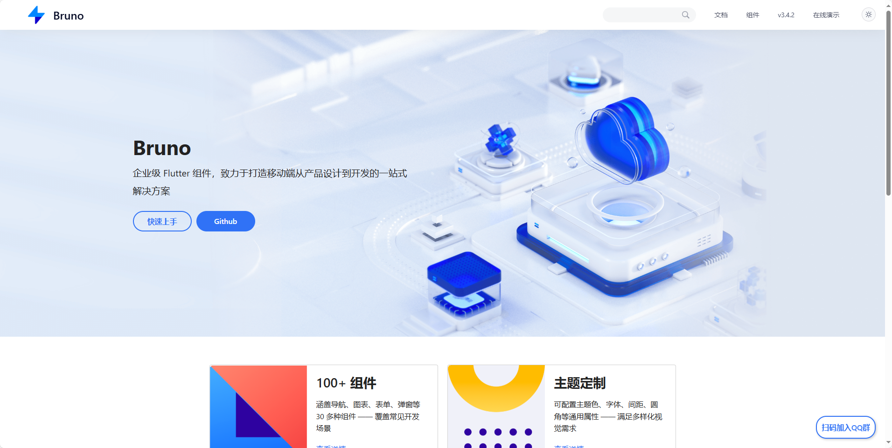
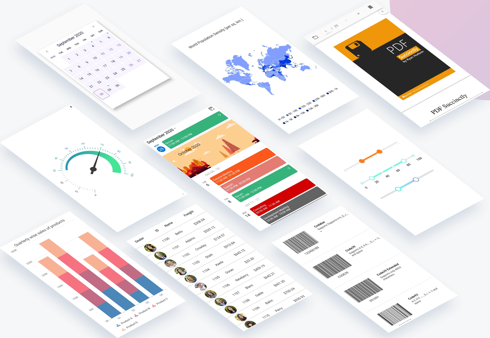

## [Best-Flutter-UI-Templates](https://github.com/mitesh77/Best-Flutter-UI-Templates)

地址：https://github.com/mitesh77/Best-Flutter-UI-Templates

## [flutter-ui-nice](https://github.com/FlutterOpen/flutter-ui-nice)

地址：https://github.com/FlutterOpen/flutter-ui-nice

## [flutter_vignettes](https://github.com/gskinnerTeam/flutter_vignettes)

地址：https://github.com/gskinnerTeam/flutter_vignettes

## [Bruno](https://bruno.ke.com/)

企业级 Flutter 组件，致力于打造移动端从产品设计到开发的一站式解决方案

地址：https://bruno.ke.com/

## [syncfusion_flutter_widgets](https://github.com/syncfusion/flutter-widgets/tree/master)

Syncfusion Flutter widgets libraries include high quality UI widgets and file-format packages to help you create rich, high-quality applications for iOS, Android, and web from a single code base.

地址：https://github.com/syncfusion/flutter-widgets/tree/master

