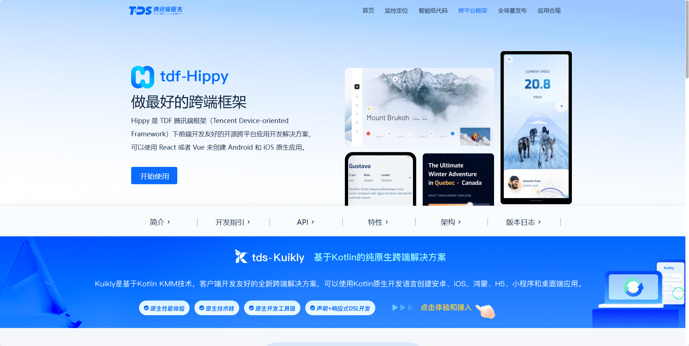
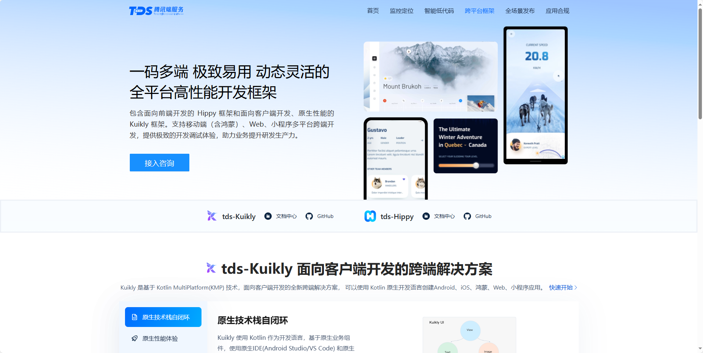

## [Hippy](https://openhippy.com/home)

Hippy 是 TDF 腾讯端框架（Tencent Device-oriented Framework）下前端开发友好的开源跨平台应用开发解决方案，可以使用 React 或者 Vue 来创建 Android 和 iOS 原生应用。

地址：https://openhippy.com/home

## [Kuikly](https://kuikly.tds.qq.com/Introduction/arch.html)

Kuikly是基于Kotlin MultiPlatform(KMP)构建的跨端开发框架。它利用了KMP逻辑跨平台的能力, 并抽象出通用的跨平台UI渲染接口，复用平台的UI组件，从而达到UI跨平台，具有轻量、高性能、可动态化等优点；同时，KuiklyBase基建同样支持逻辑跨端。

地址：https://kuikly.tds.qq.com/Introduction/arch.html
