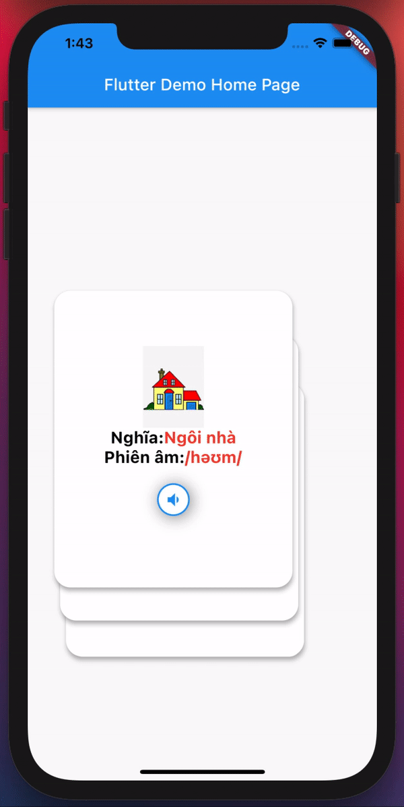

## [flutter_flip_card](https://github.com/imtheguna/flutter_flip_card)

提供翻转卡片动画的组件。可用于隐藏和显示产品的详细信息。

地址：https://github.com/imtheguna/flutter_flip_card

## [flutter_cool_card_swiper](https://github.com/MicroProgramers/flutter_cool_card_swiper)

带有平滑动画的酷炫Flutter Card Swiper

地址：https://github.com/MicroProgramers/flutter_cool_card_swiper

## [flash_card](https://pub.dev/packages/flash_card)

支持创建Flash Cards的学习方法，使用户更容易记住信息。

地址：https://pub.dev/packages/flash_card

## [flutter_blue](https://pub.dev/packages/flutter_blue)

用于连接和与Bluetooth低功耗设备通信的Flutter插件，在安卓和iOS上都可以使用。

地址：https://github.com/pauldemarco/flutter_blue

## [plus_plugins](https://github.com/fluttercommunity/plus_plugins)

Flutter Community Plus Plugins

地址：https://github.com/fluttercommunity/plus_plugins