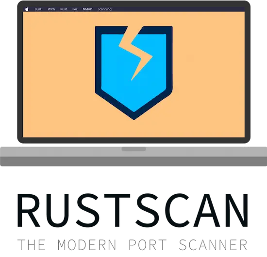
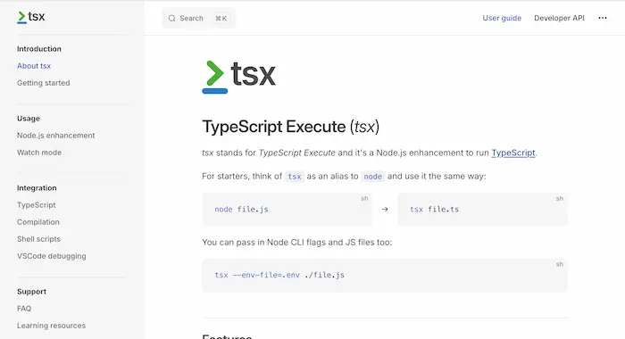

## 朱雀仿宋

简介：
朱雀仿宋/朱雀宋朝/Zhuque Fangsong: An open-source Fangsong typeface project

地址：
https://github.com/TrionesType/zhuque

## Windows 任务管理器的四种替代品（英文）

https://www.xda-developers.com/powerful-tools-should-use-instead-task-manager/

## RustScan

RustScan 是一个基于 Rust 语言的端口扫描工具，它的速度非常快，支持多线程扫描，并且可以扫描指定范围内的端口。

地址：
https://github.com/bee-san/RustScan

## tsx

tsx 是一个用于运行 TypeScript 的命令行工具，它可以直接运行 TypeScript 文件而无需编译。

地址：
https://github.com/privatenumber/tsx

## oss-rebuild

谷歌本周推出的一项服务，用来验证网上的 NPM、PyPI、Rust 的软件包，是否跟源码构建出来的完全一样，保证软件供应链安全。

地址：https://oss-rebuild.dev/

