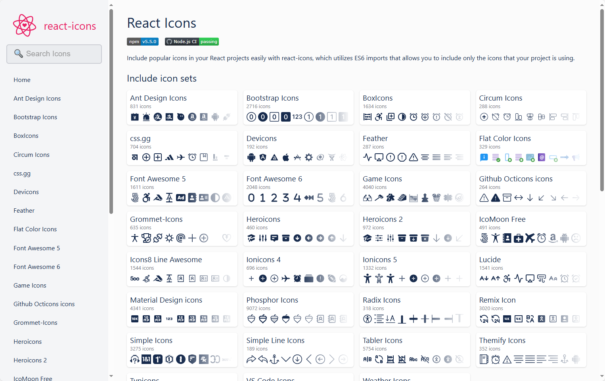

### [React Icons](https://react-icons.github.io/react-icons/)

- React Icons 是一个便捷的图标库，将流行的图标集整合进 React 项目。
- 采用 ES6 模块导入，可以按需加载，减少打包体积。
- 包含超过 40 个主流图标集，涵盖设计、开发、社交等场景。

地址：https://react-icons.github.io/react-icons/

### [IconPark](https://iconpark.oceanengine.com/official)

- IconPark 是由字节跳动推出的图标库平台，提供海量免费 SVG 图标资源，支持灵活自定义样式。
- 图标覆盖 2658+ 个图标，包含丰富分类，适用于产品设计、Web 开发、移动 App 等场景。

地址：https://iconpark.oceanengine.com/official