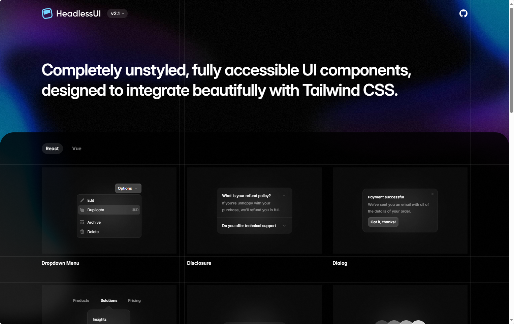
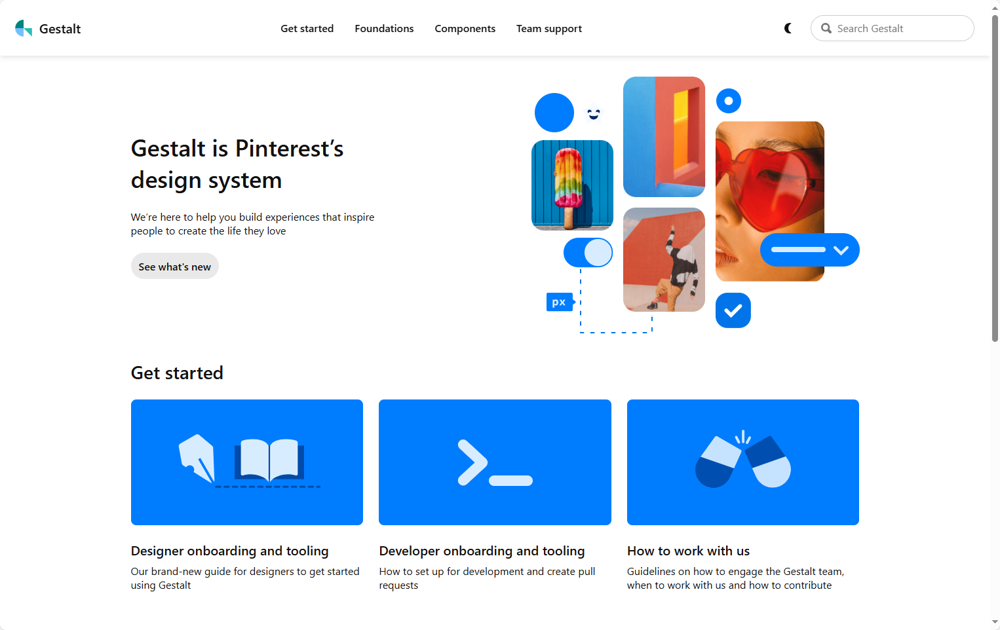

## [React Icons](https://mui.com/)


### 🌟 什么是 MUI？
- **MUI（Material UI）** 是一个功能强大的 React UI 组件库，帮助开发者快速构建美观、可定制的 Web 应用界面。
- 提供多个子库，包括：
  - **Material UI**：基于 Google Material Design 的核心组件库
  - **MUI Base**：无样式基础组件，适合自定义设计系统
  - **Joy UI**：现代美学风格组件
  - **MUI X**：高级组件（如数据表格、日历等）
  - **Toolpad**：用于构建内部工具和仪表盘的组件和工具（Beta）

---

### 🚀 核心优势
- **组件丰富**：涵盖按钮、卡片、表单、导航等常用 UI 元素
- **高度可定制**：支持主题定制、样式覆盖、响应式设计
- **无障碍支持**：每个组件都注重可访问性（Accessibility）
- **文档完善**：拥有 2,000+ 贡献者的文档系统，覆盖广泛使用场景
- **社区活跃**：
  - 每周下载量：580 万+
  - GitHub Star 数：93.9k+
  - 贡献者：3,000+
  - X（原 Twitter）关注者：19.2k+


地址：https://mui.com/


## [HeadlessUI](https://headlessui.com/)




### 🧩 项目简介：Headless UI
- **Headless UI** 是一组完全无样式但具备完整可访问性的 UI 组件。
- 由 **Tailwind Labs** 开发，专为与 **Tailwind CSS** 搭配使用而设计。
- 支持 **React** 和 **Vue** 框架。

---

### 🎯 核心特点
- **无样式设计**：组件不包含任何默认样式，开发者可完全控制外观。
- **可访问性优先**：每个组件都遵循 WAI-ARIA 标准，确保对所有用户友好。
- **组件灵活**：适合构建高度定制化的 UI，而不受预设样式限制。

---

### 🧱 提供的组件（部分）
- **交互类**：
  - Dialog（对话框）
  - Popover（弹出层）
  - Dropdown Menu（下拉菜单）
  - Tabs（标签页）
  - Transition（过渡动画）

- **表单类**：
  - Combobox（组合框）
  - Listbox（列表框）
  - Radio Group（单选组）
  - Switch（开关）
  - Checkbox（复选框）
  - Input / Textarea / Select 等基础表单元素

---

### 📦 使用场景
- 构建自定义设计系统
- 与 Tailwind CSS 深度集成
- 需要高度可访问性但不希望被样式限制的项目

地址：https://headlessui.com/

## [HeroUI](https://www.heroui.com/)


### 🌟 项目简介：HeroUI（前身为 NextUI）
- **HeroUI** 是一个现代化、快速且美观的 React UI 组件库。
- 适用于构建可访问性强、可定制的 Web 应用。
- 基于 **Tailwind CSS**，无运行时样式，体积轻巧。

---

### 🚀 核心优势
- **无样式冲突**：使用 Tailwind Variants，避免类名冲突。
- **自动暗黑模式**：根据 HTML 属性自动切换主题。
- **完全类型化**：TypeScript 支持，提升开发体验。
- **可访问性优先**：基于 React Aria，支持键盘导航、屏幕阅读器等。
- **组件多样**：提供 210+ 响应式组件模板（HeroUI Pro）。
- **Next.js 支持**：兼容新版本的 app/ 目录结构。

---

### 🎨 主题与定制
- 提供 Tailwind 插件，可自定义主题色彩与语义 token。
- 支持 light/dark 模式的独立配置：
  ```js
  const { heroui } = require("@heroui/react");
  module.exports = {
    plugins: [
      heroui({
        themes: {
          light: { colors: { primary: "#0072f5" } },
          dark: { colors: { primary: "#0072f5" } },
        },
      }),
    ],
  };
  ```

---

### 🧰 开发体验亮点
- **组件插槽定制**：轻松修改组件结构与样式。
- **Polymorphic `as` 属性**：可更改组件标签类型。
- **无样式污染**：无冗余 CSS 类，优化打包体积。
- **React Server Components 支持**：组件默认包含 `use client` 指令。

---

### 💬 社区与支持
- 社区平台：GitHub、Discord、X（原 Twitter）
- 支持方式：Open Collective、Patreon
- 作者：Junior Garcia

---

### 📦 快速开始命令
```bash
npx heroui-cli@latest init
```


地址： https://www.heroui.com/

## [gestalt](https://gestalt.pinterest.systems/home)



### 🎨 什么是 Gestalt？
- **Gestalt** 是 Pinterest 官方推出的设计系统。
- 旨在帮助设计师和开发者构建激发用户灵感的产品体验。
- 提供统一的 UI 组件、设计规范和工具资源。

---

### 🚀 快速入门指南
- **设计师入门**：提供新手指南和工具配置说明，帮助设计师快速上手 Gestalt。
- **开发者入门**：涵盖开发环境设置、如何创建 Pull Request 等流程。
- **协作指南**：说明如何与 Gestalt 团队合作、何时参与贡献。

---

### 🧱 核心模块
| 模块         | 内容简介 |
|--------------|----------|
| **Components** | 丰富的 UI 控件和工具集，支持高质量界面构建 |
| **Foundations** | 包含颜色、排版、图标等基础设计规范 |
| **Resources** | 提供 Figma 资源库、插件、平台支持（Web、iOS、Android） |

---

### 🧰 支持与工具
- **Figma 插件与库**：加速设计流程
- **Slack 频道**：设计与工程团队沟通支持
- **代码资源**：
  - GitHub 仓库
  - CodeSandbox 示例
  - Web 工程库

---

### 🏢 背景与技术
- 由 Pinterest 设计与工程团队维护
- 网站由 Netlify 提供支持
- 版权归 Pinterest 所有 © 2025


地址：https://gestalt.pinterest.systems/home

## [shadcn](https://ui.shadcn.com/)


### 🧱 项目简介：shadcn/ui
- **shadcn/ui** 是一个开源的 React 组件库，强调设计系统的可扩展性与可定制性。
- 提供一套美观、实用的 UI 组件，适合构建现代 Web 应用。
- 设计理念是：**“Start here, then make it your own.”**

---

### 🎯 核心特点
- **开源代码**：所有组件均可查看源代码并自由修改。
- **可定制性强**：组件结构清晰，支持 Tailwind CSS 和多种主题配置。
- **组件丰富**：涵盖表单、仪表盘、认证、图表、日历等常用 UI 模块。
- **设计系统基础**：适合构建自己的 UI 体系或产品组件库。

---

### 📦 示例与功能模块
- **Dashboard 示例**：展示收入、订阅等数据统计组件。
- **Authentication 模块**：提供登录、注册等用户认证界面。
- **Calendar 组件**：新推出的日历功能，支持交互式日期选择。
- **Charts & Blocks**：用于可视化和布局的高级组件。

---

### 💼 订阅与计划
- 提供免费计划与 Pro 计划：
  - **Starter Plan**：适合小型项目或个人使用。
  - **Pro Plan**：解锁更多功能与存储空间。
- 支持团队协作功能，可邀请成员共同编辑项目。

---

### 🔐 其他功能亮点
- **Cookie 设置管理**：支持个性化功能与隐私控制。
- **支付系统集成**：展示付款状态与用户信息。
- **消息与问题反馈系统**：内置聊天与问题报告界面。


地址：https://ui.shadcn.com/
