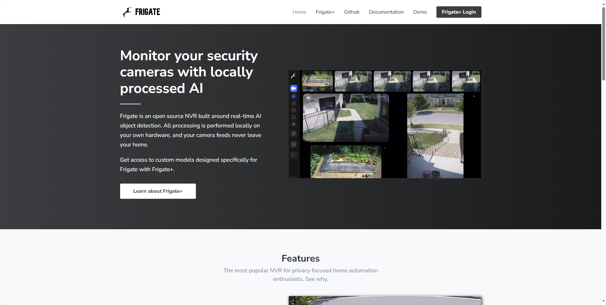
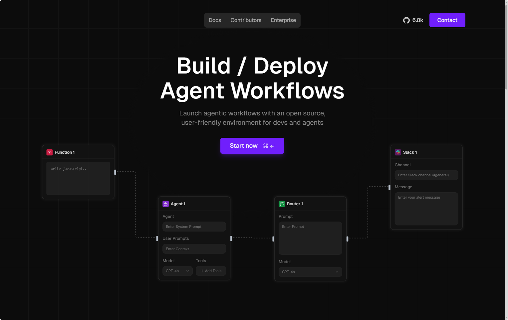
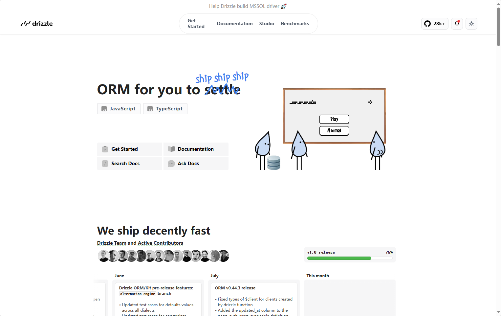

## [Frigate](https://github.com/blakeblackshear/frigate)



一个完整的本地网络视频录像机（NVR），专为Home Assistant设计，具备AI物体检测功能。使用OpenCV和TensorFlow在本地为IP摄像头执行实时物体检测。

强烈推荐使用GPU或者AI加速器（例如Google Coral加速器 或者 Hailo）。它们的性能甚至超过目前的顶级CPU，并且可以以极低的耗电实现更优的性能。

- 通过自定义组件与Home Assistant紧密集成
- 设计上通过仅在必要时和必要地点寻找物体，最大限度地减少资源使用并最大化性能
- 大量利用多进程处理，强调实时性而非处理每一帧
- 使用非常低开销的运动检测来确定运行物体检测的位置
- 使用TensorFlow进行物体检测，运行在单独的进程中以达到最大FPS
- 通过MQTT进行通信，便于集成到其他系统中
- 根据检测到的物体设置保留时间进行视频录制
- 24/7全天候录制
- 通过RTSP重新流传输以减少摄像头的连接数
- 支持WebRTC和MSE，实现低延迟的实时观看

地址：https://github.com/blakeblackshear/frigate

## [sim](https://github.com/simstudioai/sim)



---

### 🚀 项目简介
- **Sim** 是一个轻量级、用户友好的平台，用于快速构建和部署连接你常用工具的 LLM（大型语言模型）工作流。
- 提供图形化界面（Sim Studio）来设计 agent 流程，支持低代码/无代码开发。

---

### 🛠️ 部署方式
Sim 提供多种部署方式，适合不同技术背景的用户：

1. **NPM 包（最简单）**
   ```bash
   npx simstudio
   ```
   - 默认运行在 `http://localhost:3000`
   - 需安装并运行 Docker

2. **Docker Compose**
   ```bash
   git clone https://github.com/simstudioai/sim.git
   cd sim
   docker compose -f docker-compose.prod.yml up -d
   ```

3. **本地模型支持**
   - 使用 `ollama_docker.sh` 脚本拉取模型
   - 支持 GPU 和 CPU 模式运行

4. **Dev Containers（适用于 VS Code）**
   - 使用 Remote - Containers 插件
   - 命令：`bun run dev:full`

5. **手动部署**
   - 依赖：Bun、PostgreSQL（需 pgvector 扩展）
   - 使用 `bun install` 安装依赖
   - 设置 `.env` 文件并运行数据库迁移

---

### 🧱 技术栈
| 技术领域       | 使用工具/框架                     |
|----------------|----------------------------------|
| 前端框架       | Next.js（App Router）             |
| 运行时         | Bun                              |
| 数据库         | PostgreSQL + Drizzle ORM         |
| UI 库          | Shadcn + Tailwind CSS            |
| 状态管理       | Zustand                          |
| 工作流编辑器   | ReactFlow                        |
| 文档系统       | Fumadocs                         |
| 实时通信       | Socket.io                        |
| 后台任务       | Trigger.dev                      |
| 身份验证       | Better Auth                      |

---

### 📦 项目状态
- ⭐ Star 数：6.8k+
- 🍴 Fork 数：908+
- 👥 贡献者：24+ 人
- 📄 许可证：Apache 2.0

---

地址：https://www.sim.ai/

## [drizzle-orm](https://github.com/drizzle-team/drizzle-orm)


---

### 🌟 项目概览
- **Drizzle ORM** 是一个轻量级、无依赖的 ORM（对象关系映射）工具。
- 体积小，仅约 7.4KB（minified + gzipped），支持 tree-shaking。
- 适用于多种数据库：PostgreSQL、MySQL、SQLite，包括 serverless 数据库如 Turso、Neon、PlanetScale、Supabase 等。

---

### ⚙️ 技术特点
- **零依赖**：无需额外安装 Rust 二进制或 serverless 适配器。
- **跨平台支持**：兼容 Node.js、Bun、Deno、Cloudflare Workers、Vercel Functions 等。
- **TypeScript 优化**：支持类型安全的 SQL schema 声明与查询构建。
- **JavaScript 兼容**：也可作为纯 JS 库使用。

---

### 🧰 配套工具
- **Drizzle Kit**：CLI 工具，支持数据库迁移文件生成与自动应用。
- **Drizzle Studio**：图形化界面，用于浏览和操作数据库数据。

---

### 📦 项目状态
| 指标            | 数值/状态         |
|----------------|------------------|
| ⭐ Star 数      | 29.6k+           |
| 🍴 Fork 数      | 970+             |
| 👥 使用者       | 139k+ 项目       |
| 👨‍💻 贡献者       | 134+ 人           |
| 📄 许可证        | Apache 2.0       |
| 🧑‍💻 编程语言     | TypeScript（98.7%）|

---

### 🔗 支持的数据库服务（部分）
- Supabase
- Vercel Postgres
- Cloudflare D1
- PlanetScale
- AWS Data API
- Turso
- Neon
- Xata
- FlyIO LiteFS

---

地址：https://orm.drizzle.team/