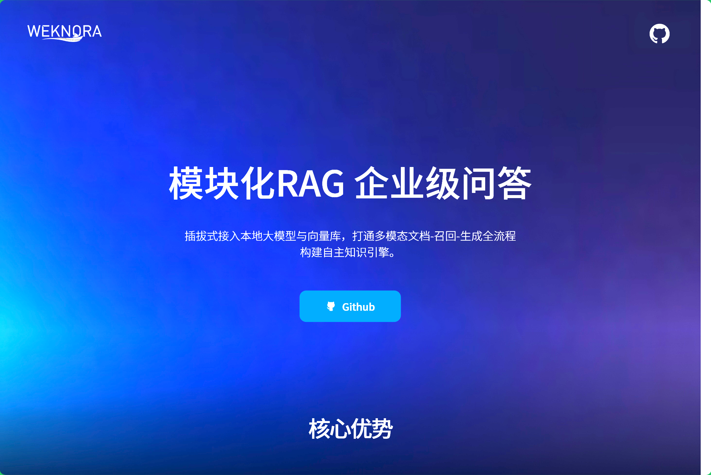

## [Motionity](https://github.com/alyssaxuu/motionity)

- 一个免费开源的网页动画编辑器
- 结合了 After Effects 的强大功能和 Canva 的易用性

地址：https://github.com/alyssaxuu/motionity

## [WeKnora](https://github.com/Tencent/WeKnora)

WeKnora（维娜拉） 是一款基于大语言模型（LLM）的文档理解与语义检索框架，专为结构复杂、内容异构的文档场景而打造。

框架采用模块化架构，融合多模态预处理、语义向量索引、智能召回与大模型生成推理，构建起高效、可控的文档问答流程。核心检索流程基于 RAG（Retrieval-Augmented Generation） 机制，将上下文相关片段与语言模型结合，实现更高质量的语义回答。

地址：https://github.com/Tencent/WeKnora

## [Neko](https://github.com/m1k1o/neko)

一个在 Docker 中运行并使用 WebRTC 技术的自托管虚拟浏览器。Neko 是一个强大的工具，允许您在虚拟环境中运行一个功能齐全的浏览器，让您能够从任何地方安全和私密地访问互联网。使用 Neko，您可以浏览网页、运行应用程序和执行其他任务，就像在普通浏览器上一样，所有这些都在一个安全和隔离的环境中进行。无论您是希望测试 web 应用程序的开发人员，还是寻求安全浏览体验的注重隐私的用户，或者只是想利用虚拟浏览器的便利性和灵活性的人，Neko 都是完美的解决方案。

地址：https://github.com/m1k1o/neko

## [Pingora](https://github.com/cloudflare/pingora)

Pingora 是 Cloudflare 开源的基于 Rust 语言的网络框架，它的核心用途是帮助开发者构建高性能、可靠且灵活的网络服务。无论是搭建代理服务器、负载均衡器，还是构建自定义 HTTP 服务，Pingora 都能轻松胜任。作为 Cloudflare 内部的核心技术，Pingora 已经在生产环境中默默支撑着超过每秒 4000 万次的互联网请求，是 Rust 语言在高性能网络服务领域的优秀实践。

地址：https://github.com/cloudflare/pingora

