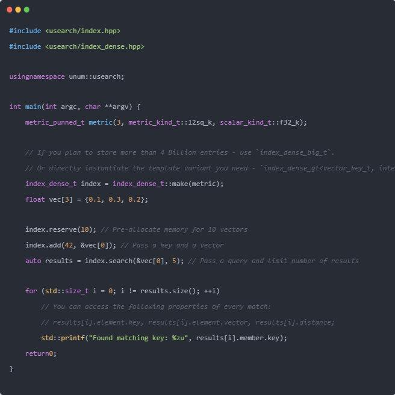
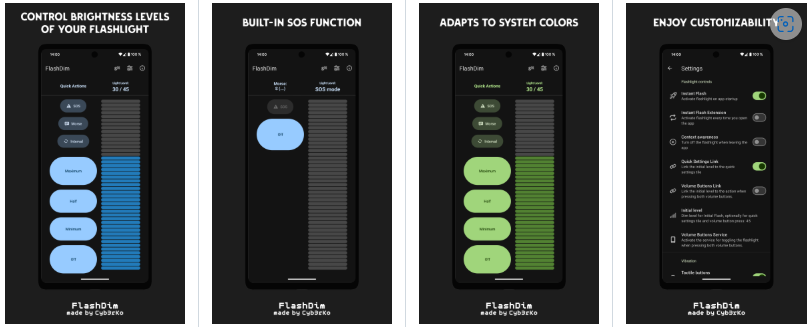
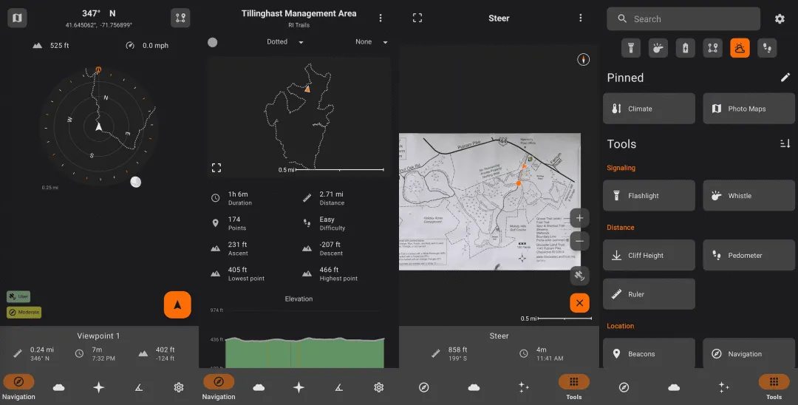
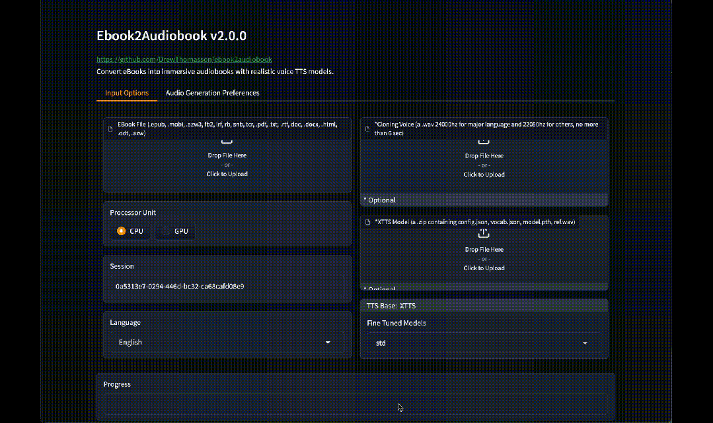
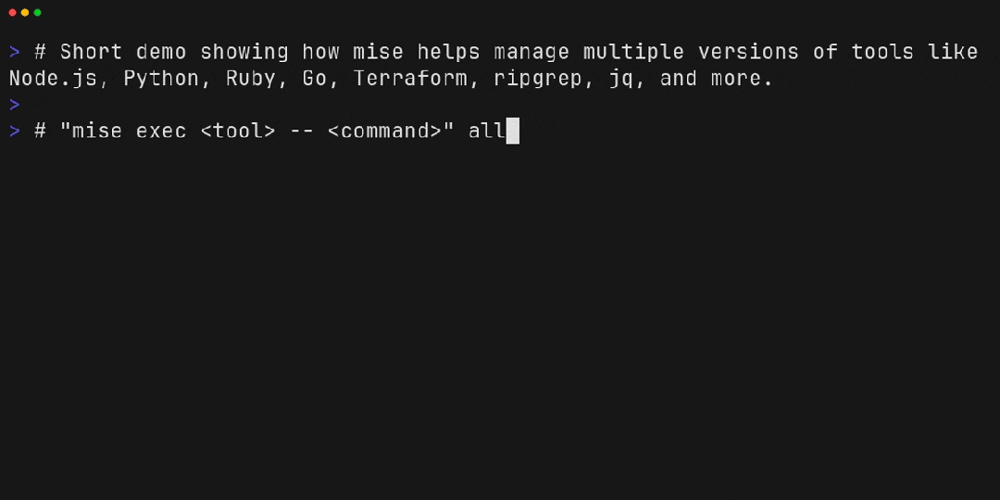
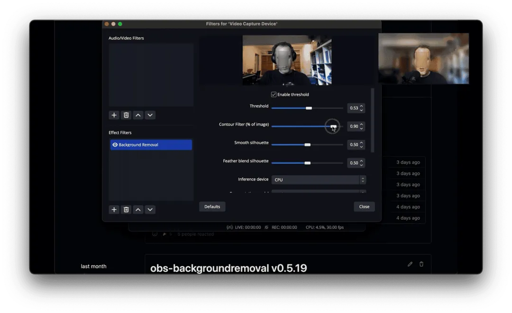

## [Usearch](https://github.com/unum-cloud/usearch)

更快且小巧的向量检索与聚类引擎。这是一款高性能、轻量级的相似搜索和聚类引擎，单头文件设计，可嵌入主流数据库，支持向量和多模态数据（文本、图像、地理坐标）。它基于 HNSW 算法实现高效的近似最近邻搜索，兼容多种编程语言和精度类型，适用于推荐系统、向量数据库、智能检索、地理空间分析等场景。

地址：https://github.com/unum-cloud/usearch

## [f2](https://github.com/ayoisaiah/f2)

f2：跨平台的批量重命名工具。这是一款命令行批量重命名工具，完全用 Go 语言编写，支持正则表达式、自动解决冲突、撤销等功能。

地址：https://github.com/ayoisaiah/f2

## [logdy-core](https://github.com/logdyhq/logdy-core)

logdy-core：自带 Web 界面的实时日志查看工具。这是一款轻量级的实时日志查看工具，无需安装、开箱即用。它内置 Web 界面，可通过浏览器像 tail -f 一样实时查看与过滤日志，支持多种输入模式和自定义解析器。

地址：https://github.com/logdyhq/logdy-core

## [OpenList](https://github.com/OpenListTeam/OpenList)

OpenList：支持多种存储的文件列表程序。这是一个基于 Gin 和 SolidJS 的文件列表程序，支持本地存储、阿里云盘、OneDrive、Google Drive 等多种存储方式。它完全开源（fork 自 AList），由社区共同维护。

地址：https://github.com/OpenListTeam/OpenList

## [remotion](https://github.com/remotion-dev/remotion)

remotion：用 React 制作动态视频。这是一个能够通过代码生成视频的平台，开发者可以用 Web 技术（如 CSS、Canvas、SVG、WebGL）、React 组件、变量和函数动态生成视频内容，支持复杂的动画和效果。

地址: https://github.com/remotion-dev/remotion

## [flashdim](https://github.com/cyb3rko/flashdim)

flashdim：专业级 Android 手电筒应用。这是一款免费、无广告、可离线使用的手电筒应用，适配 Android 13 及以上系统。它通过硬件接口实现多级亮度调节，支持 SOS、摩斯码信号、BMP、定时闪烁等模式，非常适合徒步、露营、夜跑等场景使用。来自 @ewiro 的分享

地址: https://github.com/cyb3rko/flashdim

## [Trail-Sense](https://github.com/kylecorry31/Trail-Sense)

Trail-Sense：野外生存必备 Android 应用。这是一款专为徒步、露营、野外生存等场景设计的开源 Android 应用。它利用手机的传感器，提供离线导航、日落提醒、照片地图、路径追踪等实用功能，所有功能均可在无网络环境下使用

地址: https://github.com/kylecorry31/Trail-Sense

## [ebook2audiobook](https://github.com/DrewThomasson/ebook2audiobook)

ebook2audiobook：电子书转有声书的工具。这款开源工具可以轻松将电子书转换为有声书，支持多种常见格式，如 EPUB、MOBI、PDF 等。它通过 calibre 提取电子书文本，并运用语音合成技术（Text-to-Speech），能够生成包含章节和元数据的有声书，支持包括中文在内的 1000 多种语言。

地址: https://github.com/DrewThomasson/ebook2audiobook

## [microbin](https://github.com/szabodanika/microbin)

microbin：极简的文件分享和短链接平台。这是一款用 Rust 编写的轻量级 Web 应用，集共享文件、在线剪贴板和 URL 短链接于一体。它安全可靠且易于部署，支持自动过期、设置密码和保护级别等功能

地址: https://github.com/szabodanika/microbin

## [mise](https://github.com/jdx/mise)

mise：一站式多语言开发环境管理工具。这是一款用 Rust 编写的开发环境管理工具，集多语言工具链切换、环境变量管理和任务自动化于一体，轻松解决多版本编程语言、环境隔离和自动化构建等问题，可替代 asdf、nvm、pyenv、direnv、make 等多种工具。

地址: https://github.com/jdx/mise

## [container](https://github.com/microsoft/container)

ontainer：苹果开源的轻量级虚拟机。这是一款苹果官方开源的轻量级虚拟化容器工具，用于在 Mac 上创建和运行 Linux 容器。它采用 Swift 开发，并针对 Apple 芯片（如 M1、M2 芯片）进行了优化，旨在为 macOS 用户提供高效、原生的容器体验，支持 OCI 标准容器镜像，并可无缝对接 Docker Hub 等主流镜像仓库。

地址: https://github.com/apple/container

## [daily-arXiv-ai-enhanced](https://github.com/dw-dengwei/daily-arXiv-ai-enhanced)

daily-arXiv-ai-enhanced：每日自动生成 arXiv 论文摘要的工具。该项目能够自动获取 arxiv 上的论文，并利用大语言模型进行总结，生成中文摘要。

地址: https://github.com/dw-dengwei/daily-arXiv-ai-enhanced

## [kubernetes-the-hard-way](https://github.com/kelseyhightower/kubernetes-the-hard-way)

kubernetes-the-hard-way：笨方法搭建 Kubernetes 集群的教程。该项目旨在通过手动从零搭建 Kubernetes 集群的方式，帮助初学者深入理解 K8s 的核心组件和工作原理。它提供一份不用自动化工具，纯手动安装、配置并运行一个高可用的 K8s 集群的详细指南。

地址: https://github.com/kelseyhightower/kubernetes-the-hard-way

## [obs-backgroundremoval](https://github.com/royshil/obs-backgroundremoval)

obs-backgroundremoval：OBS 背景移除插件。这是一个开源的 OBS Studio 插件，可以在录制或直播过程中自动识别人像并去除背景，让用户能够轻松更换视频背景，支持 Windows、macOS 和 Ubuntu 等平台。

地址: https://github.com/royshil/obs-backgroundremoval