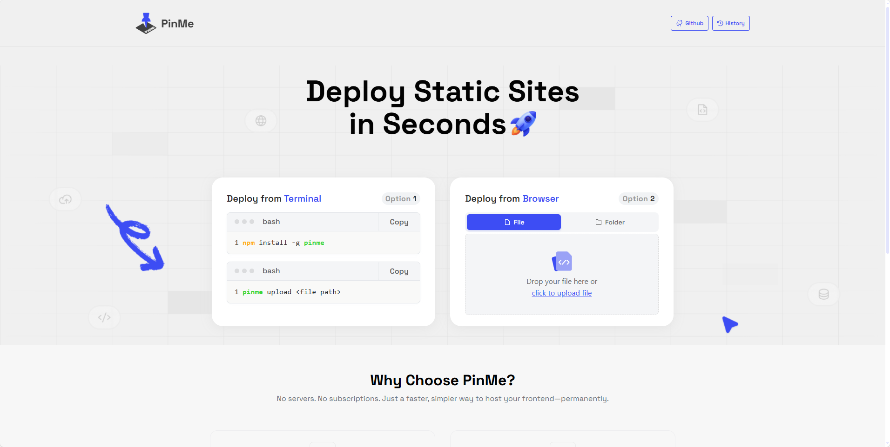
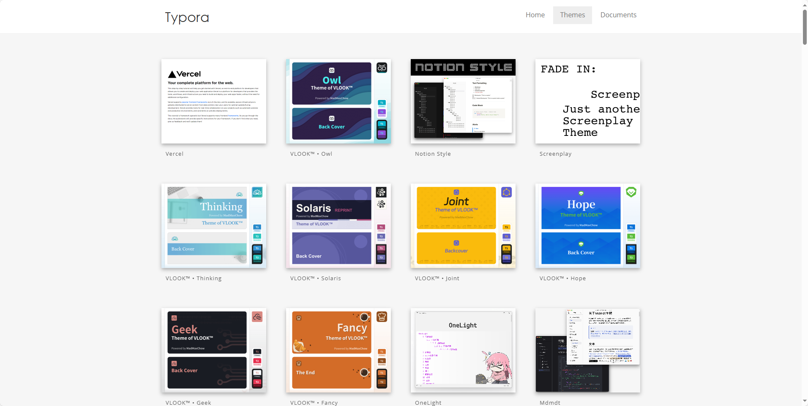
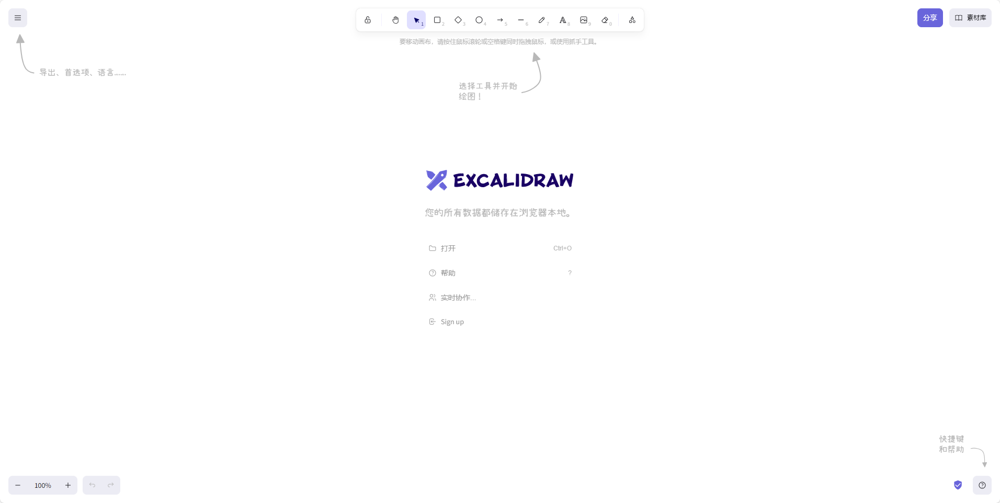

## [Folo](https://github.com/RSSNext/Folo)

Folo 是一款开源、基于 RSS 的信息聚合神器，帮助用户将所有感兴趣的信息整合成一个时间线。它不仅适合忙碌的普通用户，也为开发者提供了高度可定制的订阅体验。无论是文字、视频、图片还是音频，Folo 都能帮你一网打尽，让信息消费变得更智能、更高效！

地址：https://github.com/RSSNext/Folo

## [PinMe](https://pinme.eth.limo/)

PinMe 是一个部署工具，可以让你一行命令上线自己的博客、作品集、简历页——不用注册、不用买服务器、不用申请域名。 它背后用的是一种去中心化的方式发布内容（技术叫 IPFS + ENS），所以你的网站不会因为平台挂掉而消失。 永不下线，不受限制，真正属于你。 适合开发者、设计师、学生党，快速上线静态站点。  在网站上直接拖拽 html 文件即可上传你的网站并获得域名！

地址：https://pinme.eth.limo/

## [Typora 的主题](https://theme.typora.io/)

地址：https://theme.typora.io/

## [Excalidraw](https://github.com/excalidraw/excalidraw)

- Excalidraw 是一个开源的虚拟白板工具，支持手绘风格图示的绘制。
- 适用于创建流程图、线框图、草图等。
- 提供协作功能和端到端加密，适合团队使用。

地址：https://github.com/excalidraw/excalidraw

