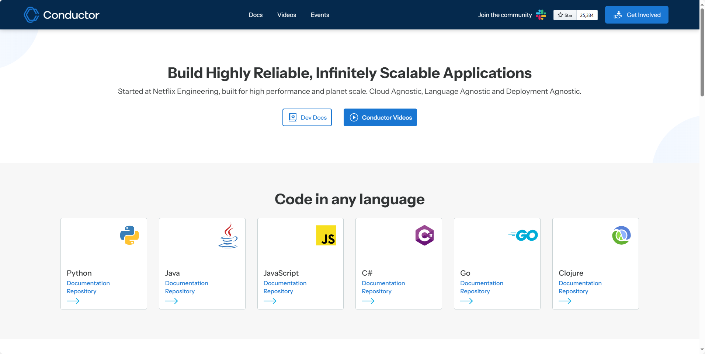
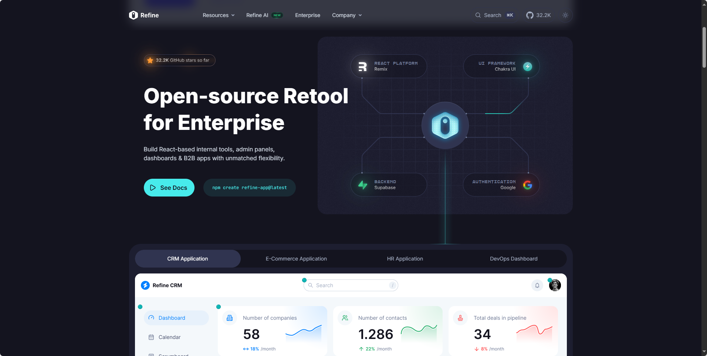

## [project-based-learning](https://github.com/practical-tutorials/project-based-learning)

这是一个GitHub上的项目合集，专门为想通过实战学习编程的人准备。里面收集了各种编程语言的教程，教你从零开始搭建实际应用，比如写个小游戏、做个聊天软件、开发网页应用，甚至自己写个操作系统或编译器。每个教程都分步骤讲解，适合想动手练技术的新手和进阶开发者。你可以按自己感兴趣的语言或项目类型挑选学习，直接fork仓库就能开始实践。

地址：https://github.com/practical-tutorials/project-based-learning

## [Conductor](https://github.com/conductor-oss/conductor)

Conductor是Netflix开源的一个微服务编排引擎，专门用来管理和协调分布式系统中的异步工作流。简单来说，它就像个智能调度员，能帮你把多个微服务、数据库或外部API串联成复杂的业务流程，还能自动处理错误、重试失败任务，并提供可视化监控。无论是电商订单处理还是数据流水线，它都能让这些跨服务的协作变得更灵活可靠，支持用代码定义工作流，还兼容多种数据库和编程语言SDK。

地址：https://github.com/conductor-oss/conductor

## [Refine](https://github.com/refinedev/refine)

Refine是一个基于React的前端框架，专为快速开发Web应用程序而设计。它通过提供一系列开箱即用的解决方案，显著简化了开发者在构建数据密集型应用时的重复性工作。

作为一个"headless"（无头）框架，Refine的核心优势在于其解耦的设计理念——它将业务逻辑与UI呈现完全分离，让开发者可以自由选择自己喜欢的UI库或自定义设计，同时享受框架提供的强大功能支持。

地址：https://refine.dev/