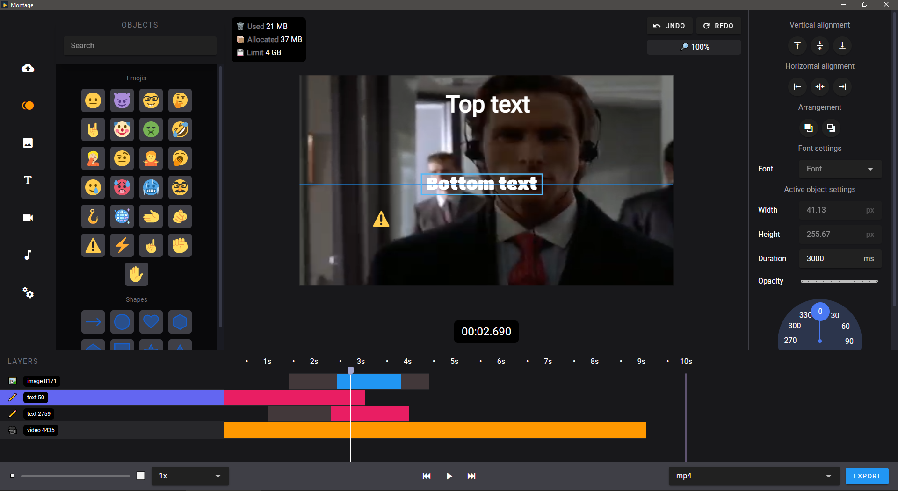
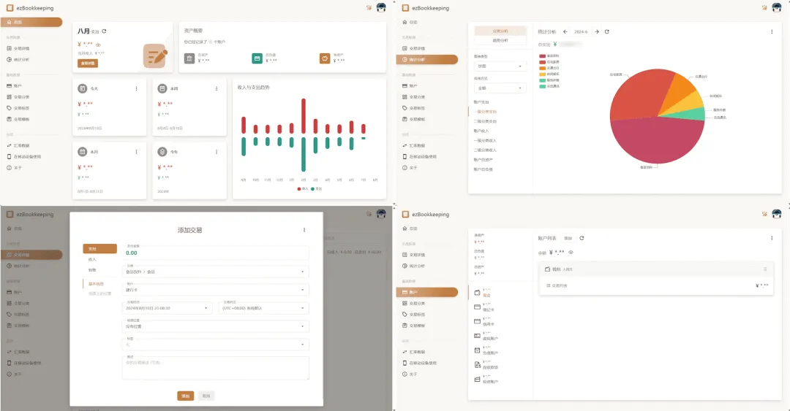
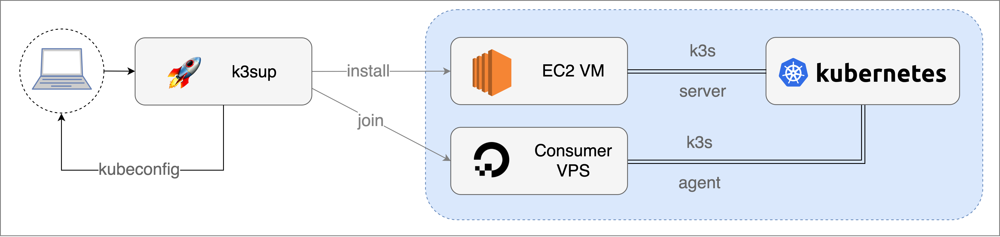
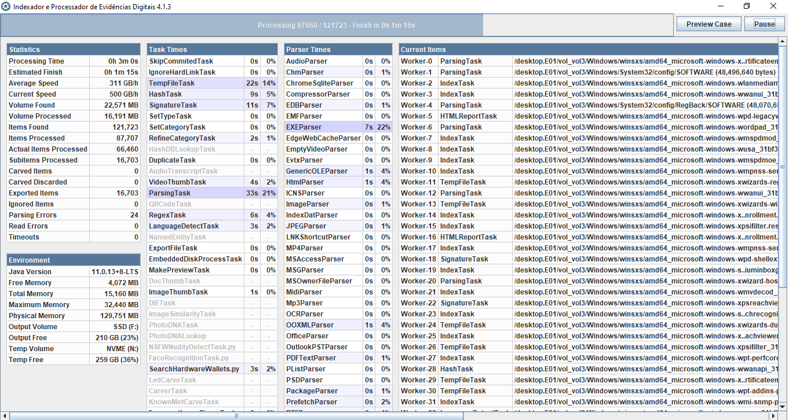
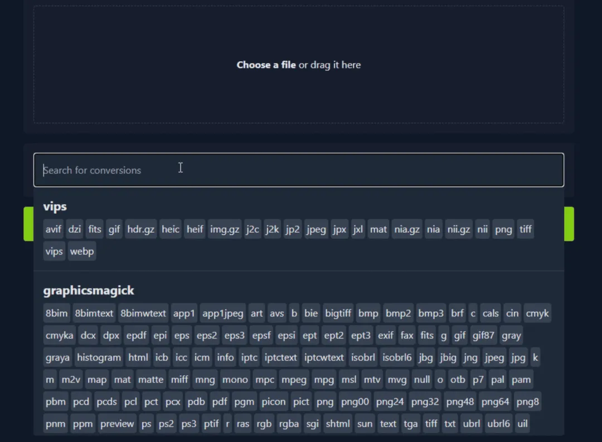
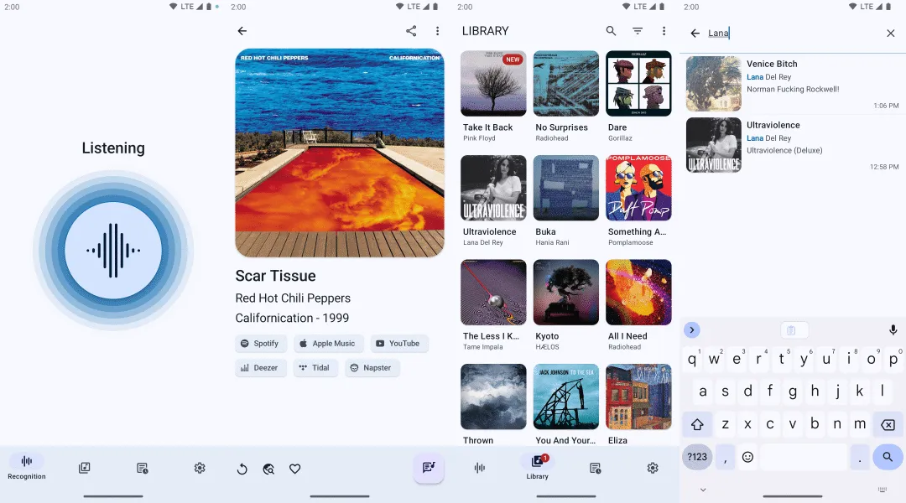
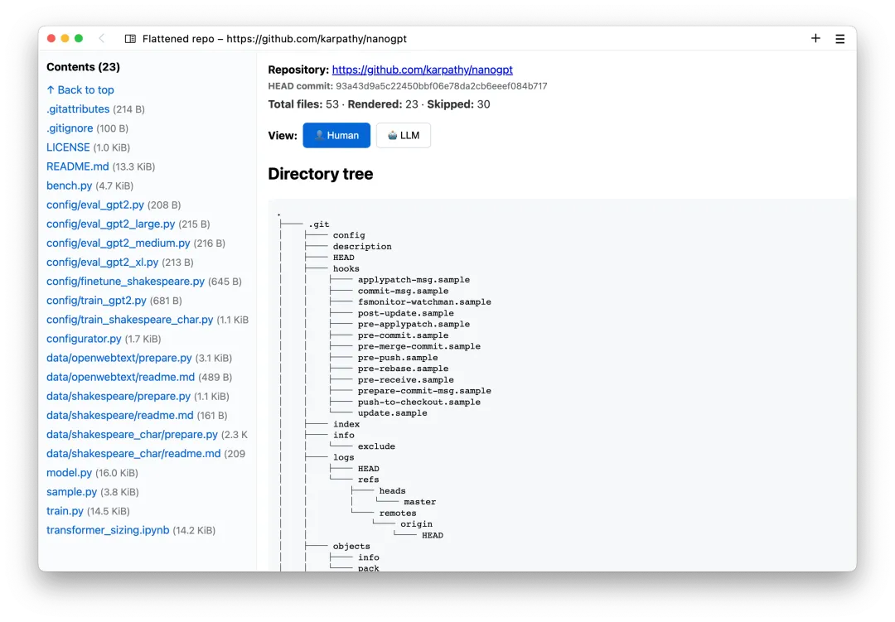

## [Publican](https://github.com/craigbuckler/publican)

StaticSearch是一款专为静态网站设计的客户端JavaScript搜索引擎，它通过索引网站内容生成JSON和JavaScript数据文件，实现高效的搜索功能。该引擎不仅提供了易于集成的Web组件，还支持模块化和API接口，以满足更个性化的定制需求

地址：https://github.com/craigbuckler/publican

## [Supabase](https://supabase.com/)

Supabase 不仅提供了数据库服务，也是一个全功能的后端服务平台。通过 Supabase，我们不再受限于传统的前后端分离模式，无需编写复杂的后端逻辑，可以直接在前端代码中进行数据库操作。

地址：https://supabase.com/

## [color-thief](https://github.com/lokesh/color-thief)

Color Thief 是一个 JavaScript 库，用于从图片中提取主色。

地址：https://github.com/lokesh/color-thief

## [Oxygen](https://oxygent.jd.com/)

OxyGent 是一个开源框架，将工具、模型、智能体统一为可插拔的原子算子——Oxy。专为开发者设计，OxyGent 让你像搭乐高一样构建灵活的多智能体系统，极致可扩展，每一步决策全链路可追溯。从构建、推理到持续进化，OxyGent 打造了一个闭环智能体流水线——无缝集成 Oxy，弹性扩展，协同创新，驱动 AI 生态无限可能。

地址：https://oxygent.jd.com/

## [Design Studio](https://github.com/Tiledesk/design-studio)

Tiledesk 是一个开源的无代码开发平台，用于创建聊天机器人和对话式应用

地址：https://github.com/Tiledesk/design-studio

## [jenv](https://github.com/jenv/jenv)

Manage your Java environment

地址：https://github.com/jenv/jenv

## [Montage](https://github.com/MatijaNovosel/montage)

montage 是一个轻量级、跨平台的视频剪辑编辑器，适合需要快速进行视频剪辑的用户。它结合了 Tauri 的高性能和 Rust 的后端处理能力，提供了一个简单易用的界面和基本的剪辑功能。

地址：https://github.com/MatijaNovosel/montage

## [EzBookkeeping](https://github.com/mayswind/ezbookkeeping)

ezbookkeeping：轻松自托管你的个人财务数据。这是一款免费、轻量、可自托管的个人记账应用，采用 Go+Vue 构建。它界面简洁易用、功能丰富，支持二级账户（个人/家庭）、收支分类、交易图片附件、定期收支自动记账等功能。借助 PWA 技术，可一键添加到手机主屏幕，体验媲美原生 App

地址：http://github.com/mayswind/ezbookkeeping

## [k3sup](https://github.com/alexellis/k3sup)

k3sup：一键快速部署 K8s 集群。这是一款通过 SSH 快速部署 K3s（轻量级 Kubernetes）集群的工具。它集成了 SSH 自动化部署和 K3s，支持一条命令完成集群的搭建与管理，适用于云服务器、树莓派、虚拟机等多种环境。

地址：https://github.com/alexellis/k3sup

## [IPED](https://github.com/sepinf-inc/IPED)

IPED：开源的数字取证工具。该项目是专为处理和分析数字证据而设计的数据取证工具，采用 Java 语言开发。支持根据文件系统时间戳、EXIF 信息、邮件收发时间、聊天记录等多维度生成可视化时间线，以及人脸识别、全文检索和生成报告等功能。

地址：https://github.com/sepinf-inc/IPED

## [ConvertX](https://github.com/C4illin/ConvertX)

ConvertX：自托管的在线文件转换工具。这是一个开源的在线文件格式转换工具，支持超过 1000 种主流文档、图片、音视频等多类型文件格式，不依赖第三方服务。它即装即用、操作便捷，并提供文件夹批量处理、实时进度条显示等功能。

地址：https://github.com/C4illin/ConvertX

## [Perfect Freehand](https://github.com/steveruizok/perfect-freehand)

perfect-freehand：生成自由手绘线条的 JavaScript 库。这是一个实现类似真实纸笔手绘效果的库，可根据用户绘图时的压力变化，自动生成自然且流畅的变宽线条，并支持 Web、Flutter 及 Figma 插件，轻松集成于多种应用场景。

地址：https://github.com/steveruizok/perfect-freehand

## [MusicRecognizer](https://github.com/aleksey-saenko/MusicRecognizer)

MusicRecognizer：开源的 Android 音乐识别应用。这是一款 Andriod 音乐识别应用，通过调用 AudD 和 ACRCloud 服务实现歌曲识别功能。用户可以轻松识别歌曲、获取详细信息，所有识别记录自动保存，可用于构建和管理个人音乐库

地址：https://github.com/aleksey-saenko/MusicRecognizer

## [rendergit](https://github.com/karpathy/rendergit)

rendergit：一键渲染 GitHub 仓库为静态网页的工具。该项目可以一键将 GitHub 仓库代码渲染为单页静态 HTML，提供便于阅读的 Human 模式，支持语法高亮、Markdown 渲染和侧边栏导航等功能。同时还支持 LLM 模式，方便将项目代码快速复制到 AI 工具作为上下文。

地址：https://github.com/karpathy/rendergit

