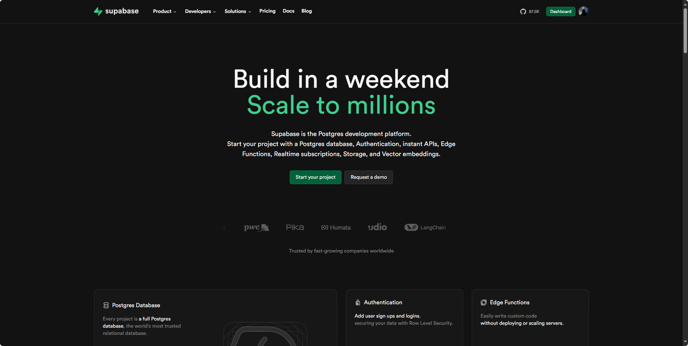
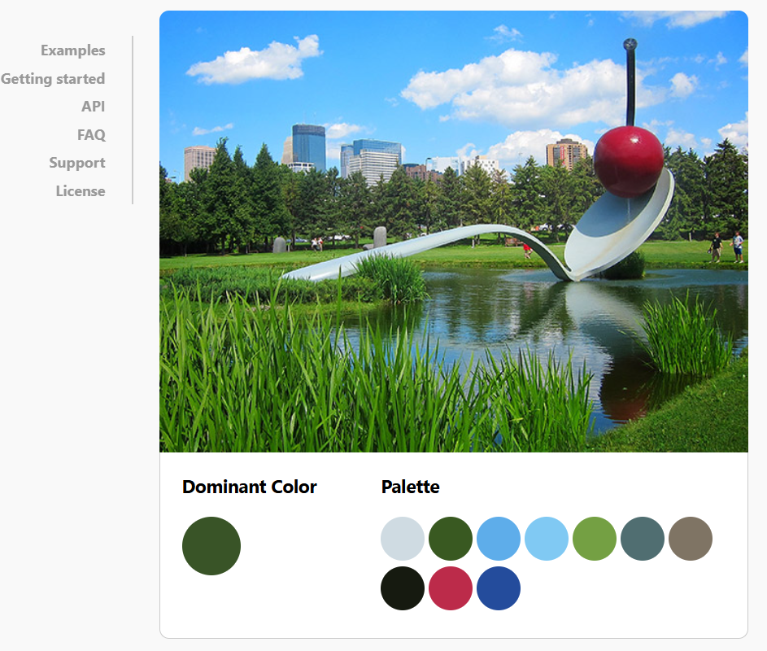
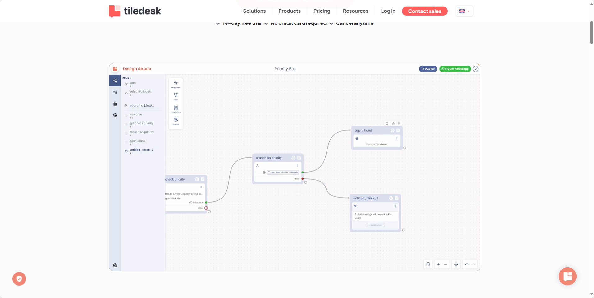
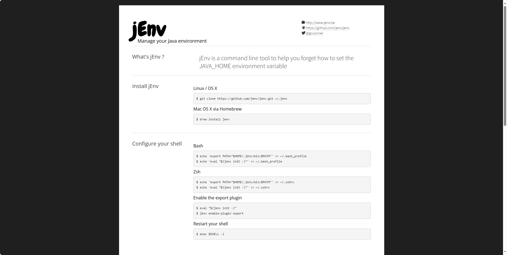

## [Publican](https://github.com/craigbuckler/publican)

StaticSearch是一款专为静态网站设计的客户端JavaScript搜索引擎，它通过索引网站内容生成JSON和JavaScript数据文件，实现高效的搜索功能。该引擎不仅提供了易于集成的Web组件，还支持模块化和API接口，以满足更个性化的定制需求

地址：https://github.com/craigbuckler/publican

## [Supabase](https://supabase.com/)

Supabase 不仅提供了数据库服务，也是一个全功能的后端服务平台。通过 Supabase，我们不再受限于传统的前后端分离模式，无需编写复杂的后端逻辑，可以直接在前端代码中进行数据库操作。

地址：https://supabase.com/

## [color-thief](https://github.com/lokesh/color-thief)

Color Thief 是一个 JavaScript 库，用于从图片中提取主色。

地址：https://github.com/lokesh/color-thief

## [Oxygen](https://oxygent.jd.com/)

OxyGent 是一个开源框架，将工具、模型、智能体统一为可插拔的原子算子——Oxy。专为开发者设计，OxyGent 让你像搭乐高一样构建灵活的多智能体系统，极致可扩展，每一步决策全链路可追溯。从构建、推理到持续进化，OxyGent 打造了一个闭环智能体流水线——无缝集成 Oxy，弹性扩展，协同创新，驱动 AI 生态无限可能。

地址：https://oxygent.jd.com/

## [Design Studio](https://github.com/Tiledesk/design-studio)

Tiledesk 是一个开源的无代码开发平台，用于创建聊天机器人和对话式应用

地址：https://github.com/Tiledesk/design-studio

## [jenv](https://github.com/jenv/jenv)

Manage your Java environment

地址：https://github.com/jenv/jenv