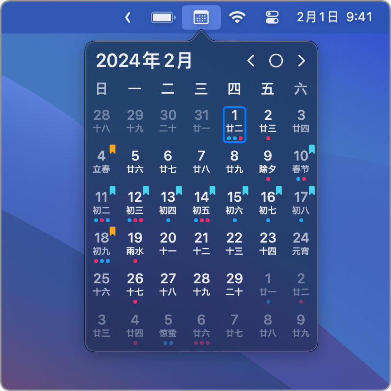
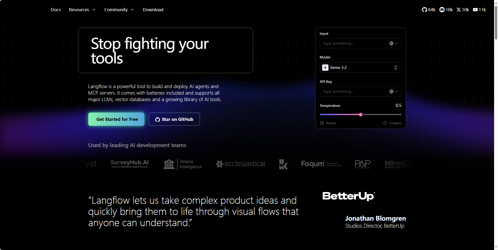
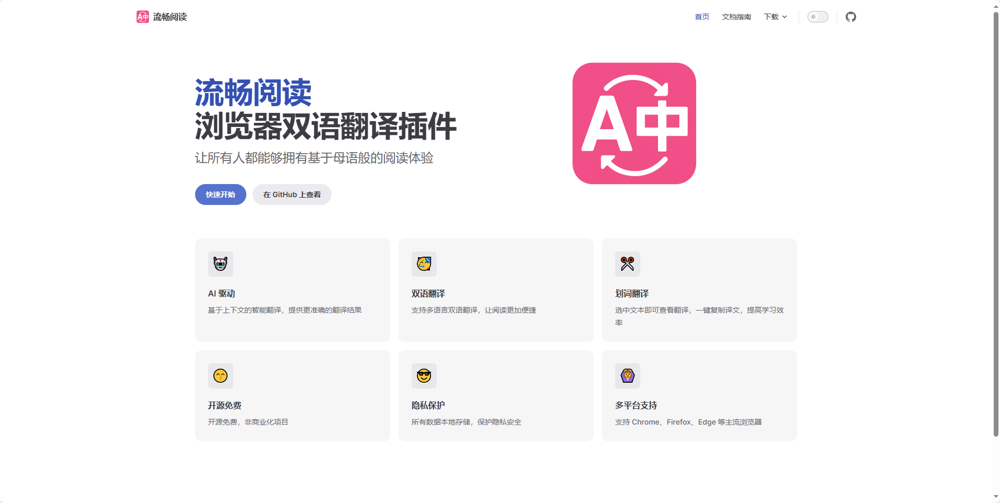
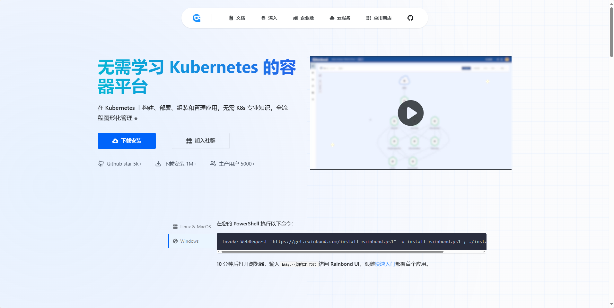

## [Doxx](https://github.com/bgreenwell/doxx)

doxx：终端里的 Word 文档阅读器。这是一款用 Rust 开发的终端 Word 文档查看工具，可在命令行中快速渲染 .docx 文件，保留格式、表格和颜色效果。它提供交互式界面，支持全文搜索、图片显示、多格式导出等功能。

地址：https://github.com/bgreenwell/doxx

## [LunarBar](https://github.com/LunarBar-app/LunarBar)

LunarBar：极简的 Mac 菜单栏日历。这是一款专为 macOS 设计的菜单栏日历工具，支持农历、节日、节气和提醒等功能。

地址：https://github.com/LunarBar-app/LunarBar

## [langflow](https://github.com/langflow-ai/langflow)

langflow：可视化 AI 工作流构建平台。这是一款面向开发者和企业用户的开源 AI 智能体与工作流构建平台。它将 LangChain 的核心能力（链、工具、记忆、向量存储等）封装成可复用组件，并结合 React Flow 实现可视化流程编辑，用户无需编写代码即可快速设计、调试并部署复杂的 AI 工作流。

地址：https://github.com/langflow-ai/langflow

## [asm-lessons](https://github.com/FFmpeg/asm-lessons)

asm-lessons：FFmpeg 社区音视频汇编实战教程。该项目是由 FFmpeg 社区开源的汇编语言学习资料和代码示例，结合 FFmpeg 讲解汇编在音视频处理中的实际应用，帮助学习者深入理解 FFmpeg 的底层架构与性能优化技巧。

地址：https://github.com/FFmpeg/asm-lessons

## [FluentRead](https://github.com/Bistutu/FluentRead)

开源的沉浸式翻译，一款革命性的浏览器翻译插件，让所有人都能够拥有母语般的阅读体验。

地址: https://github.com/Bistutu/FluentRead

## [rainbond](https://github.com/goodrain/rainbond)

Rainbond 是一个基于 Kubernetes 的云原生应用管理平台，它简化了应用容器化、部署和管理的所有流程。你不用懂 K8s 的复杂知识，只需通过图形化界面，就能完成应用从开发到上线的全生命周期管理！就像玩积木一样，开发者几分钟内就能“搭”出一个强大的微服务系统！

地址：https://github.com/goodrain/rainbond