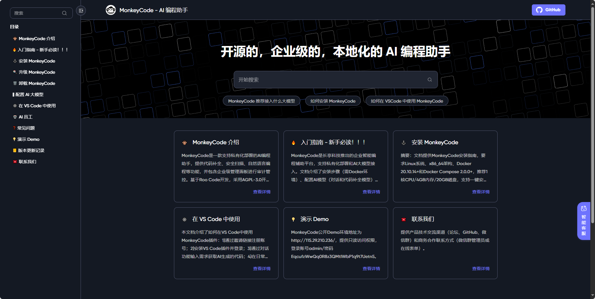

## [plutoprint](https://github.com/plutoprint/plutoprint)

lutoPrint 是一个轻量级且易于使用的 Python 库，用于将 HTML 或 XML 内容渲染为高质量的 PDF 和图像文件，基于 PlutoBook 的渲染引擎构建

地址：https://github.com/plutoprint/plutoprint

## [copyparty](https://github.com/9001/copyparty)

Portable file server with accelerated resumable uploads, dedup, WebDAV, FTP, TFTP, zeroconf, media indexer, thumbnails++ all in one file, no deps

地址：https://github.com/9001/copyparty

## [MonkeyCode](https://github.com/chaitin/MonkeyCode)

企业级 AI 编程助手，支持私有化离线部署，兼容第三方及本地化大模型，具备企业级管理面板，具备代码安全功能。

地址：https://github.com/chaitin/MonkeyCode

## [awesome-public-datasets](https://github.com/awesomedata/awesome-public-datasets)

这个项目叫做“Awesome Public Datatasets”，是一个精心整理的高质量公开数据集集合。它按主题分类，涵盖了农业、生物学、气候、经济、医疗、社会科学等众多领域，帮你轻松找到需要的数据。这些数据来自博客、用户分享和学术研究，大部分可以免费使用。如果你在做数据分析、机器学习或者学术研究，这个仓库会是个非常实用的资源宝库。

地址：https://github.com/awesomedata/awesome-public-datasets

## [Edge Security](https://www.edge-security.com/)

theHarvester 是一款专门用于网络安全侦察的开源情报（OSINT）收集工具。它可以帮助安全研究人员或渗透测试人员快速查找与目标域名相关的公开信息，比如电子邮件地址、子域名、IP 地址和主机信息。通过集成多个搜索引擎和数据源，它能够自动化地从互联网中搜集这些信息，为后续的安全评估提供基础数据支持。简单来说，它就像是一个“数字侦探”，帮你发现企业在网络上可能暴露的敏感信息。

地址：https://www.edge-security.com/

## [triplit](https://github.com/aspen-cloud/triplit)

Triplit 是一个开源的实时同步数据库,可以在服务器和浏览器之间进行实时同步。它提供了一个实时同步的数据存储,可以作为一个TypeScript包集成到您的应用程序中。Triplit 负责在服务器上存储您的数据,并智能地将查询同步到您的客户端。这种系统被称为"全栈数据库"。

地址：https://github.com/aspen-cloud/triplit

