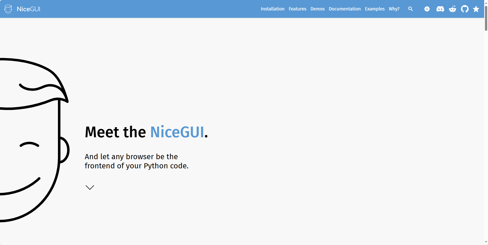
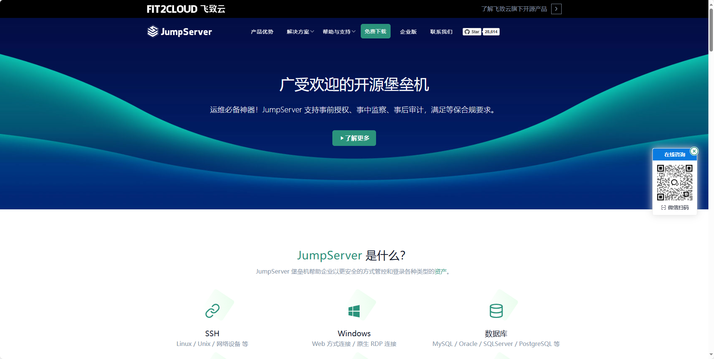
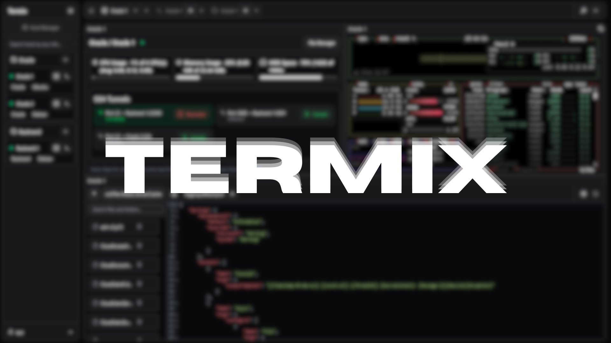
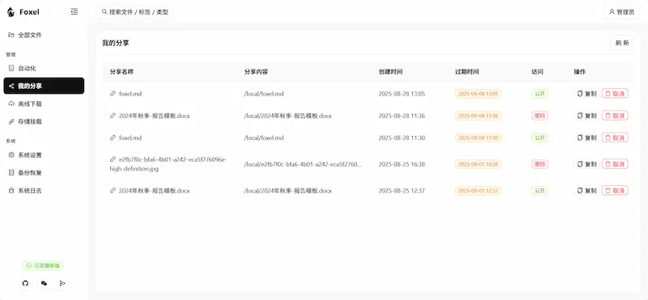
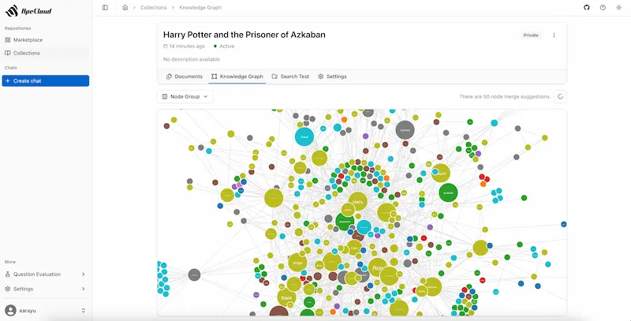
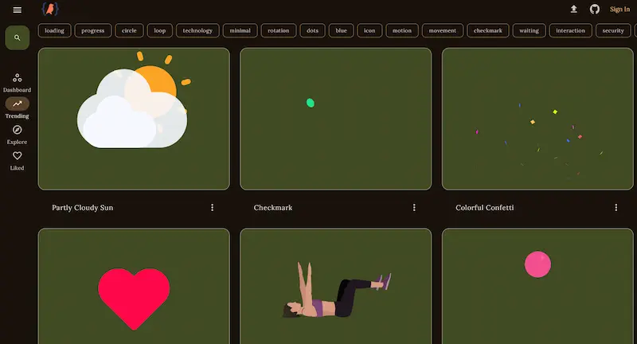

## [awesome-flutter-plugins](https://github.com/jahnli/awesome-flutter-plugins)

🔥🔥 收集好用的Flutter插件以便更效率的开发

地址：https://github.com/jahnli/awesome-flutter-plugins?tab=readme-ov-file

## [NiceGUI](https://nicegui.io/)

NiceGUI是一个基于Python的轻量级Web-UI框架，其设计理念是简洁与易用。它允许开发者使用纯Python代码快速创建具有丰富交互功能的Web应用程序，而无需编写任何HTML、CSS或JavaScript代码。

地址：https://nicegui.io/

## [Jumpserver](https://github.com/jumpserver/jumpserver)

JumpServer 是一个开源的特权访问管理 (PAM) 平台，提供 DevOps 和 IT 团队按需安全访问 SSH、RDP、Kubernetes、数据库和 RemoteApp 端点的功能，均可通过网页浏览器进行访问。

地址：https://github.com/jumpserver/jumpserver

## [Termix](https://github.com/LukeGus/Termix)

Termix 是一个开源的、可自托管的服务器管理平台，让你通过网页就能轻松管理远程服务器。它内置了 SSH 终端操作、文件编辑和端口转发等功能，还支持多标签页和分屏操作，界面简洁直观，适合开发者或运维人员在一个统一的 Web 界面中高效管理多个服务器。

地址：https://github.com/LukeGus/Termix

## [ML-From-Scratch](https://github.com/eriklindernoren/ML-From-Scratch)

这是一个用Python从零实现机器学习算法的项目，主要使用NumPy来构建各种模型。它不追求最高性能，而是通过简洁易懂的代码展示机器学习原理，涵盖从线性回归到深度学习的核心内容。项目包含监督学习、无监督学习、强化学习等多种算法实现，适合想深入理解机器学习底层原理的开发者学习。

地址：https://github.com/eriklindernoren/ML-From-Scratch

## [Foxel](https://github.com/DrizzleTime/Foxel)

开源的私有云盘，支持 AI 语义搜索。

地址：https://github.com/DrizzleTime/Foxel

## [StoryMotion](https://storymotion.video/)

一个基于 Web 的动画编辑器，用来制作嵌入网页的 Excalidraw 手绘风格动画，很适合用来演示。

地址：https://storymotion.video/

## [ApeRAG](https://github.com/apecloud/ApeRAG)

开源的 RAG（检索增强生成）平台，将图谱 RAG、向量搜索和全文搜索与 AI 代理相结合。

地址：https://github.com/apecloud/ApeRAG

## [OpenAnimationApp](https://github.com/orispok/OpenAnimationApp)

这个仓库专门收集各种基于 Lottie 的动画。

地址：https://github.com/orispok/OpenAnimationApp