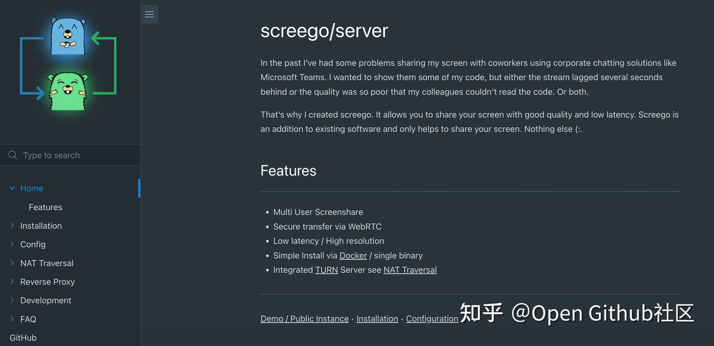
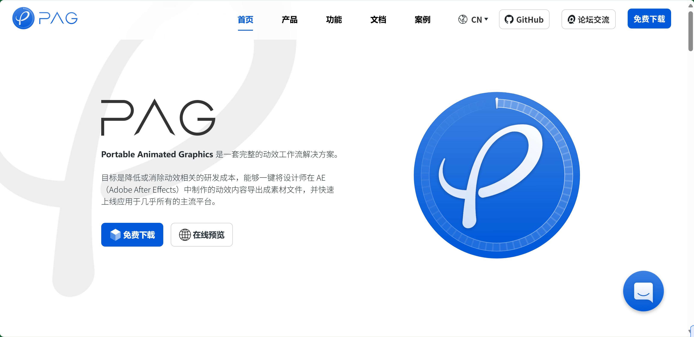
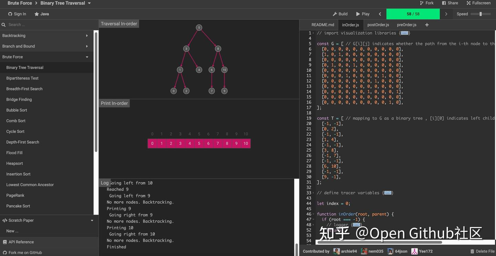
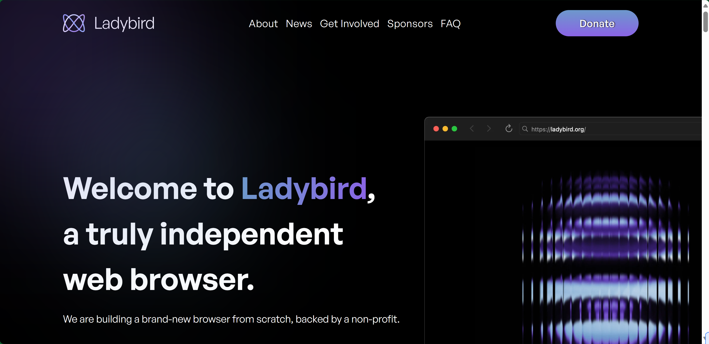
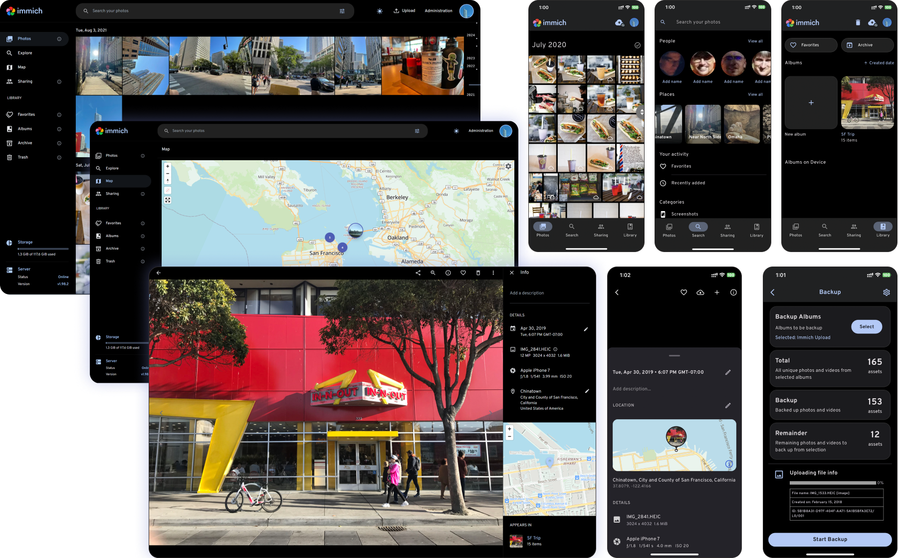

## [server](https://github.com/screego/server)

多人屏幕共享服务器

地址：https://github.com/screego/server

## [PAG](https://pag.io/en/)

libpag 是 PAG (Portable Animated Graphics) 动效文件的渲染 SDK，目前已覆盖几乎所有的主流平台，包括：iOS, Android, OpenHarmony, macOS, Windows, Linux, 以及 Web 端。

PAG 方案是一套完善的动效工作流。提供从 AE（Adobe After Effects）导出插件，到桌面预览工具 PAGViewer，再到各端的跨平台渲染 SDK。

目标是降低或消除动效研发相关的成本，打通设计师创作到素材交付上线的极简流程，不断输出运行时可编辑的高质量动效内容。

地址：https://pag.io/en/

## [data-engineer-handbook](https://github.com/DataExpert-io/data-engineer-handbook?tab=readme-ov-file)

This is a repo with links to everything you'd ever want to learn about data engineering

地址：https://github.com/DataExpert-io/data-engineer-handbook?tab=readme-ov-file

## [algorithm-visualizer](https://github.com/algorithm-visualizer/algorithm-visualizer)

一个交互式在线平台，旨在通过可视化让算法变得生动易懂。无论你是学生、教师还是专业人士，我们的平台都提供了一种引人入胜的方式来探索和理解各种算法。

地址：https://github.com/algorithm-visualizer/algorithm-visualizer

## [ladybird](https://github.com/LadybirdBrowser/ladybird)

一个用现代 C++ 编写的浏览器内核项目，目标是构建简洁可维护的网页渲染引擎，适合系统开发者学习研究。

地址：https://github.com/LadybirdBrowser/ladybird

## [immich](https://github.com/immich-app/immich)

家庭照片系统

地址：https://github.com/immich-app/immich