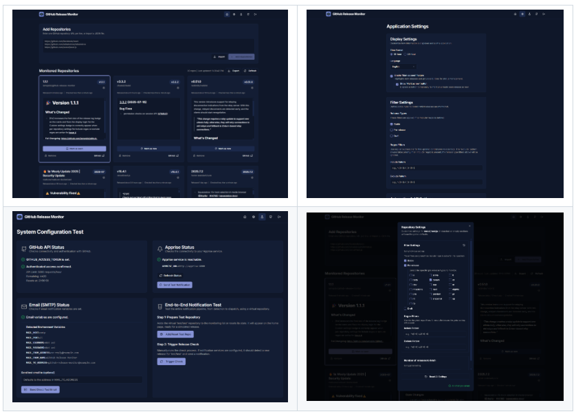
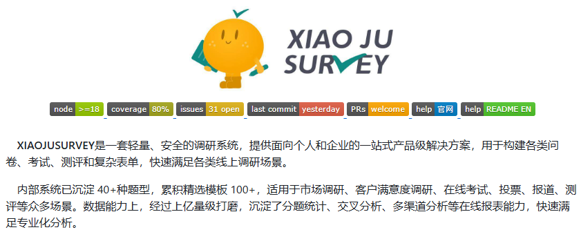
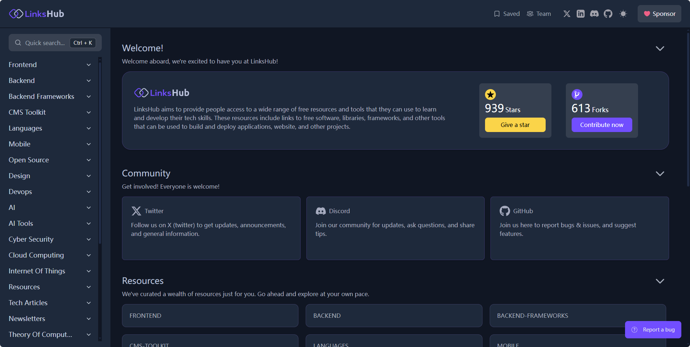
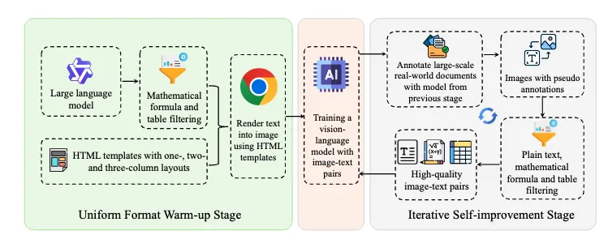

## [GitHub Release Monitor](https://github.com/iamspido/github-release-monitor)

GitHub Release Monitor 是一个功能强大、可自托管的工具，可自动监控 GitHub 开源项目发布并通过电子邮件、Apprise 等实时消息通知

地址：https://github.com/iamspido/github-release-monitor

## [Xiaoju Survey](https://github.com/didi/xiaoju-survey)

XIAOJUSURVEY（小桔调研）是一款轻量、安全的开源调研系统，提供面向个人和企业的一站式解决方案，帮助用户快速构建各类问卷、考试、测评和复杂表单，满足多样化的线上调研需求。

地址：https://github.com/didi/xiaoju-survey

## [LinksHub](https://github.com/rupali-codes/LinksHub)

LinksHub 是一个由社区创建和维护的资源中心,旨在为开发人员提供各种免费的软件、库、框架和工具等资源,帮助他们在工作中使用。

地址：https://github.com/rupali-codes/LinksHub

## [JVS Knowledge UI](https://gitee.com/software-minister/jvs-knowledge-ui)

无忧·企业文档=企业级知识库+在线编辑工具集+企业搜索引擎+内容展示平台

地址：https://gitee.com/software-minister/jvs-knowledge-ui

## [POINTS-Reader](https://github.com/Tencent/POINTS-Reader)

在端到端方案中，POINTS-Reader提出了一套高度可扩展的数据生成方案，包含两个核心阶段：统一格式预热阶段(Uniform Format Warm-up Stage)和迭代自我改进阶段(Iterative Self-improvement Stage)

地址：https://github.com/Tencent/POINTS-Reader