## [Eyecons](https://eyecons.dev/)

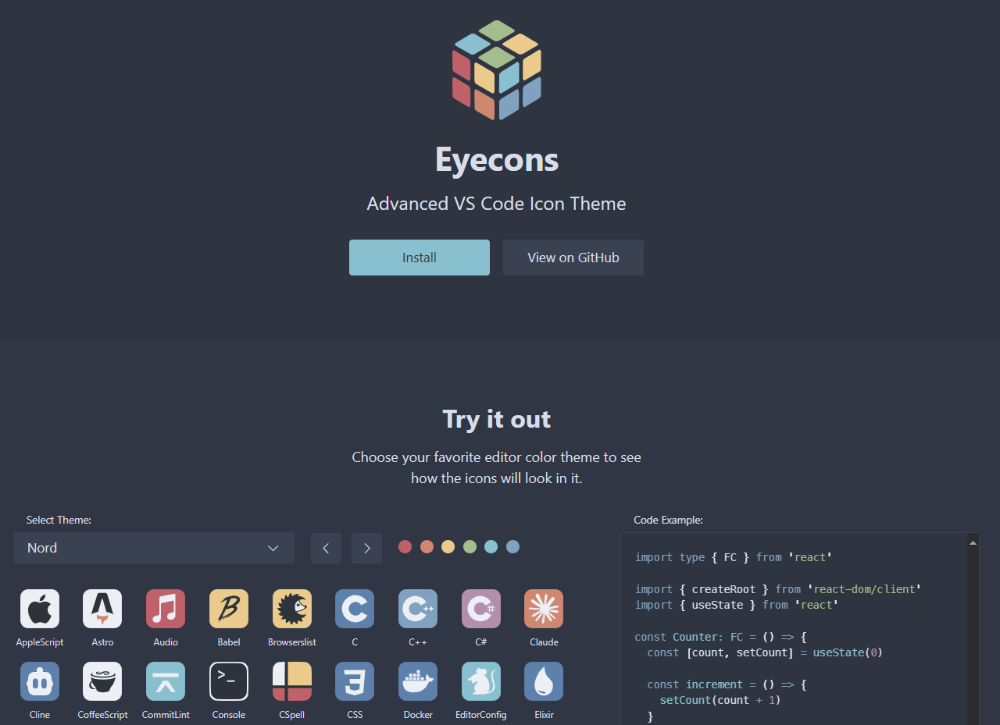

🎨 Eyecons 是一个 VS Code 图标主题，它会自动调整图标的颜色以适应编辑器的主题 

地址：https://eyecons.dev/

## [Typescript Result](https://github.com/everweij/typescript-result)

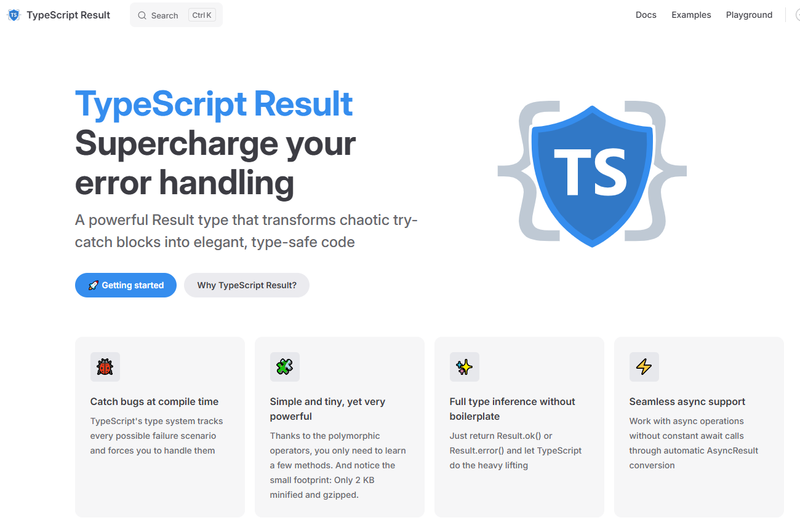

TypeScript Result 将类型带入其中，以帮助您以更类型安全的方式处理错误。

地址：https://github.com/everweij/typescript-result

## [Tricolore.js](https://riatelab.github.io/tricolore.js/)

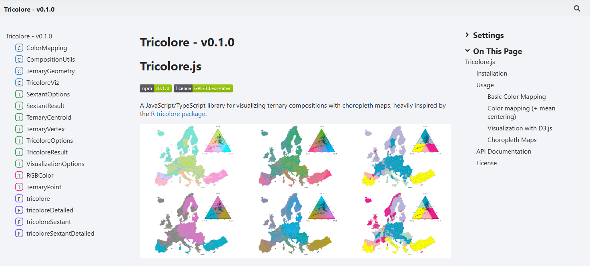

使用等值线图可视化三元构图

地址：https://riatelab.github.io/tricolore.js/

## [Andromeda](https://github.com/tryandromeda/andromeda)

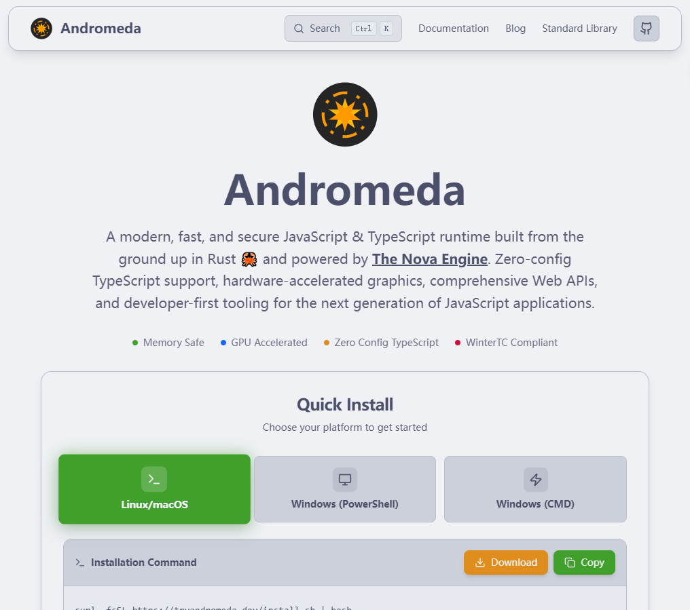

Andromeda： The Newest JavaScript Runtime on the Block — 一个围绕 Rust 驱动的 Nova 引擎构建的新 JavaScript 和 TypeScript 运行时。现在还处于早期阶段，但它们承诺很多：原生单文件编译、GPU 加速的 2D Canvas API、低运行时开销、与 Rust 的互作、内存安全、WinterTC 兼容性和跨平台支持。

地址：https://github.com/tryandromeda/andromeda

## [ts-to-zod](https://github.com/fabien0102/ts-to-zod)

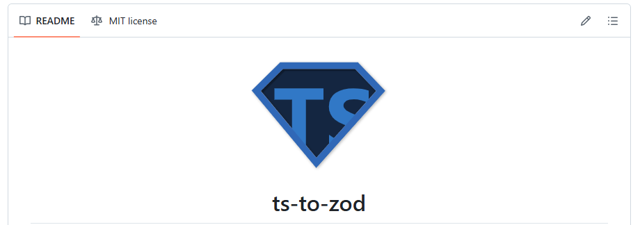

从 TypeScript 类型/接口生成 Zod 模式

地址：https://github.com/fabien0102/ts-to-zod

## [uuid](https://github.com/uuidjs/uuid)

生成符合RFC9562的 UUID

地址： https://github.com/uuidjs/uuid

## [Spectral](https://github.com/microsoft/Spectral)

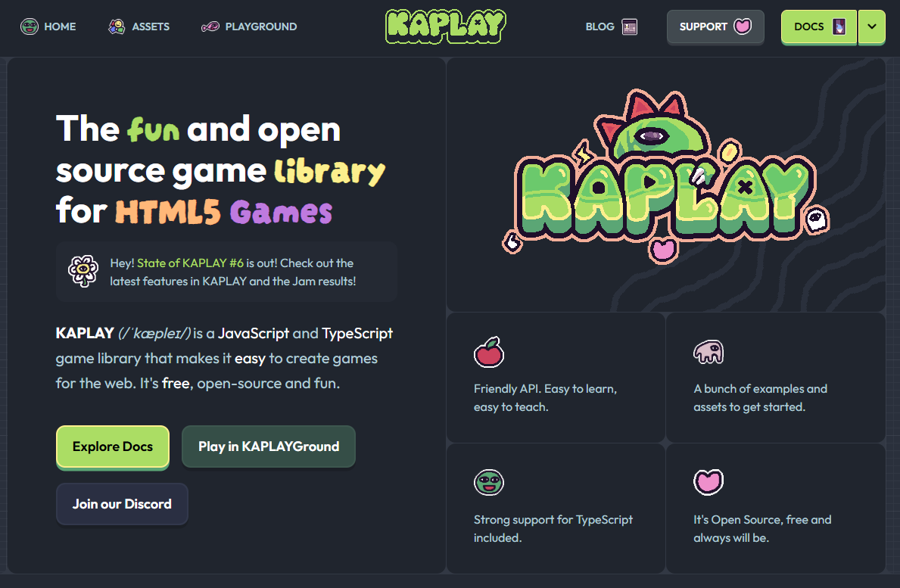

The fun and open source game library for HTML5 Games

地址：https://kaplayjs.com/

## [CornerstoneJS](https://www.cornerstonejs.org/)

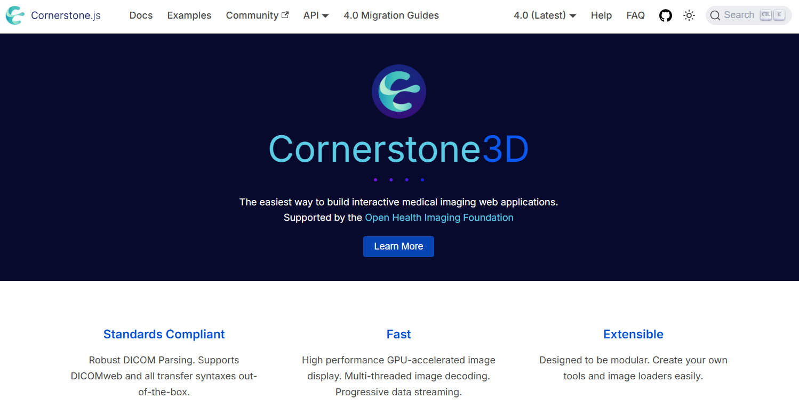

Cornerstone3D 4.0：构建基于 Web 的医学成像应用程序 — 一组 JavaScript 库，用于构建诸如 3D CT 扫描查看器、PET-CT 扫描查看器等内容。这个项目有很多内容，还有许多教程。

地址： https://www.cornerstonejs.org/

## [Obs.js](https://csswizardry.com/Obs.js/demo/)

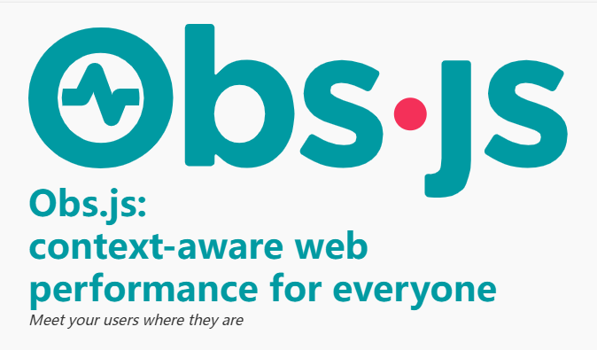

使用 Navigator 和 Battery API 获取有关用户连接强度和电池状态的上下文信息，以便您可以根据环境调整网站/应用或收集数据进行分析。

地址：https://csswizardry.com/Obs.js/demo/

## [RxDB](https://github.com/pubkey/rxdb)

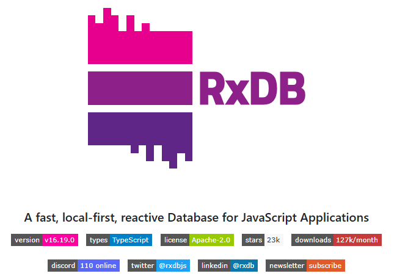

用于 JS 应用程序的离线优先反应式数据库。

地址：https://github.com/pubkey/rxdb

## [Seventeen](https://musicforprogramming.net/seventyfive)

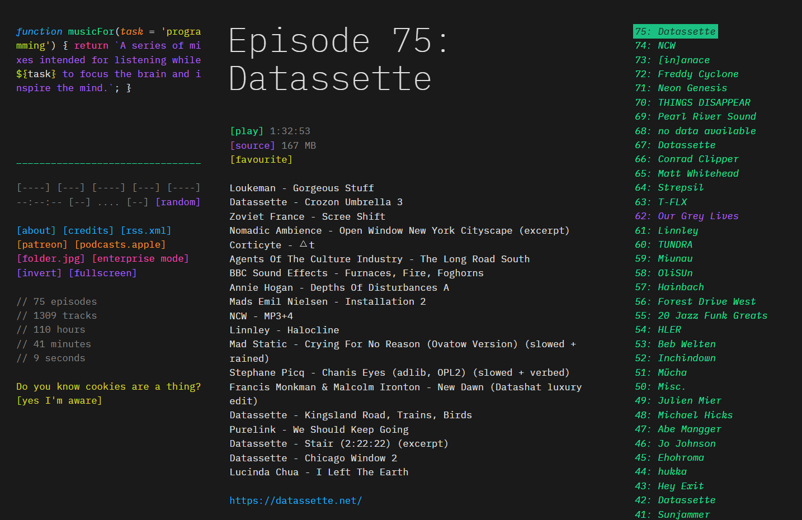

炫酷的纯文字网站

地址：https://musicforprogramming.net/seventyfive

## [Retire.js](https://github.com/RetireJS/retire.js)

一种安全扫描工具，用于检测项目中存在已知漏洞的 JavaScript 库的使用情况。

地址：https://github.com/RetireJS/retire.js

## [Fuite](https://github.com/nolanlawson/fuite)

用于在 Web 应用程序中查找内存泄漏的工具。

地址：https://github.com/nolanlawson/fuite

## [Awesome Index](https://awesomeindex.dev/)

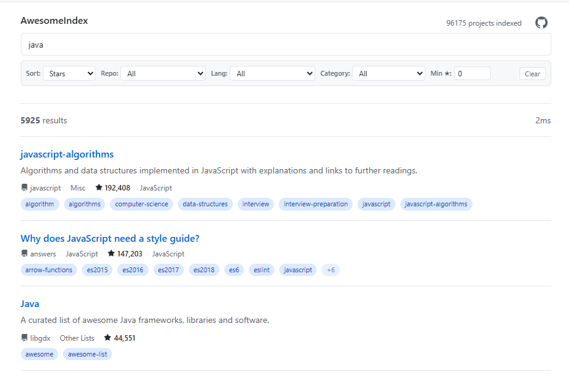

提供了一种一次搜索数百个“很棒”风格的精选链接列表的方法。这个想法有很大的潜力，因为这些列表塞满了有用的资源。

地址：https://awesomeindex.dev/

## [JavaScript Weekly](https://javascriptweekly.com/)

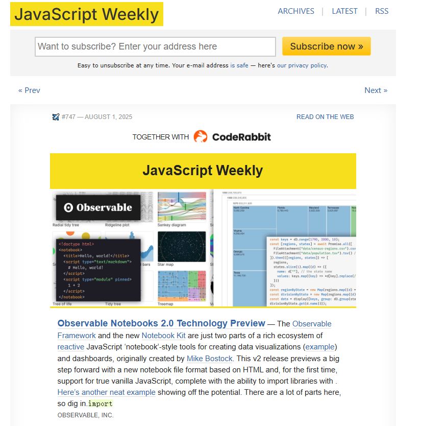

JavaScript Weekly 是一个每周发布的 JavaScript 相关新闻、文章、库和工具的电子邮件列表。

地址：https://javascriptweekly.com/

## [Dependency Cruiser](https://github.com/sverweij/dependency-cruiser)

Dependency Cruiser 17：可视化依赖关系的方法 — 如果您想查看输出，有一整页适用于流行的真实世界项目的图表，包括 Chalk、Yarn 和 React。

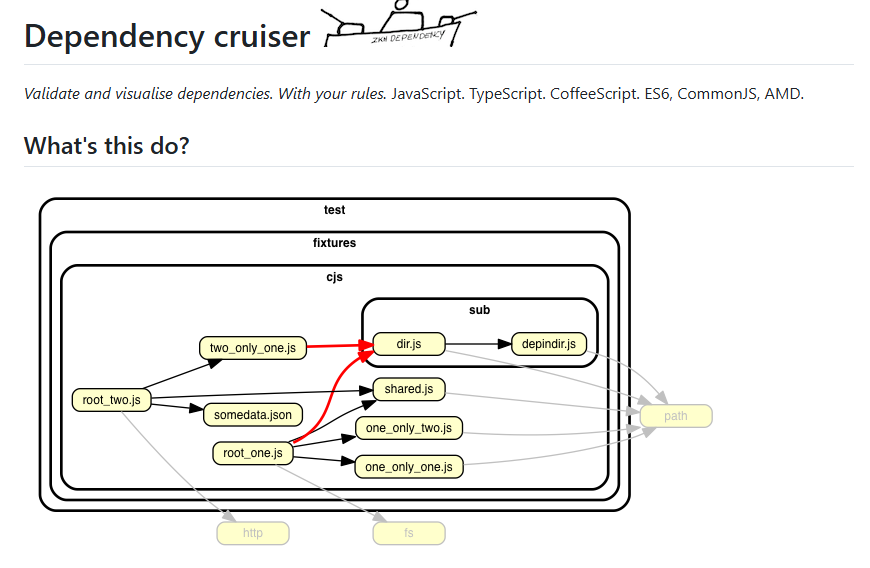

地址：https://github.com/sverweij/dependency-cruiser

## [TanStack DB](https://tanstack.com/db)

用于 TanStack 查询的嵌入式客户端数据库 — 团队 React 的数据库！TanStack DB 是一个嵌入式客户端数据库，它使用差异数据流来支持实时、关系查询、亚毫秒增量更新和乐观写入。

地址：https://tanstack.com/blog/tanstack-db-0.1-the-embedded-client-database-for-tanstack-query

