## [npmgraph](https://npmgraph.js.org/)

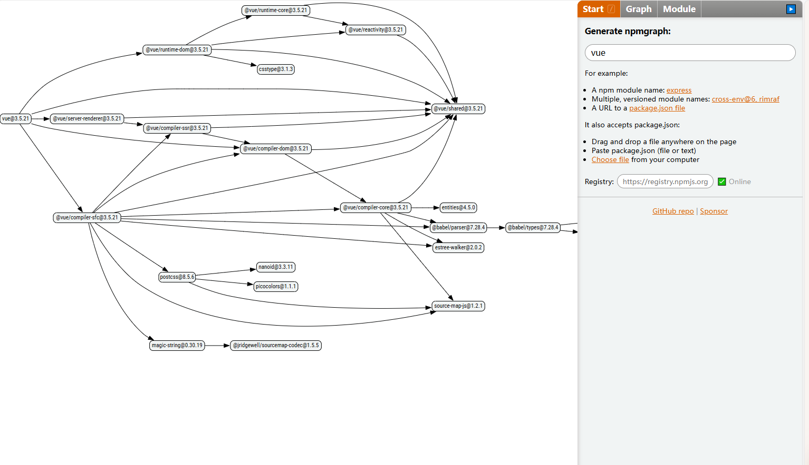

npmgraph：可视化 npm 模块依赖关系的工具 — 为这个基于 Web 的工具提供一个或多个 npm 包名称（甚至您的文件），您可以看到这些包的依赖关系图的可视化，包括它们相交的位置。

地址：https://npmgraph.js.org/

## [odyc.dev](https://odyc.dev/)

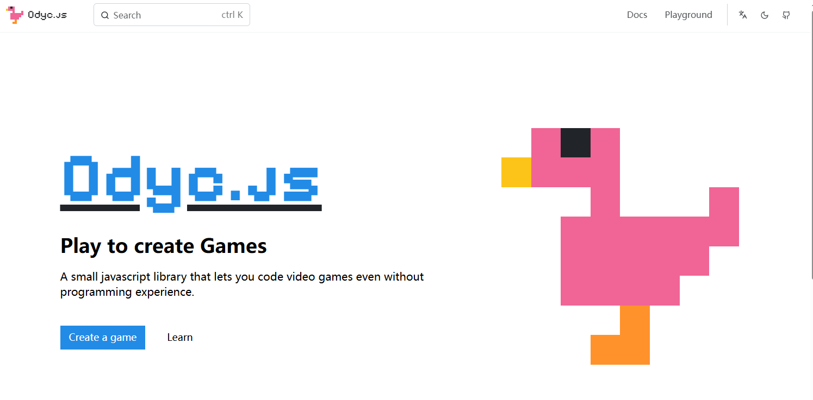

 Odyc.js：像素游戏/故事的 JS 库

地址：https://odyc.dev/

## [ink](https://github.com/vadimdemedes/ink)

使用 React 生成 CLI 应用。现在支持 React 19。

地址：https://github.com/vadimdemedes/ink

## [defuddle](https://github.com/kepano/defuddle)

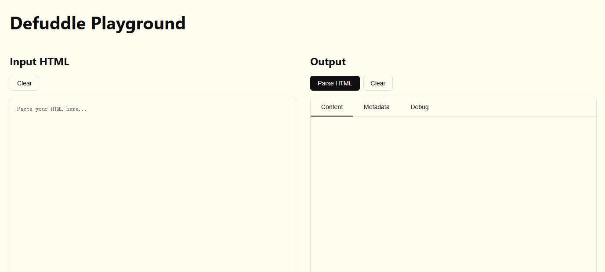

从网页中提取主要内容 — 从 HTML 中去除无关的混乱，以便只留下主要内容供您根据需要格式化或使用。本质上是 Mozilla 可读性背后思想的现代实现。如果您想尝试一下，有一个在线演示。

地址：https://github.com/kepano/defuddle

## [snapdom](https://github.com/zumerlab/snapdom)

将 DOM 节点捕获为图像 — 一种快速准确的 DOM 到图像捕获机制，可将任何 HTML 元素捕获为可缩放的 SVG 图像，保留样式、字体、背景图像等

地址：https://github.com/zumerlab/snapdom

## [cli](https://github.com/astracompiler/cli)

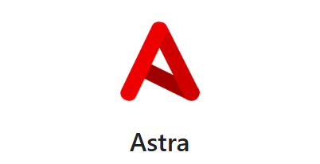

适用于 Windows 的新型 JavaScript-to-EXE 编译器 — 拥有“一种编译”JavaScript 应用程序的新方法，仅在 Windows 上提供单一可执行体验（目前）。

地址：https://github.com/astracompiler/cli

## [pdfslick](https://github.com/pdfslick/pdfslick)

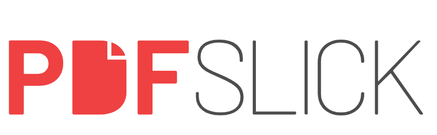

在 JS 应用程序中查看 PDF 文档并与之交互 — 适用于 React、Solid、Svelte 和 vanilla JS 应用程序的全功能 PDF 查看器。它建立在PDF.js之上，提供了广泛的功能，从简单的 PDF 查看到处理带有注释的多个大型文档。演示。v3.0 升级到 PDF.js v5，支持 ICC 配置文件、更好的 JPEG 2000 支持以及改进的大页面渲染

地址：https://github.com/pdfslick/pdfslick

## [pintura](https://pqina.nl/pintura/install/)

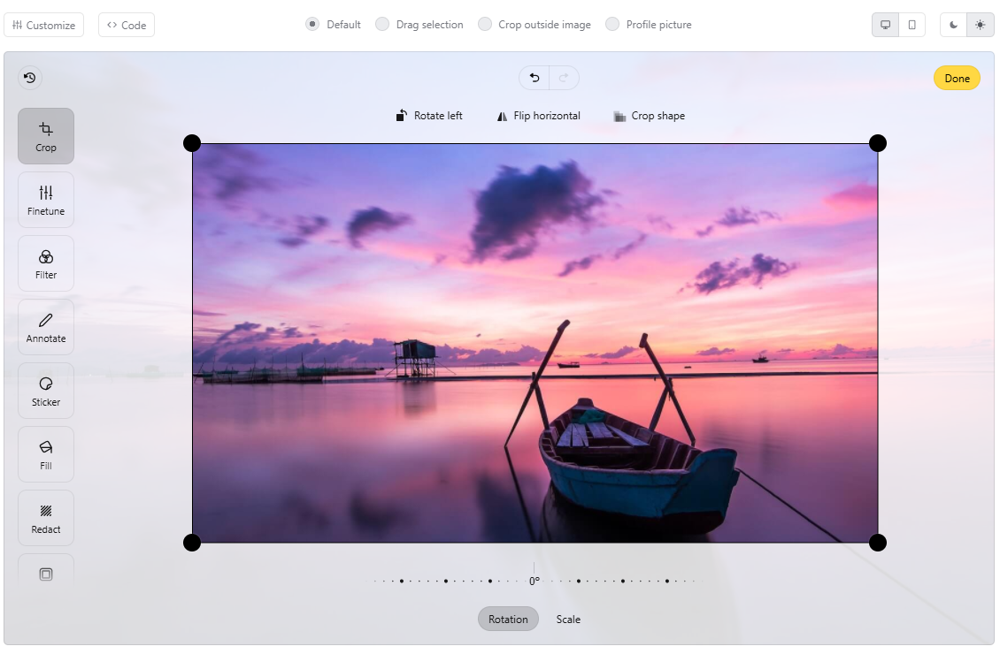

为您的 Web 应用程序提供即插即用图像编辑器 — 省去构建图像编辑器的麻烦。导入 pintura 模块，为其提供图像源，并立即获得裁剪、旋转、调整大小和注释等功能。需要帮助？支持可以满足您的需求

地址：https://pqina.nl/pintura/install/

## [animejs](https://animejs.com/)

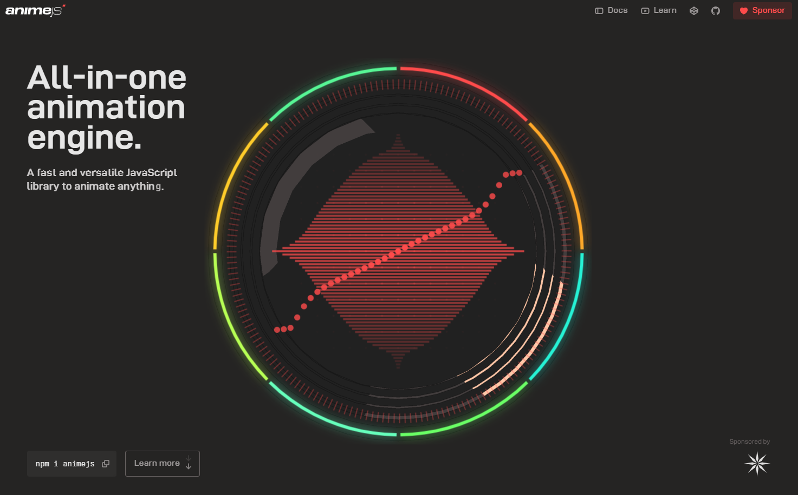

如果您厌倦了 Web 动画，也许Anime.js会让您胃口大开。这是对用于动画处理 CSS 属性、SVG、DOM 和 JS 对象的成熟库的重大升级。

地址：https://animejs.com/

## [uvcanvas](https://uvcanvas.com/)

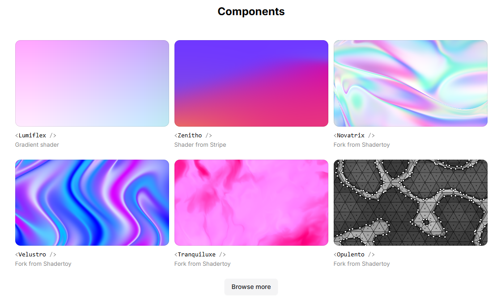

React 渲染精美的阴影画布

地址：https://uvcanvas.com/

## [danfojs](https://github.com/javascriptdata/danfojs)

受 Pandas 启发的 JavaScript 数据分析工具包

地址：https://github.com/javascriptdata/danfojs

## [fuzzball.js](https://github.com/javascriptdata/danfojs)

🔎 Fuzzball：模糊字符串匹配库 — 解决键入内容不完全符合预期的情况。有一个简洁的树主题基于 Web 的演示。

地址：https://github.com/nol13/fuzzball.js

## [BlockNote](https://github.com/blocknote/blocknote)

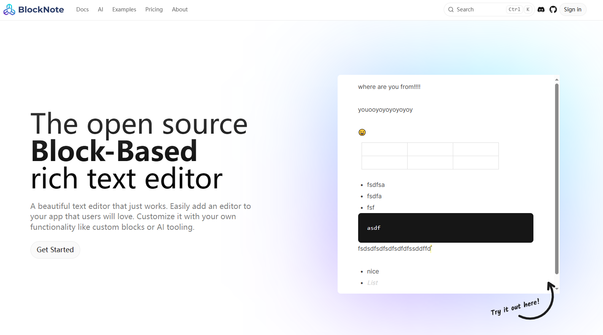

类型：基于 React 的块状富文本编辑器，风格类似 Notion

技术栈：构建于 Prosemirror 和 Tiptap 之上

特点：高度可扩展，适合嵌入现代 Web 应用

地址：https://www.blocknotejs.org/

## [Streamdown](https://github.com/streamdown/streamdown)

Streamdown：支持流媒体的嵌入式 react-markdown 替代品 — react-markdown 非常适合渲染 Markdown，但如果您必须处理实时流媒体内容（例如在 AI 上下文中），Vercel 的新项目可以提供您所需的功能。GitHub 存储库。

地址：https://streamdown.ai/

## [CSS Doodle](https://github.com/css-doodle/css-doodle)

用于使用 CSS 绘制图案的 Web 组件

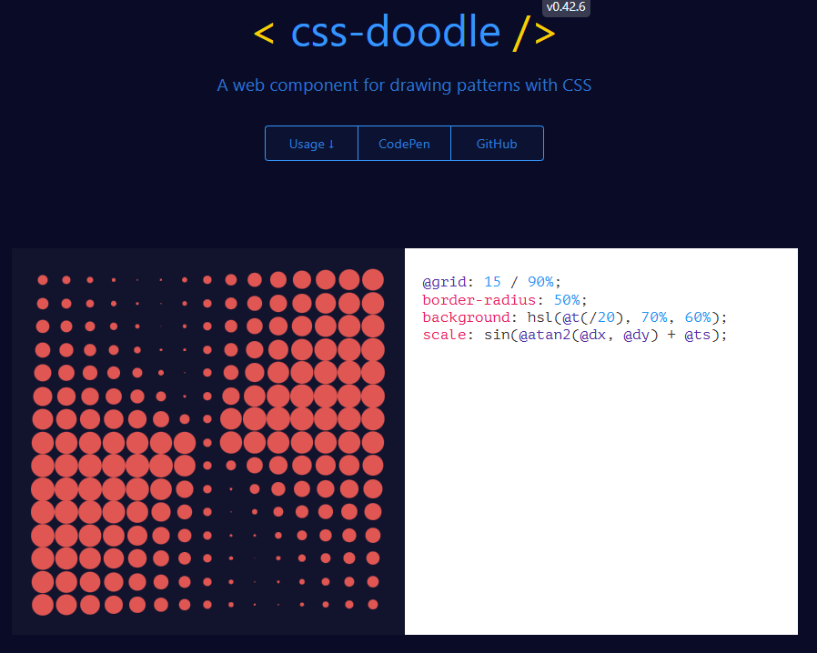

地址：https://css-doodle.com/

## [QuickJS](https://github.com/sebastianwessel/quickjs)

QuickJS Sandbox 2.0：在 QuickJS 支持的沙箱中执行 JS/TS — QuickJS 是由 Fabrice Bellard 构建的小型可嵌入 JavaScript 引擎，它扩展了它，使其可以轻松地在隔离的沙盒环境中运行代码，以及一些基本的 Node 模块支持和虚拟文件系统。GitHub 存储库。

地址：https://sebastianwessel.github.io/quickjs/

## [Mastra](https://mastra.ai/)

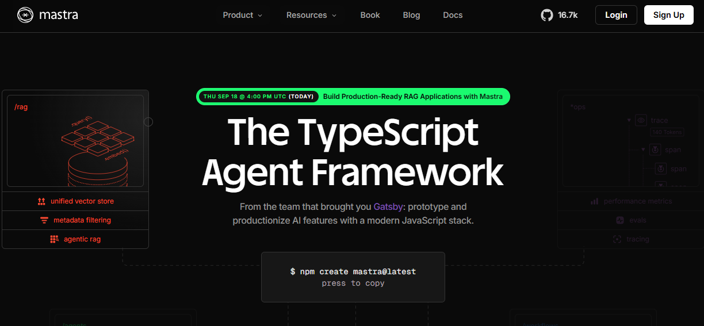

Gatsby 团队的 TypeScript AI 框架 — Gatsby React 框架背后的一些人提出了一种新方法来构建 LLM 驱动的代理，这些代理可以执行各种任务、使用知识库和保存内存。想想像 Next.js 这样的元框架，但适用于 AI 代理。GitHub 存储库。

地址：https://mastra.ai/