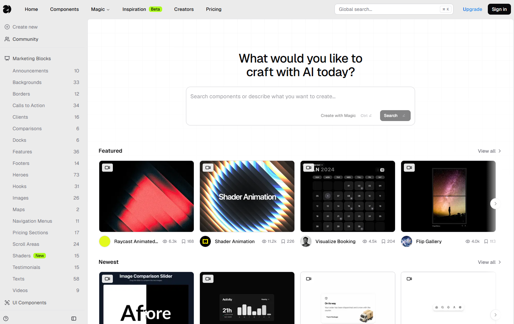
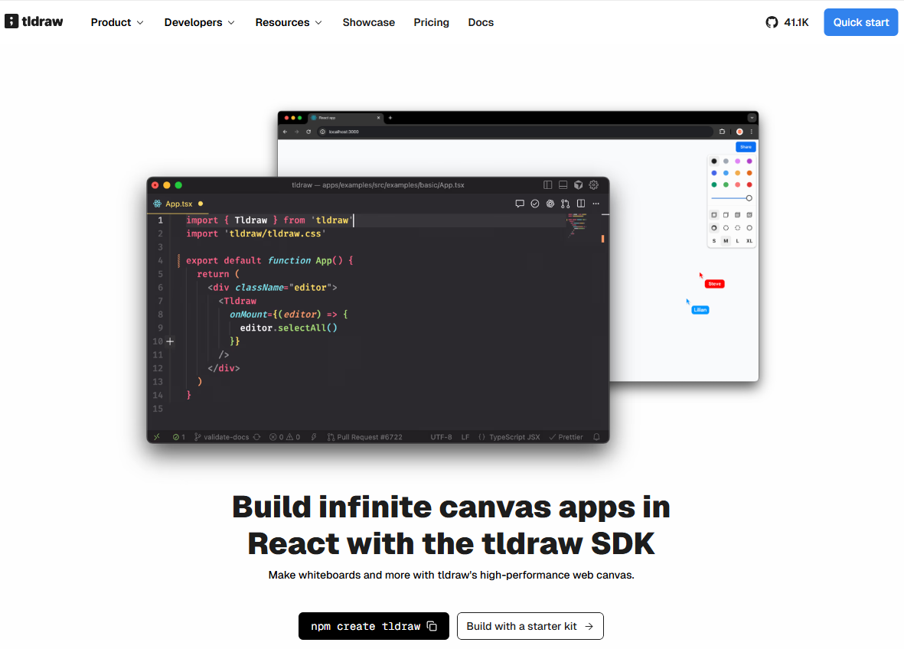
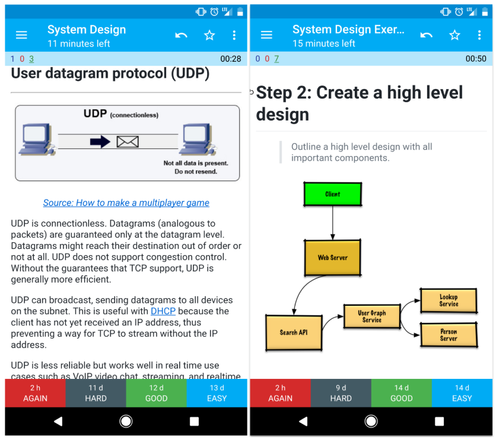
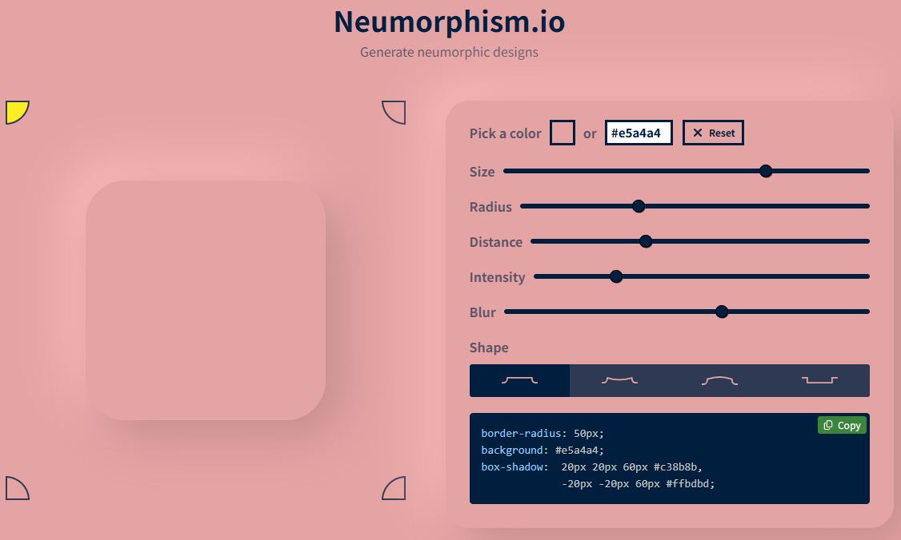
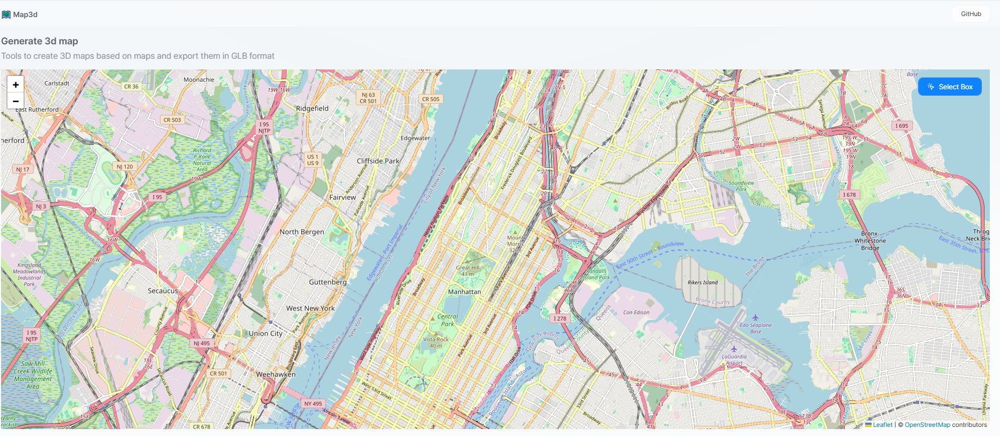
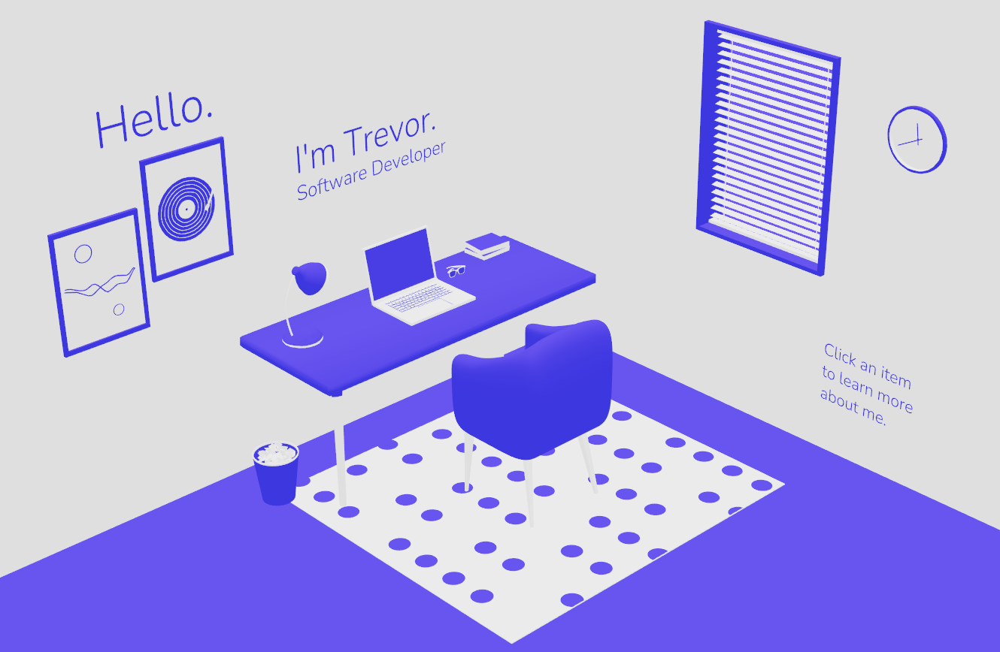

## [21st.dev](https://21st.dev/home)

21st.dev 是一个专注于「氛围打造」的创意工具库，提供大量可视化 UI 组件，帮助开发者和设计师快速构建具有视觉冲击力的网页和应用界面。

地址：https://21st.dev/home

## [ungoogled-chromium](https://github.com/ungoogled-software/ungoogled-chromium)

这是一个去除 Google 服务依赖的 Chromium 浏览器版本。

地址：https://github.com/ungoogled-software/ungoogled-chromium

## [DeepResearch](https://github.com/Alibaba-NLP/DeepResearch)

DeepResearch 是阿里巴巴通义实验室开发的一款开源智能研究助手，它能够自主进行复杂的信息搜索和深度分析任务。

地址：https://github.com/Alibaba-NLP/DeepResearch

## [free-programming-books](https://github.com/EbookFoundation/free-programming-books)

这是一个名为“free-programming-books”的GitHub项目，它收集了大量免费的编程书籍和学习资源，涵盖多种编程语言和主题。

地址：https://github.com/EbookFoundation/free-programming-books?tab=readme-ov-file

## [tldraw](https://github.com/tldraw/tldraw)

tldraw 是一个用于创建无限画布体验的 React 组件库，非常适合开发数字白板或绘图应用。

地址：https://github.com/tldraw/tldraw

## [system-design-primer](https://github.com/donnemartin/system-design-primer)

这是一个教你如何设计大型系统的GitHub开源项目，特别适合准备系统设计面试的程序员。

地址：https://github.com/donnemartin/system-design-primer

## [neumorphism.io](https://neumorphism.io/#e5a4a4)

地址：https://neumorphism.io/#e5a4a4

## [map3d](https://github.com/cartesiancs/map3d)

map3d 是一个开源项目，旨在利用 React Three Fiber（R3F）构建城市 3D 地图。它基于 OpenStreetMap 数据，支持生成包含建筑物和道路信息的 3D 地图，并允许将地图导出为 GLB 文件。

地址：https://github.com/cartesiancs/map3d

## [3D-Portfolio](https://github.com/trevsm/3D-Portfolio)

创建一个个人房间模型，用户可以探索物体，如电脑、书架等，每个物体链接到作者的简历、项目或联系方式。这种设计像一个数字化的“开放日”，让访客感觉在参观作者的虚拟空间。

地址：https://github.com/trevsm/3D-Portfolio