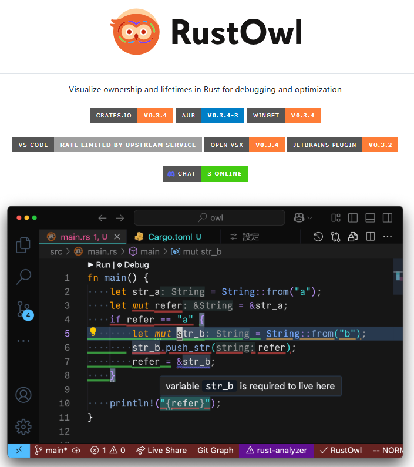
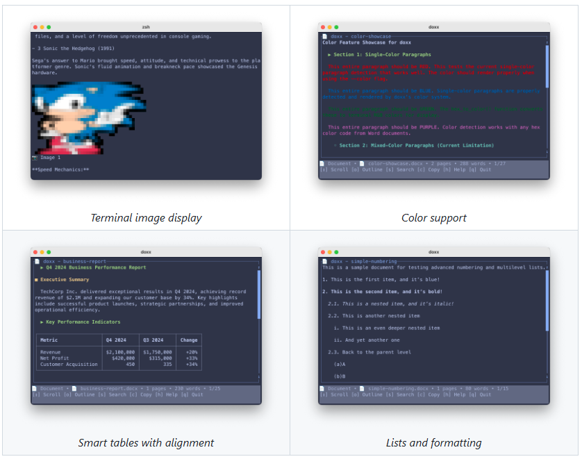
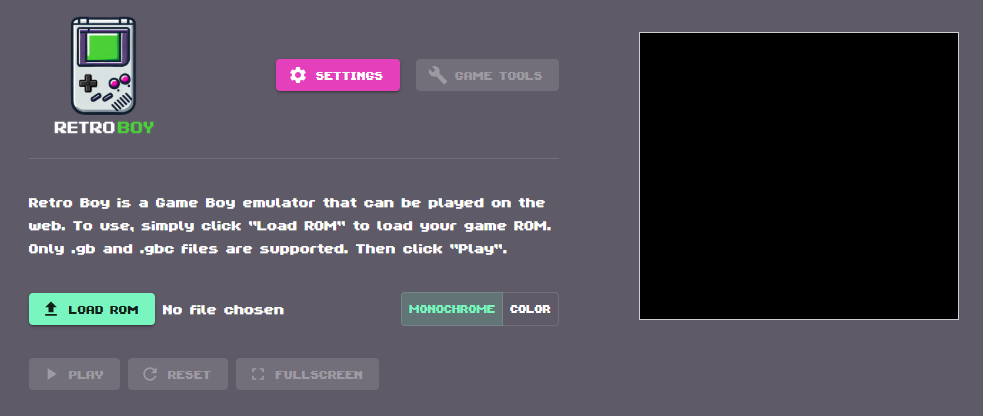
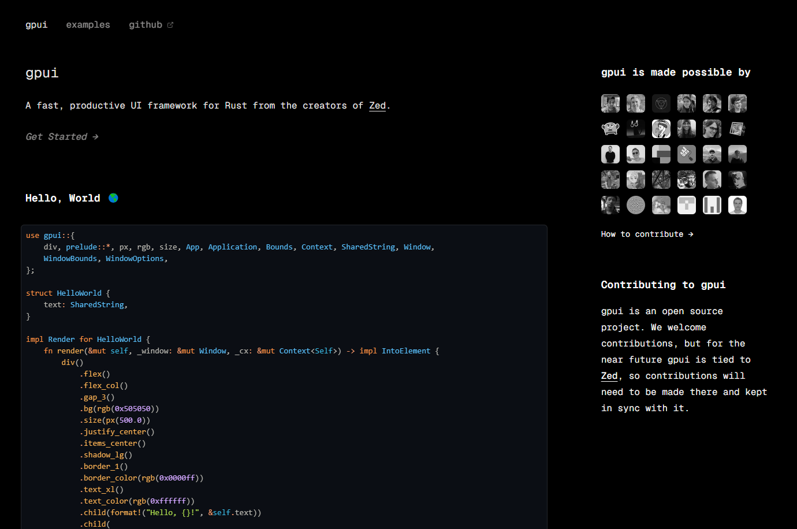
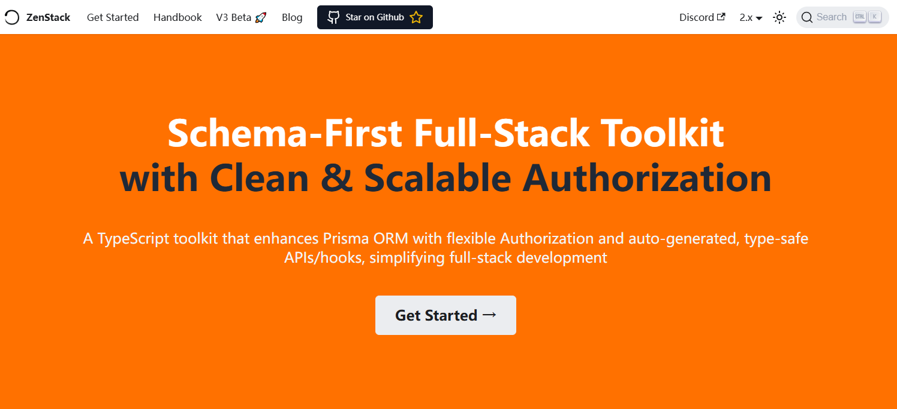
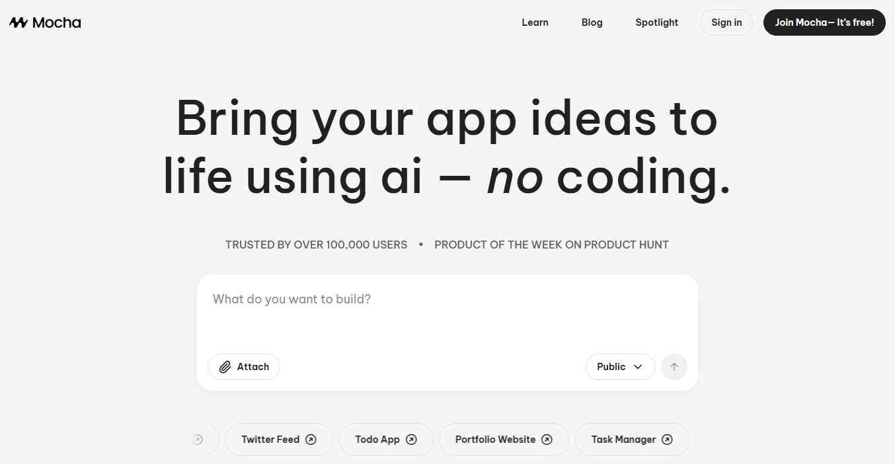
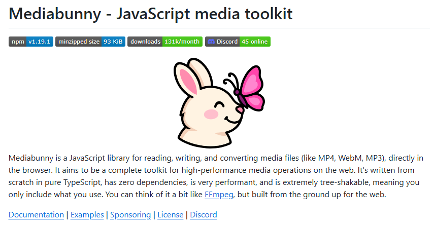
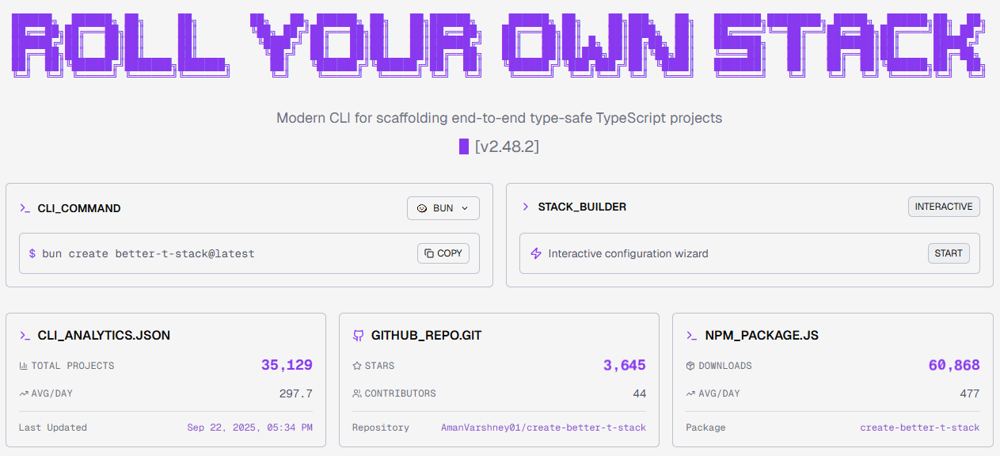

## [langshift](https://langshift.dev/)

地址：https://langshift.dev/

## [AppFlowy](https://github.com/AppFlowy-IO/AppFlowy)

AppFlowy is the AI workspace where you achieve more without losing control of your data

地址：https://github.com/AppFlowy-IO/AppFlowy

## [rustowl](https://github.com/cordx56/rustowl)

RustOwl 是一个用于可视化 Rust 语言中变量的所有权和生命周期的工具，主要用于调试和优化。它通过在编辑器中悬停变量或函数调用，展示其生命周期状态，帮助开发者理解复杂的所有权逻辑。

地址：https://github.com/cordx56/rustowl

## [doxx](https://github.com/bgreenwell/doxx)

doxx 是一个用 Rust 编写的终端工具，用于查看和导出 .docx 文件内容，无需安装 Microsoft Word。它专为开发者和终端用户设计，提供快速、安全、格式保留的文档处理体验。

地址：https://github.com/bgreenwell/doxx

## [retroboy](https://github.com/smparsons/retroboy)

RetroBoy 是一个用 Rust 编写的 Game Boy 模拟器，支持在网页上运行。它追求周期精确（cycle-accurate）的模拟效果，力求还原原始硬件的行为。

地址：https://github.com/smparsons/retroboy

## [shadcn-admin](https://github.com/satnaing/shadcn-admin)

Shadcn Admin 是一个使用 ShadcnUI 和 Vite 构建的现代化管理后台界面，注重响应式设计与可访问性。它并非一个入门模板，而是一个可复用的 UI 集合，适用于个人或企业项目中的后台系统。

地址：https://github.com/satnaing/shadcn-admin

## [yazi](https://github.com/sxyazi/yazi)

Yazi 是一个用 Rust 编写的终端文件管理器，基于异步 I/O 架构，追求极致性能与现代交互体验。它的名字来自中文“鸭子”，象征轻快灵活。

地址：https://github.com/sxyazi/yazi

## [gpui](https://www.gpui.rs/)

gpui 是一个由 Zed 编辑器团队开发的高性能 Rust UI 框架，旨在提供现代、响应式、可组合的用户界面构建能力。它目前是 Zed 的 UI 引擎，但未来也计划开放给更广泛的开发者社区使用。

地址：https://www.gpui.rs/

## [zenstack](https://zenstack.dev/)

ZenStack 是一个基于 TypeScript 的全栈开发工具包，最初构建于 Prisma ORM 之上，现已在 v3 Beta 中引入了全新查询引擎。它的核心目标是简化全栈开发中的数据访问与权限控制，提供自动生成的 API 和前端 hooks，并确保端到端的类型安全。

地址：https://zenstack.dev/

## [elysia](https://elysiajs.com/)

ElysiaJS 是一个由 Bun 驱动的现代 Web 框架，专为人类设计，强调人体工学（Ergonomic）、类型安全（Type Safety）和卓越的开发体验。它是首个生产可用、广受欢迎的 Bun 框架。

地址：https://elysiajs.com/

## [srcbook](https://github.com/srcbookdev/srcbook)

Mocha 是一个由 AI 驱动的无代码应用构建平台，专为创业者设计。用户只需用自然语言描述自己的想法，Mocha 就能自动生成完整的 Web 应用，无需编程技能。

地址：https://github.com/srcbookdev/srcbook

## [mediabunny](https://github.com/Vanilagy/mediabunny)

Mediabunny 是一个纯 TypeScript 编写的高性能媒体工具包，用于在浏览器中直接读取、写入和转换视频与音频文件。它类似于为 Web 环境量身定制的 FFmpeg，零依赖、极度轻量、可树摇（tree-shakable）。

地址：https://github.com/Vanilagy/mediabunny

## [better-t-stack](https://better-t-stack.dev/)

Better-T-Stack 是一个现代化、开源的命令行工具（CLI），用于快速构建端到端类型安全的 TypeScript 项目。它由开发者 Aman Varshney 创建，旨在帮助开发者以最少配置启动全栈应用，支持多种技术栈组合。

地址：https://better-t-stack.dev/

## [spark-ui](https://spark-ui.dev/)

Spark UI 是一个用于快速构建动画网站的前端组件库，基于 Vue、TypeScript、TailwindCSS 和 VueUse Motion 打造。它专注于视觉动效与开发效率，适合构建现代化、响应式的 Web 页面。

地址：https://spark-ui.dev/