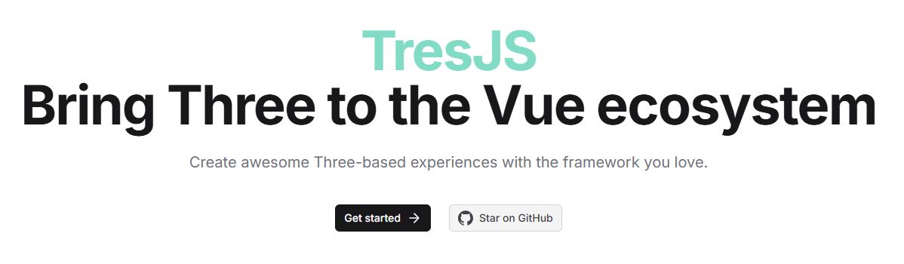

## [GLSL.app](https://glsl.app/)

地址：https://glsl.app/

## [WebGL Shaders](https://webgl-shaders.com/)

地址：https://webgl-shaders.com/

## [Tres.js](https://docs.tresjs.org/)

TresJS 是一个将 Three.js 引入 Vue.js 生态系统的框架，旨在帮助开发者用熟悉的 Vue 工具构建 3D 场景。

地址：https://docs.tresjs.org/
