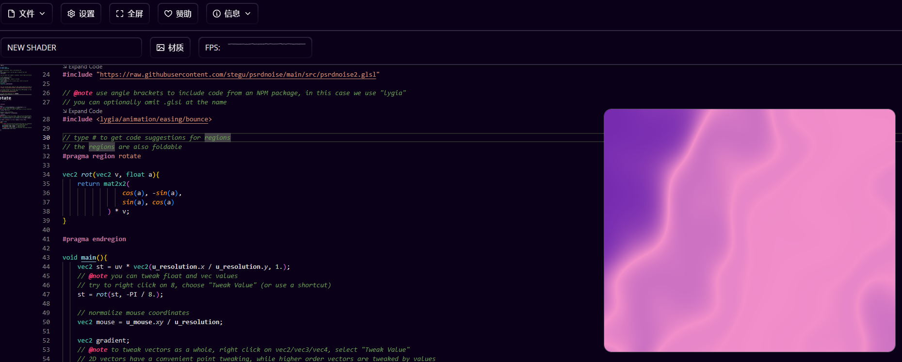
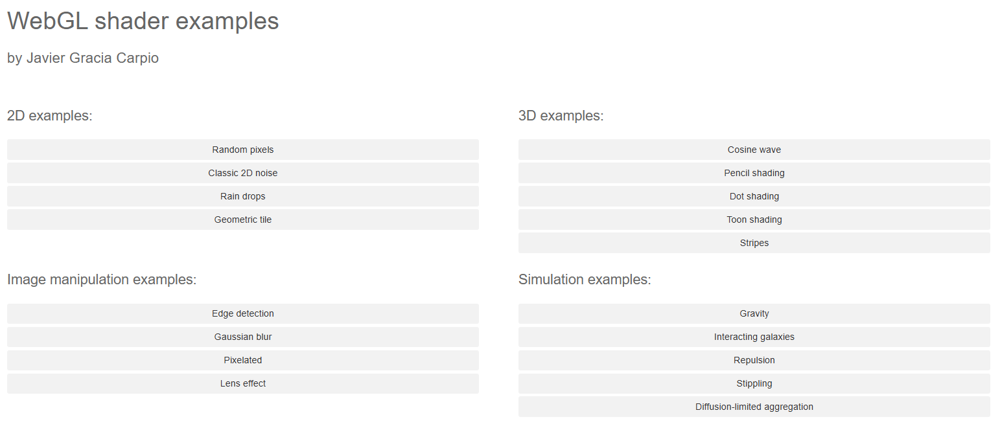

## [GLSL.app](https://glsl.app/)

地址：https://glsl.app/

## [WebGL Shaders](https://webgl-shaders.com/)

地址：https://webgl-shaders.com/

## [humanlayer](https://github.com/humanlayer/humanlayer)

HumanLayer 是一个让 AI 智能体在关键操作中自动引入人工审核的工具库。它确保像发送邮件、修改数据库或发布内容这类高风险操作，必须经过真人批准才能执行。你可以把它看作给 AI 加了一道“安全锁”，既让 AI 能自主工作，又避免了错误操作带来的后果。

地址：https://github.com/humanlayer/humanlayer

## [kamranahmedse/developer-roadmap](https://github.com/kamranahmedse/developer-roadmap)

这是一个开发者学习路径指南项目，提供了各种技术方向的互动式学习路线图，比如前端、后端、DevOps、人工智能等，帮助开发者规划职业成长。

地址：https://github.com/kamranahmedse/developer-roadmap

## [fuck-u-code](https://github.com/Done-0/fuck-u-code)

这是一个名为“fuck-u-code”的屎山代码检测工具，它能用幽默犀利的方式评估你的代码质量。工具会从复杂度、注释率、重复度等多个维度打分，分数越高代表代码越“烂”，还会生成彩色报告或Markdown文档帮你改进。

地址：https://github.com/Done-0/fuck-u-code