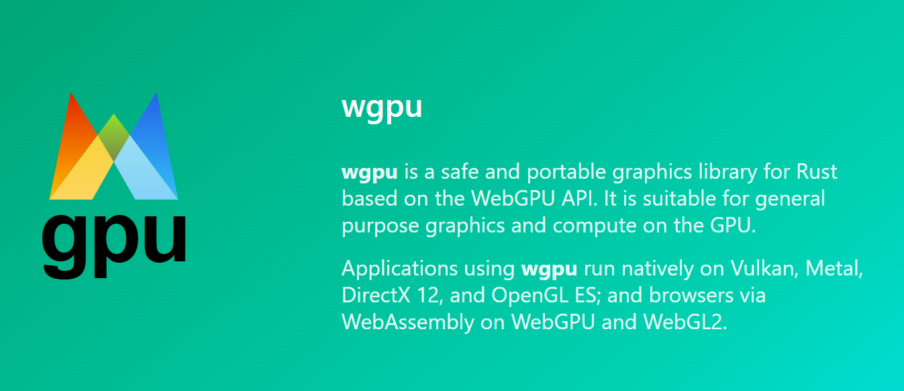
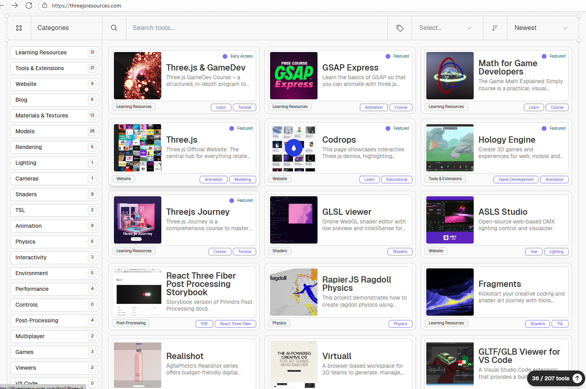

## [GLSL.app](https://glsl.app/)

地址：https://glsl.app/

## [WebGL Shaders](https://webgl-shaders.com/)

地址：https://webgl-shaders.com/

## [Tres.js](https://docs.tresjs.org/)

TresJS 是一个将 Three.js 引入 Vue.js 生态系统的框架，旨在帮助开发者用熟悉的 Vue 工具构建 3D 场景。

地址：https://docs.tresjs.org/

## [The Book of Shaders](https://thebookofshaders.com/)

The Book of Shaders 是一个 WebGL 着色器语言的教程，通过示例来解释 WebGL 的基本概念。

地址：https://thebookofshaders.com/

## [WGPU](https://wgpu.rs/)

一个基于 WebGPU API 的 Rust 图形库，强调安全性和跨平台性。

地址：https://wgpu.rs/

## [Three.js Resources](https://threejsresources.com/)

一个 Three.js 资源库，包含各种资源、工具和教程。

地址：https://threejsresources.com/
