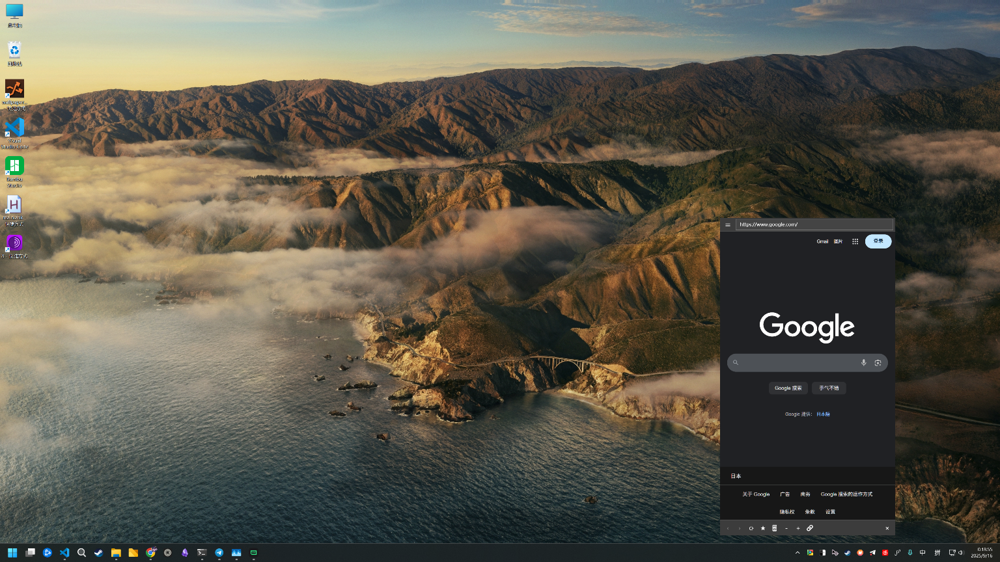
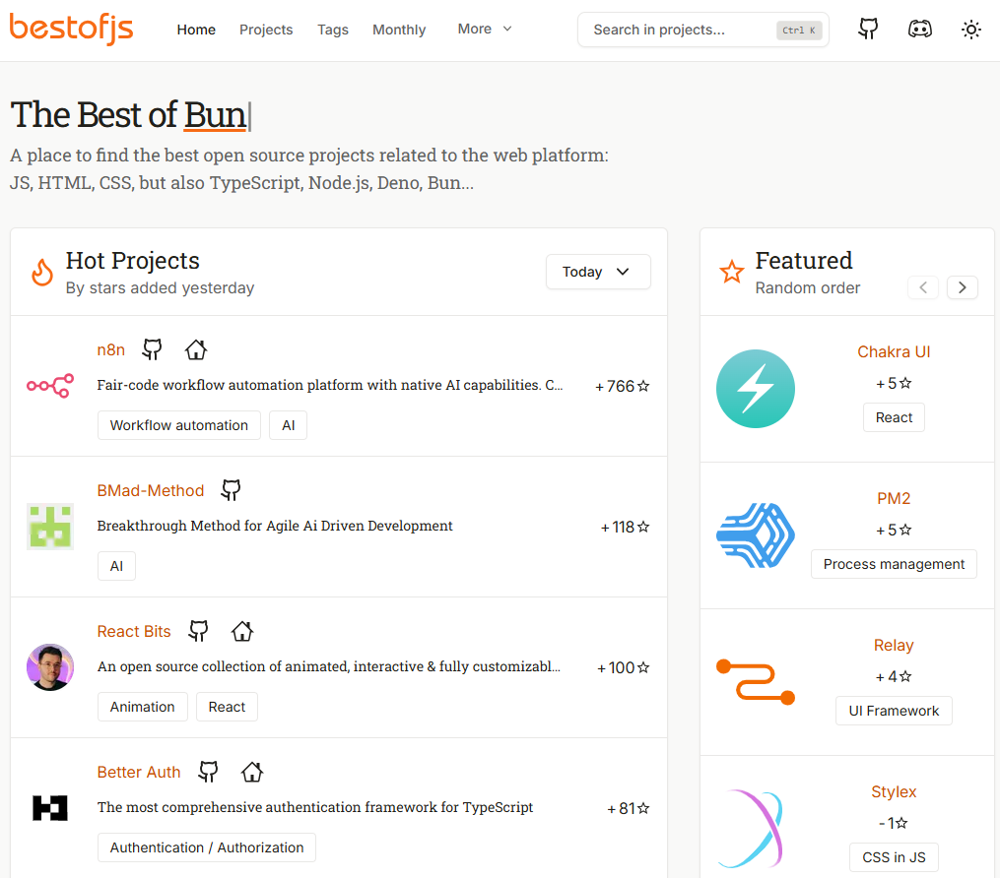
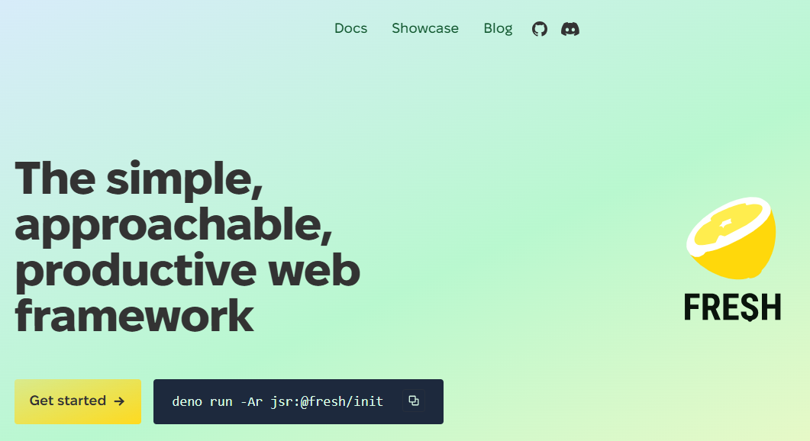
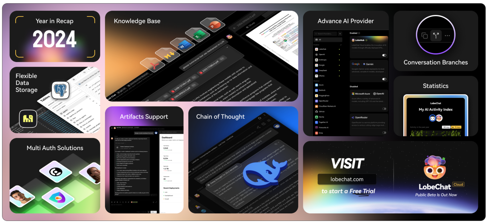

## [humanlayer](https://github.com/humanlayer/humanlayer)

HumanLayer 是一个让 AI 智能体在关键操作中自动引入人工审核的工具库。它确保像发送邮件、修改数据库或发布内容这类高风险操作，必须经过真人批准才能执行。你可以把它看作给 AI 加了一道“安全锁”，既让 AI 能自主工作，又避免了错误操作带来的后果。

地址：https://github.com/humanlayer/humanlayer

## [kamranahmedse/developer-roadmap](https://github.com/kamranahmedse/developer-roadmap)

这是一个开发者学习路径指南项目，提供了各种技术方向的互动式学习路线图，比如前端、后端、DevOps、人工智能等，帮助开发者规划职业成长。

地址：https://github.com/kamranahmedse/developer-roadmap

## [fuck-u-code](https://github.com/Done-0/fuck-u-code)

这是一个名为“fuck-u-code”的屎山代码检测工具，它能用幽默犀利的方式评估你的代码质量。工具会从复杂度、注释率、重复度等多个维度打分，分数越高代表代码越“烂”，还会生成彩色报告或Markdown文档帮你改进。

地址：https://github.com/Done-0/fuck-u-code

## [tray-chrome](https://github.com/cornradio/tray-chrome)

一个基于 WPF 和 WebView2 的轻量级托盘浏览器，专为 Windows 设计。类似 MenubarX，但更加轻便和功能丰富。

地址：https://github.com/cornradio/tray-chrome

## [bestofjs.org](https://bestofjs.org/)

展示了最近 GitHub 上星标增长最快的 JavaScript 项目

地址：https://bestofjs.org/

## [fresh](https://fresh.deno.dev/)

Fresh 是一个基于 Deno 的现代 Web 框架，主打“简单、易用、高效”，适合构建快速响应的服务端渲染应用。

地址：https://fresh.deno.dev/

## [nodebestpractices](https://github.com/goldbergyoni/nodebestpractices)

Node.js 最佳实践

地址：https://github.com/goldbergyoni/nodebestpractices?tab=readme-ov-file

## [nextcloud/server](https://github.com/nextcloud/server)

Nextcloud 是一个开源的文件同步和共享平台，允许用户在个人或企业环境中安全、便捷地存储和分享文件。

地址：https://github.com/nextcloud/server

## [commaai/openpilot](https://github.com/commaai/openpilot)

openpilot 是一个用于机器人的操作系统，目前主要用来升级300多种汽车的驾驶辅助系统。

地址：https://github.com/commaai/openpilot

## [lobehub/lobe-chat](https://github.com/lobehub/lobe-chat)

现代化设计的开源 ChatGPT/LLMs 聊天应用与开发框架
支持语音合成、多模态、可扩展的（function call）插件系统
一键免费拥有你自己的 ChatGPT/Gemini/Claude/Ollama 应用

地址：https://github.com/lobehub/lobe-chat?tab=readme-ov-file