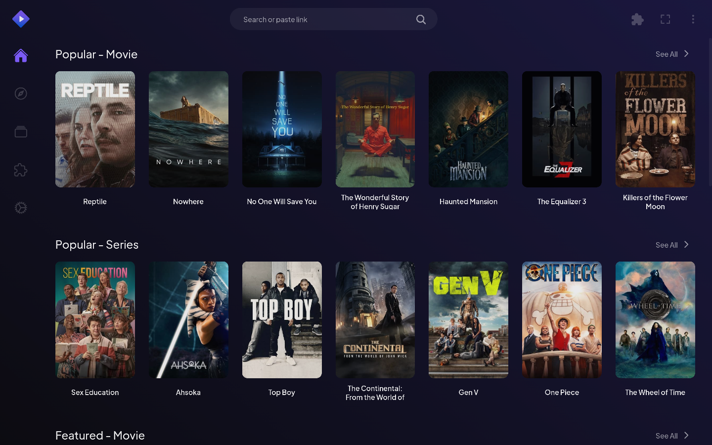
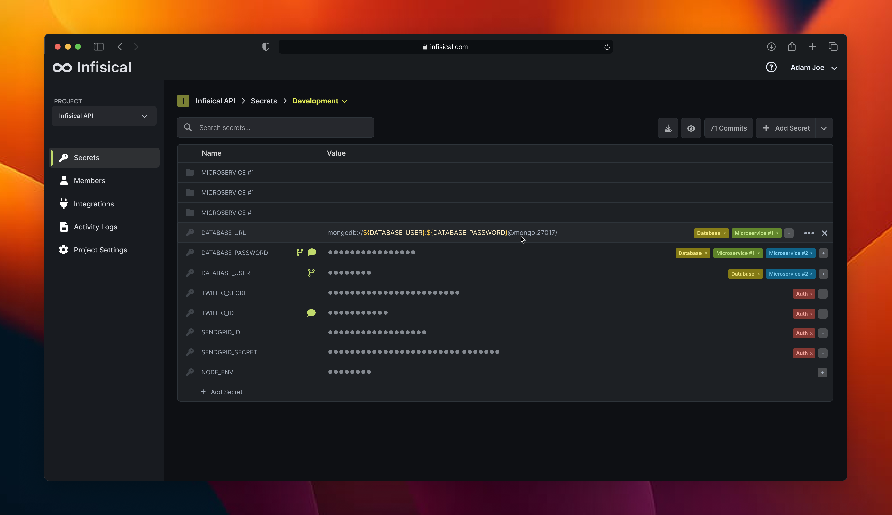
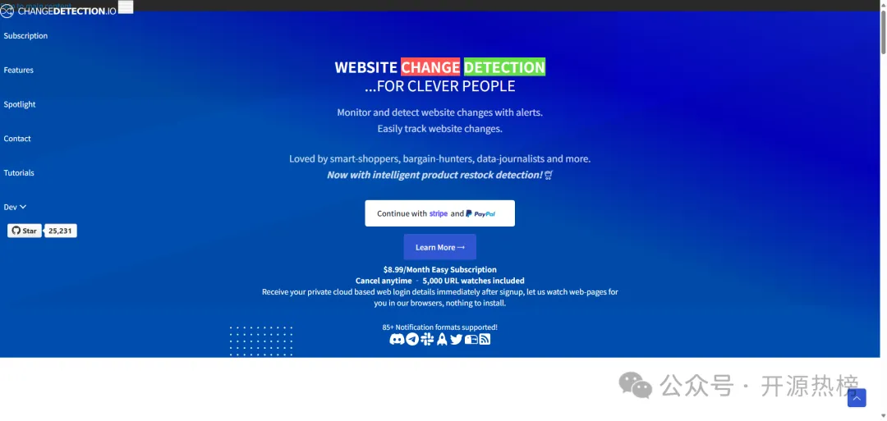

## [BitNet](https://github.com/microsoft/BitNet)

BitNet.cpp 是微软推出的高效 CPU 推理框架，专为 1.58 比特大语言模型（如 BitNet b1.58）设计，通过优化内核实现无损加速，在 ARM 和 x86 处理器上可提升 1.37x-6.17x 速度并降低 55%-82% 能耗，支持单 CPU 运行百亿参数模型。

地址：https://github.com/microsoft/BitNet

## [Stremio](https://github.com/Stremio/stremio-web)

Stremio 是一个开源的视频流服务，用户可以在其平台上订阅和观看各种视频内容。该项目的目标是提供一个统一的视频流平台，使用户能够方便地访问和管理他们的视频收藏。

地址：https://github.com/Stremio/stremio-web

## [Infisical](https://github.com/Infisical/infisical)

Infisical 是一个开源的密码管理工具，用于存储和管理敏感信息，如 API 密钥、数据库密码等。该项目的目标是提供一个安全、方便的方式来管理和分享密码，同时确保数据的机密性和完整性。

地址：https://github.com/Infisical/infisical

## [Flowise](https://github.com/FlowiseAI/Flowise)

Flowise 是一个基于 Node.js 的可视化低代码平台，用于构建和部署自定义的 AI 应用程序。该项目的目标是简化 AI 应用程序的开发过程，使用户能够快速创建和部署功能强大的 AI 应用程序。

地址：https://github.com/FlowiseAI/Flowise

## [changedetection.io](https://github.com/dgtlmoon/changedetection.io)、

changedetection.io 是一个开源的网页变化检测工具，用于监控网页的变化并通知用户。该项目的目标是提供一个简单、方便的方式来监控网页的变化，同时确保数据的安全性和隐私性。

地址：https://github.com/dgtlmoon/changedetection.io