## [Reka UI](https://reka-ui.com/)

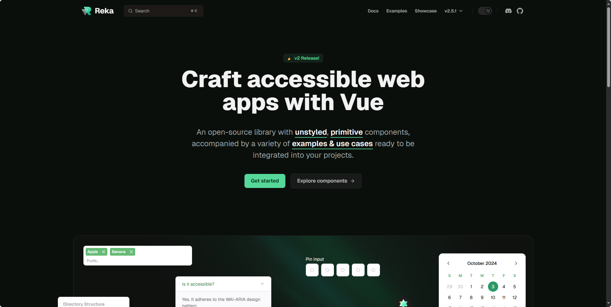

Reka UI 是一个开源的 UI 组件库。

地址：https://reka-ui.com/

## [awesome-n8n-templates](https://github.com/enescingoz/awesome-n8n-templates?tab=readme-ov-file)

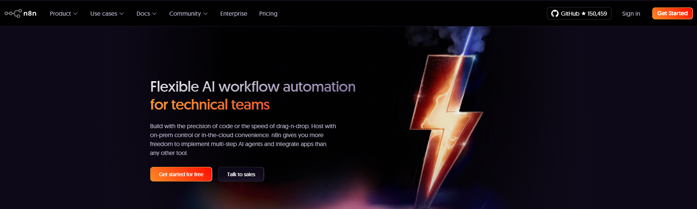

使用这个精选的 n8n 模板集合增强您的工作流程自动化！

地址：https://github.com/enescingoz/awesome-n8n-templates?tab=readme-ov-file

## [SyncTV](https://github.com/synctv-org/synctv?tab=readme-ov-file)

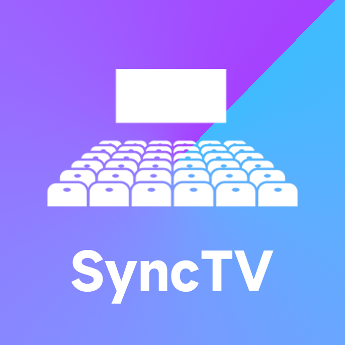

SyncTV 是一个允许您远程一起观看电影和直播的程序。它提供了同步观影、直播、聊天等功能。使用 SyncTV，您可以与朋友和家人一起观看视频和直播，无论他们在哪里。

地址：https://github.com/synctv-org/synctv?tab=readme-ov-file

## [Redis](https://redis.tinycraft.cc/)

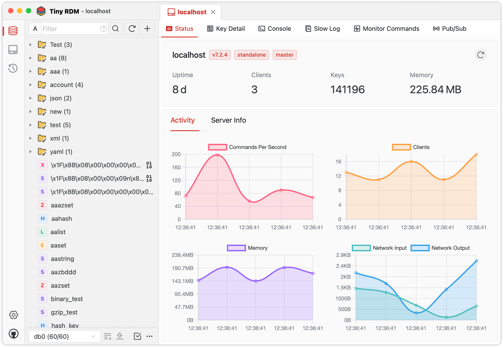

现代化的 Redis 桌面管理工具

地址：https://redis.tinycraft.cc/

## [Open Agent Builder](https://github.com/firecrawl/open-agent-builder?tab=readme-ov-file)

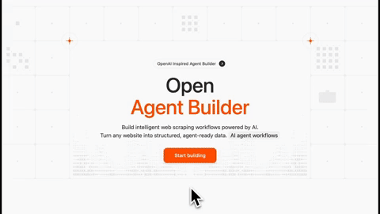

可视化构建 AI Agent 工作流，支持实时执行

地址：https://github.com/firecrawl/open-agent-builder

## [Homepage](https://github.com/gethomepage/homepage)

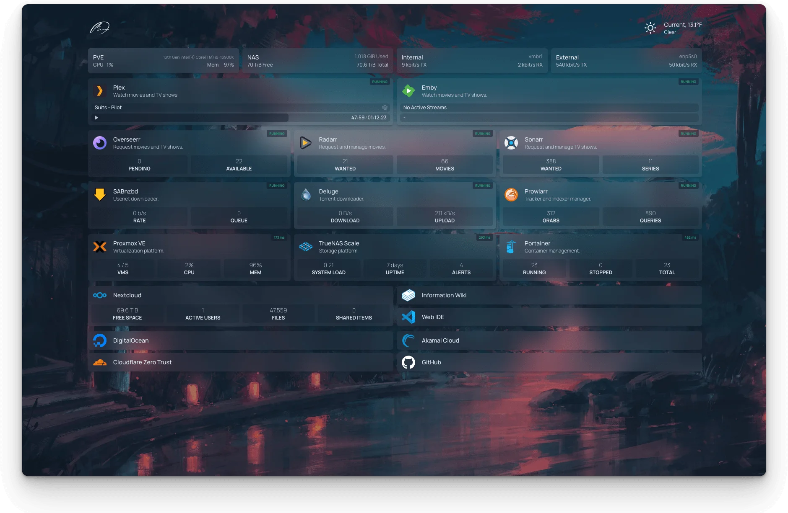

一个现代化、完全静态、快速、安全且高度可定制的起始页（或应用仪表盘），支持 Docker 和超过 100 种服务 API 集成。

地址：https://github.com/gethomepage/homepage

## [Open Notebook](https://github.com/lfnovo/open-notebook?tab=readme-ov-file)

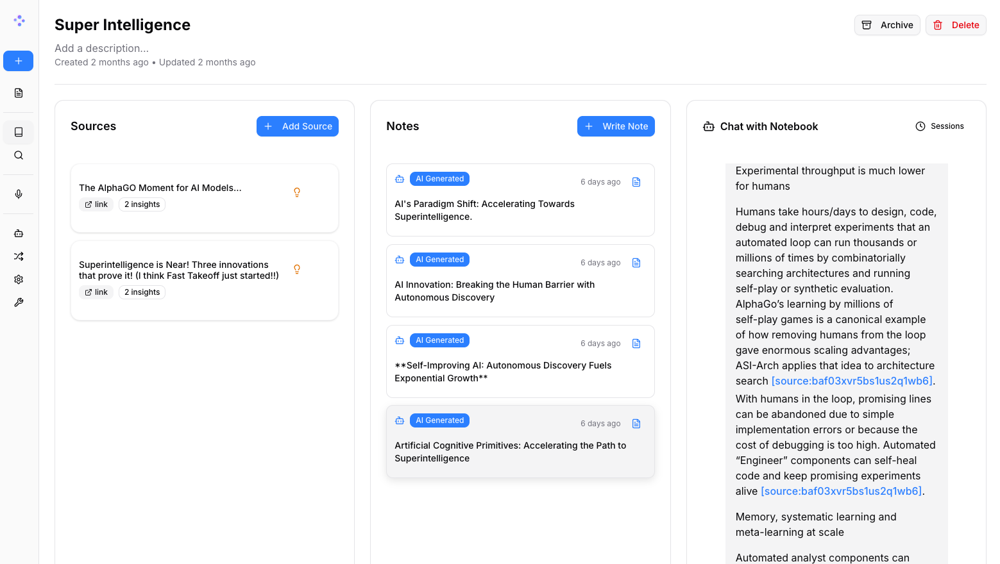

一个开源、隐私优先的替代方案，旨在提供比 Google Notebook LM 更灵活、更强大的笔记与研究平台。支持本地部署、多模型 AI、播客生成等高级功能。

地址：https://github.com/lfnovo/open-notebook?tab=readme-ov-file

## [Minimind](https://github.com/jingyaogong/minimind)

这是一个名为MiniMind的开源项目，让你能只用一张普通显卡（比如3090）和不到3块钱的电费成本，在短短2小时内从零开始训练一个超轻量级的中文语言模型。它完整公开了从数据清洗、模型预训练到微调、强化学习的全部代码，就像一份手把手教你造AI的实践教程，帮助初学者真正理解大模型背后的原理，而不仅仅是调用现成的接口。

地址：https://github.com/jingyaogong/minimind

## [Ebook2Audiobook](https://github.com/DrewThomasson/ebook2audiobook)

这是一个能将电子书转换成有声书的工具，你可以用它把喜欢的电子书变成语音版本，还能选择不同的朗读声音，甚至用自己的声音来朗读。它支持1100多种语言，操作简单，有图形界面和命令行两种使用方式，适合普通用户和技术爱好者。

地址：https://github.com/DrewThomasson/ebook2audiobook

## [OpenVoice](https://github.com/myshell-ai/OpenVoice)

OpenVoice是一个强大的AI语音克隆工具，由MIT和MyShell联合开发。它能瞬间复制任何人的声音音色，并让你自由调整说话的情感、节奏和口音。这个工具支持多种语言，生成的语音自然流畅，而且完全免费商用，特别适合做视频配音或虚拟助手等场景。

地址：https://github.com/myshell-ai/OpenVoice

## [SpacetimeDB](https://github.com/clockworklabs/SpacetimeDB)

SpacetimeDB 是一个把数据库和服务器合二为一的开发工具，专为需要实时交互的应用设计，比如多人在线游戏和聊天软件。它让你可以直接把程序逻辑上传到数据库里运行，省去了传统后端服务器的繁琐部署。这样一来，客户端能直连数据库，数据同步更快，整个开发流程也更简单高效。

地址：https://github.com/clockworklabs/SpacetimeDB

## [Cloudflare Sandbox](https://sandbox.cloudflare.com/)

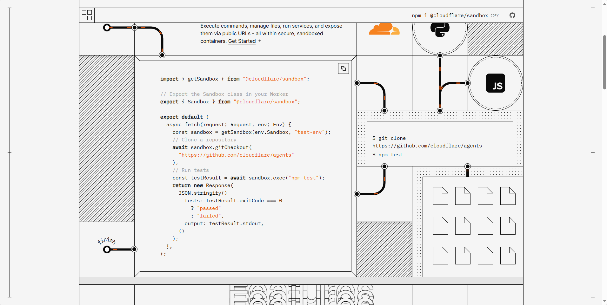

Cloudflare Sandbox 是一项新服务，用于在基于容器的安全“沙盒”环境中运行不受信任的 JavaScript（和 Python）代码。

地址：https://sandbox.cloudflare.com/

## [Image Classification with Local VLMs](https://github.com/Paulescu/image-classification-with-local-vlms)

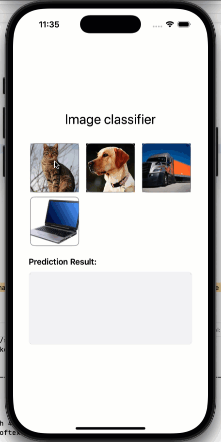

使用本地视觉语言模型（Visual Language Models, VLMs）在边缘设备上构建和部署高效图像分类器。

地址：https://github.com/Paulescu/image-classification-with-local-vlms

## [LinkSwift](https://github.com/hmjz100/LinkSwift?tab=readme-ov-file)

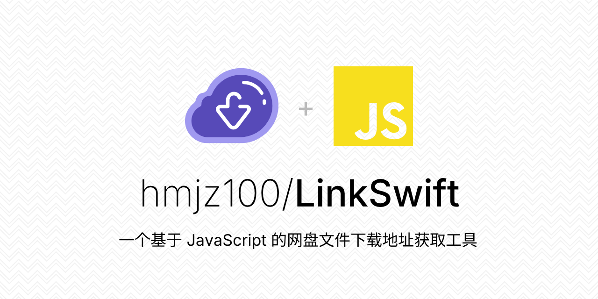

一个基于 JavaScript 的网盘文件下载地址获取工具。基于【网盘直链下载助手】修改 ，支持 百度网盘 / 阿里云盘 / 中国移动云盘 / 天翼云盘 / 迅雷云盘 / 夸克网盘 / UC网盘 / 123云盘 八大网盘

地址：https://github.com/hmjz100/LinkSwift?tab=readme-ov-file

## [CubeCity](https://github.com/hexianWeb/CubeCity)

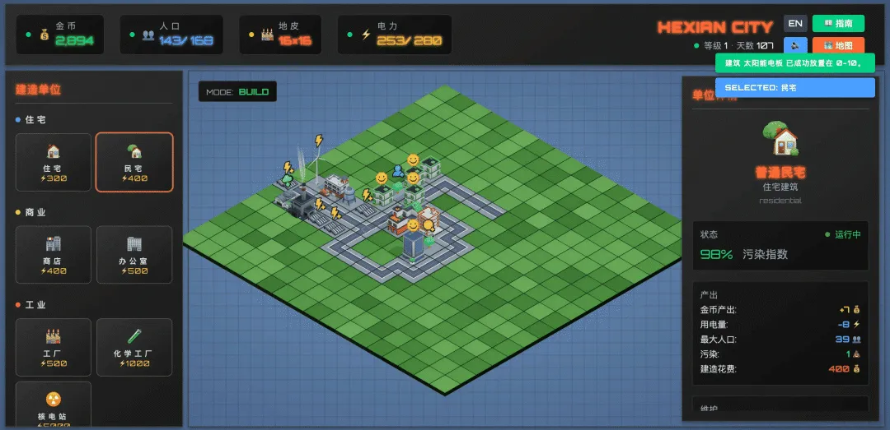

这是一款轻量级、卡通风格的 2.5D 城市模拟游戏，基于 Three.js 和 Vue3 构建。玩家可在浏览器中通过点选和拖放，实时建造、搬迁和拆除建筑。建筑会自动产出金币，可用于新建或升级设施。游戏融合了环境、社会与治理（ESG）理念，城市规划需兼顾多元需求，才能打造出可持续发展的理想城市。

地址：https://github.com/hexianWeb/CubeCity

## [HTML Rev](https://htmlrev.com)

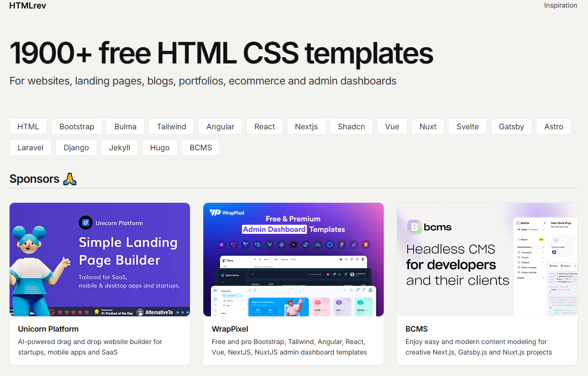

HTML Rev 是一个 HTML 静态站点生成器，基于 Vue3 构建。它允许用户使用所见即所得的方式创建静态站点，并生成 HTML、CSS 和 JavaScript 文件。

地址：https://htmlrev.com