## [DeekSeek-OCR - Dockerized API](https://github.com/Bogdanovich77/DeekSeek-OCR---Dockerized-API)

使用 DeepSeek-OCR 模型进行 PDF 到 Markdown 的转换

地址：https://github.com/Bogdanovich77/DeekSeek-OCR---Dockerized-API

## [Chrome Plus](https://github.com/Bush2021/chrome_plus?tab=readme-ov-file)

开箱即用的 Chrome 增强工具。这是一款基于 DLL 劫持技术的 Chrome 浏览器增强工具，支持双击或右键关闭标签、鼠标悬停标签栏时滚轮切换、强制保留最后一个标签防止浏览器意外关闭，以及自定义老板键快速隐藏窗口等功能。兼容所有 Chromium 内核浏览器，只需将 DLL 文件放入浏览器目录即可使用。

地址：https://github.com/Bush2021/chrome_plus?tab=readme-ov-file

## [Ech0](https://github.com/lin-snow/Ech0)

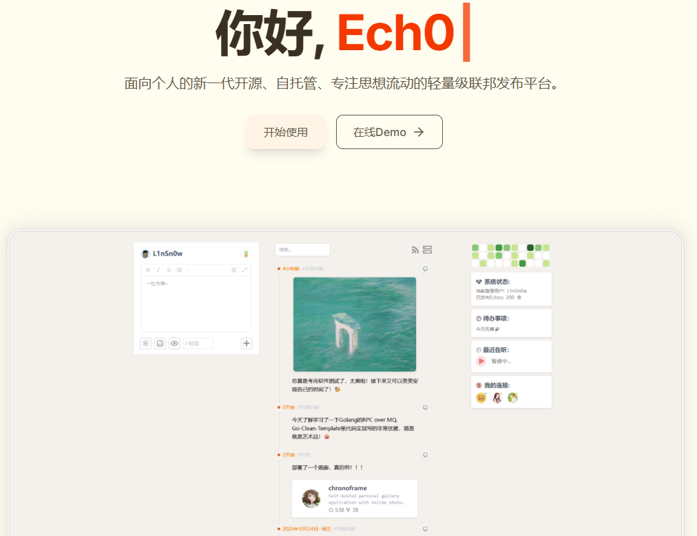

面向个人的新一代开源、自托管、专注思想流动的轻量级联邦发布平台。

地址：https://github.com/lin-snow/Ech0

## [OpenStock](https://github.com/Open-Dev-Society/OpenStock)

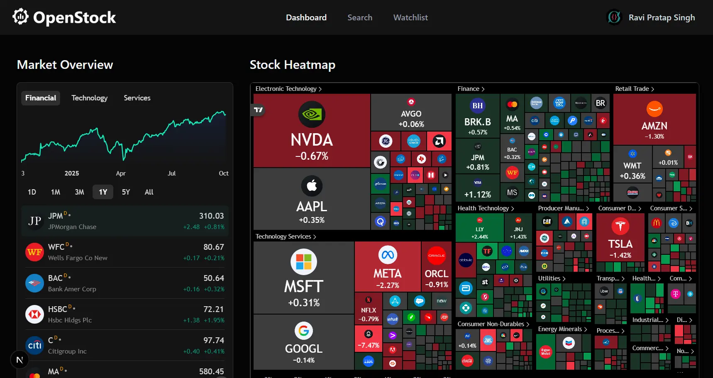

免费炫酷的股票市场应用。这是一款基于 Next.js、TailwindCSS 和 MongoDB 构建的股票市场平台，提供实时行情、图表（K 线图、热力图）、新闻资讯和个性化监控等功能，专注于数据展示与分析，不支持交易。

地址：https://github.com/Open-Dev-Society/OpenStock

## [Pages CMS](https://github.com/pages-cms/pages-cms)

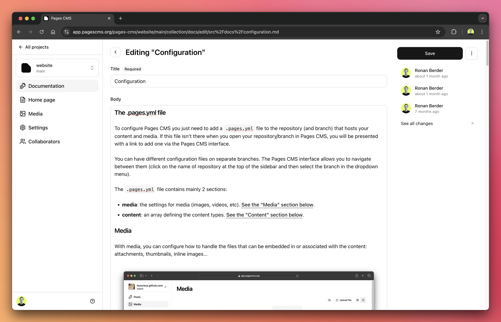

专为静态网站打造的 CMS。这是一个专为静态网站生成器设计的内容管理系统（CMS），支持 Jekyll、Next.js、VuePress 和 Hugo 等。它提供友好的用户界面，让非技术人员也能轻松编辑和更新网站内容，所有更改将自动转化为 GitHub 上的提交。

地址：https://github.com/pages-cms/pages-cms

## [Twake Drive](https://github.com/linagora/twake-drive)

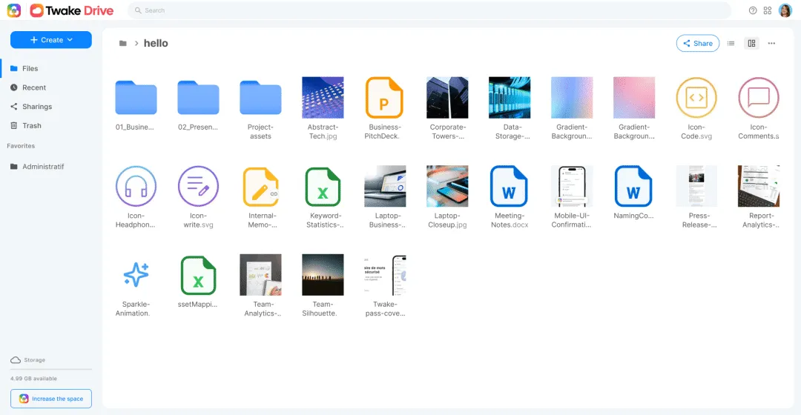

免费开源的 Google Drive 替代品。这是一款基于 Node.js 和 MongoDB 构建的云存储平台，提供类似 Google Drive 的文件管理和存储功能，支持 Docker 一键部署。

地址：https://github.com/linagora/twake-drive

## [Voice Recorder](https://github.com/FossifyOrg/Voice-Recorder)

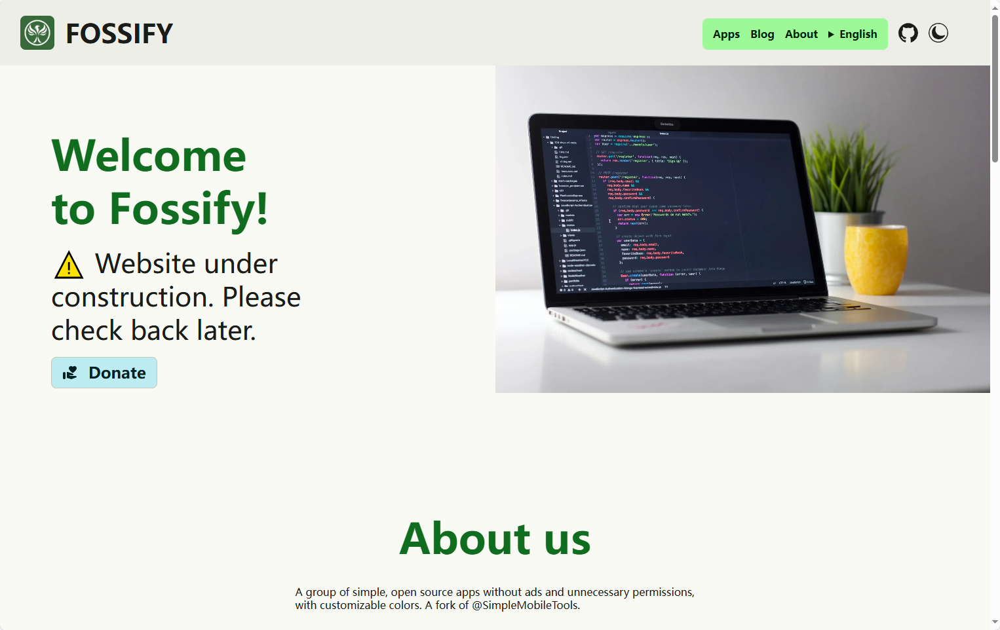

极简的 Android 语音录音应用。这是一款极简易用的 Android 语音录音应用，支持离线录音、无广告、界面清爽，适用于会议记录、课堂笔记、采访、日常备忘等场景。

地址：https://github.com/FossifyOrg/Voice-Recorder

## [Checkov](http://github.com/bridgecrewio/checkov)

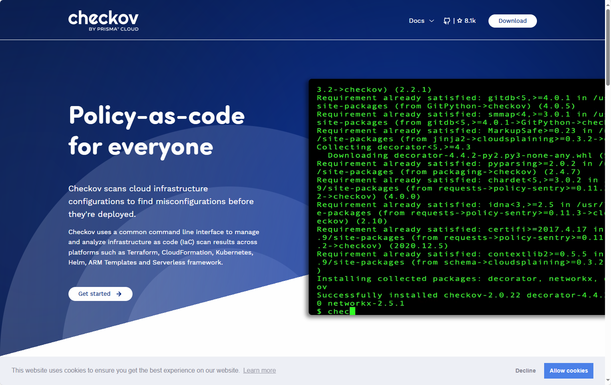

开源的 IaC 静态代码分析工具。这是一款基础设施即代码（IaC）的静态代码分析工具，旨在帮助开发者在构建阶段及时发现和防止云基础设施配置错误及安全漏洞。支持对 AWS、Azure、GCP、Kubernetes 等多种云平台的 IaC 文件（如 Terraform、CloudFormation、Kubernetes YAML 等）进行静态检测，同时可分析容器镜像和开源依赖包中的安全风险。

地址：http://github.com/bridgecrewio/checkov

## [Surf](https://github.com/deta/surf)

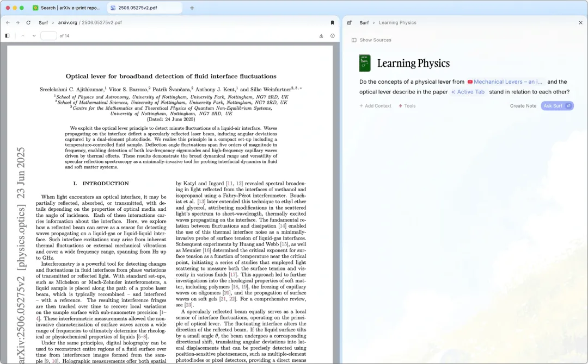

跨媒体的个人 AI 笔记应用。这是一款本地优先的 AI 笔记本工具，能够将多种媒体类型（如本地文件、网页、视频等）整合至本地资料库，并借助 AI 快速生成笔记。它帮助用户在学习和研究过程中，免去在浏览器、笔记应用、PDF 阅读器等多个应用和媒体之间切换、搜索和手动复制粘贴的繁琐操作，同时支持灵活选择 AI 模型。

地址：https://github.com/deta/surf

## [Anki JLPT Decks](https://github.com/5mdld/anki-jlpt-decks)

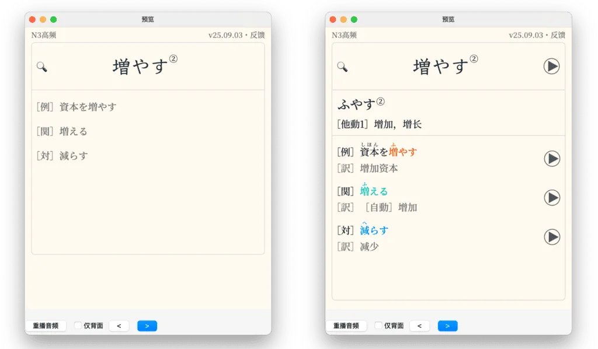

万词语音全配的日语卡组。这是一个为学习软件 Anki 制作的高质量日语单词卡组，涵盖 JLPT（日本语能力测试）N1~N5 等级，共计一万词汇，每个词条都包含释义、例句、词性，以及关联词和反义词等。

地址：https://github.com/5mdld/anki-jlpt-decks

## [Document](https://github.com/ranuts/document)

Office 文件在线编辑器。这是一个基于 OnlyOffice 和 WebAssembly 的本地 Web 文档编辑器，纯前端实现、无需服务器端处理，用户可直接在浏览器中打开和编辑 DOCX、XLSX、PPTX 等格式的文档。

地址：https://github.com/ranuts/document

## [Agentic Design Patterns](https://github.com/ginobefun/agentic-design-patterns-cn)

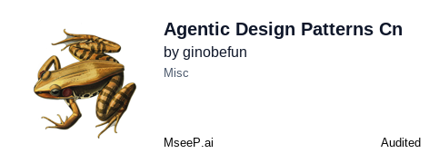

《Agentic Design Patterns》中文翻译版。该项目是《Agentic Design Patterns》一书的中英文对照版，这本书系统性地介绍了构建现代 AI 智能体（Agent）的实践方法与设计模式，包括提示链、RAG、MCP 和多智能体协作等内容。

地址：https://github.com/ginobefun/agentic-design-patterns-cn

## [GPUI Component](https://github.com/longbridge/gpui-component)

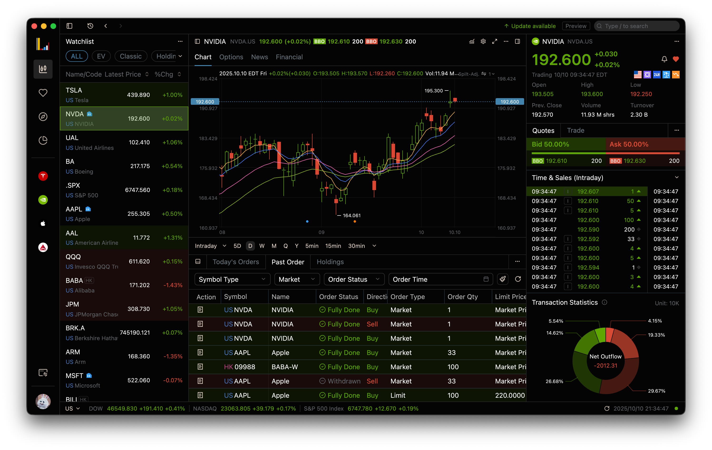

"GPUI Component 是一个基于 GPUI 的跨平台桌面 UI 组件库，提供 40+ 现代化组件，支持多主题、灵活布局和高性能渲染，已应用于 Longbridge Pro 等应用。

地址：https://github.com/longbridge/gpui-component

## [Agent Lightning](https://github.com/microsoft/agent-lightning)

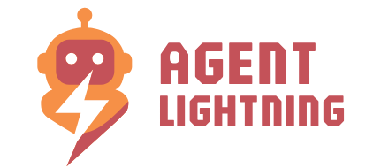

Agent Lightning是一个能够轻松训练和优化AI智能体的工具，让你无需修改代码就能提升智能体的性能。它支持各种主流框架，甚至无框架的Python开发，通过强化学习、自动提示优化等技术，帮助智能体在单机或多智能体系统中持续学习和改进。简单来说，它就像给AI智能体装上了自动升级引擎，让它们越用越聪明。

地址：https://github.com/microsoft/agent-lightning

## [Social Analyzer](https://github.com/qeeqbox/social-analyzer)

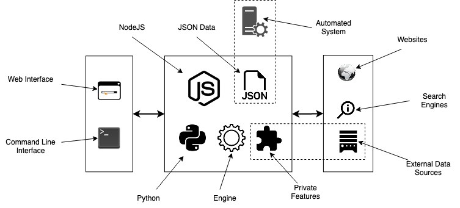

Social Analyzer 是一个开源情报工具，它能帮助你在上千个社交媒体网站上查找和分析特定人物的公开资料。这个工具提供了网页版、命令行和API三种使用方式，通过多种检测技术来评估匹配的可能性，并用0-100的评分来显示结果的可信度。它常用于调查网络骚扰、虚假信息传播等可疑网络活动，一些资源有限的执法机构也在使用它进行网络身份溯源。

地址：https://github.com/qeeqbox/social-analyzer

## [Awesome LLM Apps](https://github.com/Shubhamsaboo/awesome-llm-apps)

这个项目是一个精选的大型语言模型应用合集，涵盖了各种基于RAG、AI智能体、多智能体协作等技术的实用案例。它包含了使用OpenAI、Anthropic、Gemini等商业模型以及DeepSeek、Qwen、Llama等开源模型的应用程序，覆盖了旅行规划、金融分析、医疗影像、游戏开发等多个领域。你可以在这里找到现成的AI应用代码，学习如何构建自己的智能助手，甚至贡献你的创意项目。

地址：https://github.com/Shubhamsaboo/awesome-llm-apps