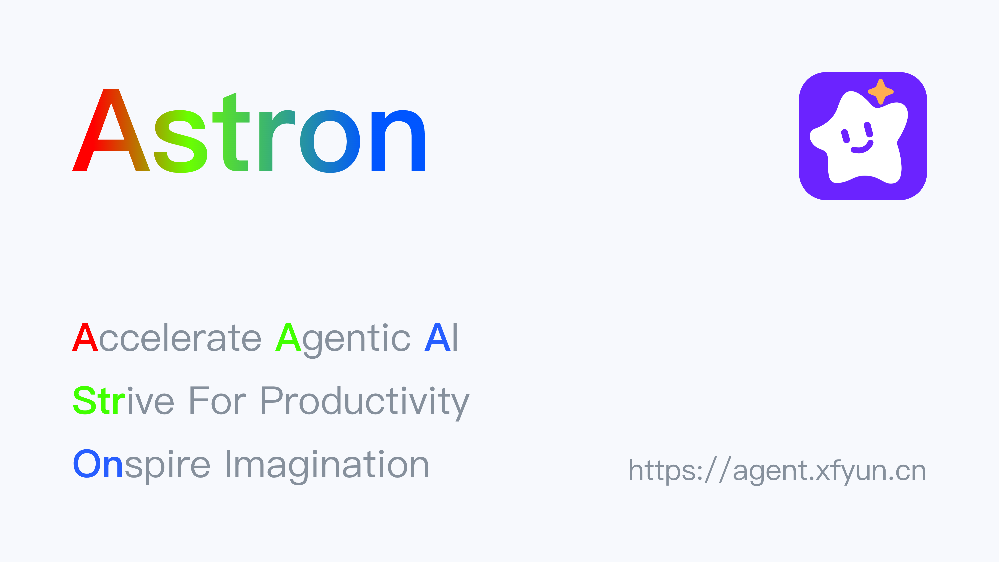
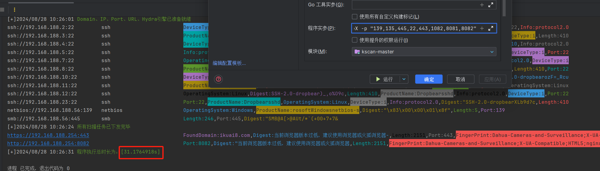
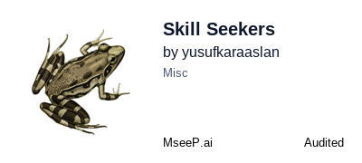
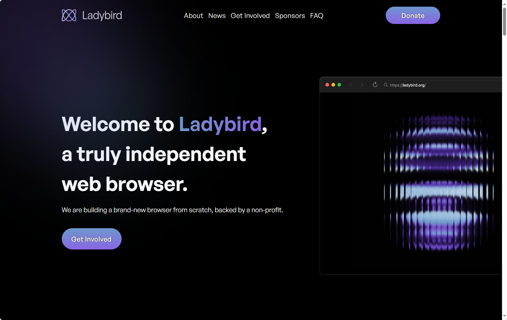
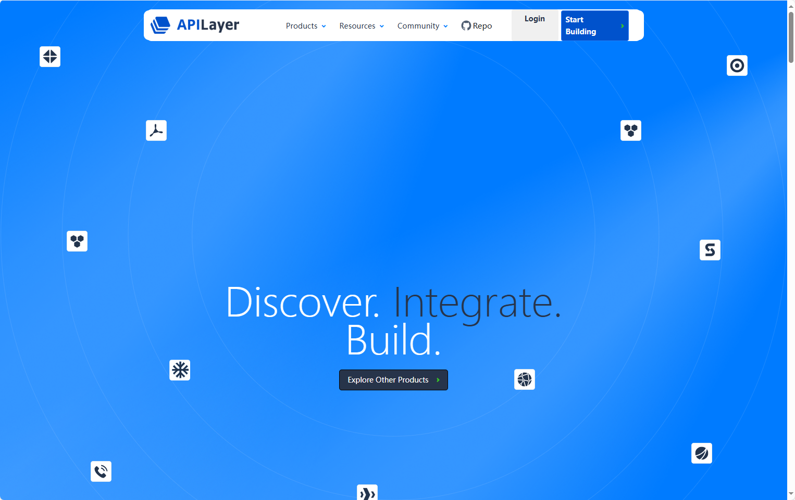
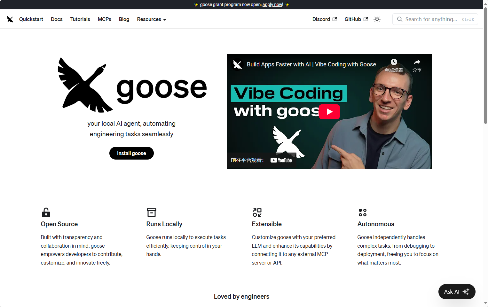
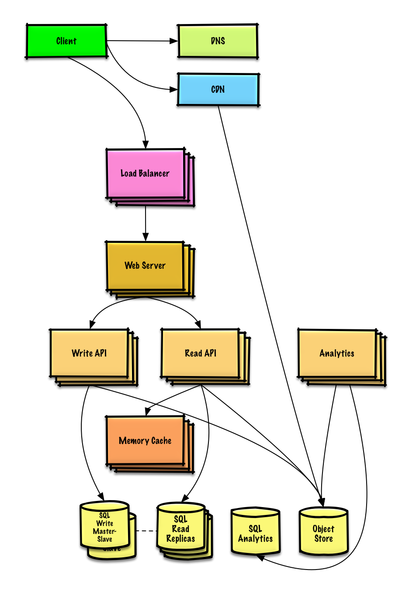

## [AI Engineering Hub](https://github.com/patchy631/ai-engineering-hub)

这是一个专注于AI工程实践的GitHub仓库，提供关于大语言模型（LLMs）、检索增强生成（RAGs）和真实AI应用场景的详细教程。无论你是初学者还是专业人士，都能在这里找到实用的代码示例和资源，帮助你快速上手和扩展AI项目。仓库鼓励大家参与贡献，还提供免费的数据科学电子书和最新资讯订阅。所有内容采用MIT开源协议，欢迎一起交流学习！

地址：https://github.com/patchy631/ai-engineering-hub

## [Depixelization_poc](https://github.com/spipm/Depixelization_poc)

这是一个能够从马赛克图片中还原出原始文字的工具。它的原理是利用马赛克生成时相邻像素块之间的颜色关联性，通过比对特殊字符序列的样本图片，来推测被模糊的文字内容。这个项目特别适用于处理用简单马赛克方式模糊的文字截图，比如聊天记录或文档中被打码的部分。

地址：https://github.com/spipm/Depixelization_poc

## [Gooey](https://github.com/cookiengineer/gooey)

它是一个用 Go 语言编写的 WebAssembly 框架，主要用于构建 Web 应用。

地址：https://github.com/cookiengineer/gooey

## [htmldocs.js](https://github.com/htmldocs-js/htmldocs)

一个现代化的 LaTeX 替代方案，使用 React、JSX 和 Tailwind CSS 来创建 PDF 文档模板

地址：https://github.com/htmldocs-js/htmldocs

## 【星辰Agent】【https://github.com/iflytek/astron-agent?tab=readme-ov-file】

星辰Agent是一个企业级、商业友好的 Agentic Workflow开发平台，融合了 AI 工作流编排、模型管理、AI 与 MCP 工具集、RPA 自动化和团队空间等特性。 平台支持高可用部署，帮助企业快速构建可规模化落地的智能体应用，打造面向未来的 AI 基座。

地址：https://github.com/iflytek/astron-agent?tab=readme-ov-file

## [qscan](https://github.com/qi4L/qscan)

一个速度极快的内网扫描器，具备端口扫描、协议检测、指纹识别，暴力破解，漏洞探测等功能。支持协议1200+，协议指纹10000+，应用指纹20000+，暴力破解协议10余种

地址：https://github.com/qi4L/qscan

## [Skill Seekers](https://github.com/yusufkaraaslan/Skill_Seekers)

一个自动化工具，用于将文档网站、GitHub 仓库和 PDF 文件转换为 Claude AI 可用的技能包。

地址：https://github.com/yusufkaraaslan/Skill_Seekers

## [ladybird](https://github.com/LadybirdBrowser/ladybird)

Ladybird是一个真正独立的网页浏览器，采用全新的引擎并基于现代网页标准开发。它采用多进程架构，包括独立的渲染进程、图像解码进程和网络请求进程，以提高安全性和稳定性。目前项目处于预发布阶段，适合开发者参与。Ladybird可在Linux、macOS和Windows等系统运行，并继承了SerenityOS的多个核心组件。该项目采用2-clause BSD开源协议，欢迎开发者加入社区共同建设。

地址：https://github.com/LadybirdBrowser/ladybird

## [Public APIs](https://github.com/public-apis/public-apis)

这是一个收集了各种免费API的GitHub仓库，里面包含了大量不同领域的公共接口，比如天气、股票、动物、动漫、书籍等。你可以直接使用这些API来开发自己的应用或项目，无需付费。这个仓库由社区成员和APILayer团队共同维护，相当于一个免费API的宝藏库，方便开发者快速找到需要的接口。

地址：https://github.com/public-apis/public-apis

## [Goose](https://github.com/block/goose)

Goose是一个开源的AI助手，专门为开发者设计，能帮你自动完成各种编程任务。它不只是简单的代码补全，还能从头开始构建项目、编写执行代码、调试错误、管理复杂的工作流程，甚至和外部API交互。你可以把它当作一个本地AI小助手，支持各种大语言模型，还能通过桌面应用或命令行使用，让开发更高效。无论是快速原型设计还是优化现有代码，Goose都能帮你节省时间，专注于创新。

地址：https://github.com/block/goose

## [System Design Primer](https://github.com/donnemartin/system-design-primer?tab=readme-ov-file)

系统设计

地址：https://github.com/donnemartin/system-design-primer?tab=readme-ov-file