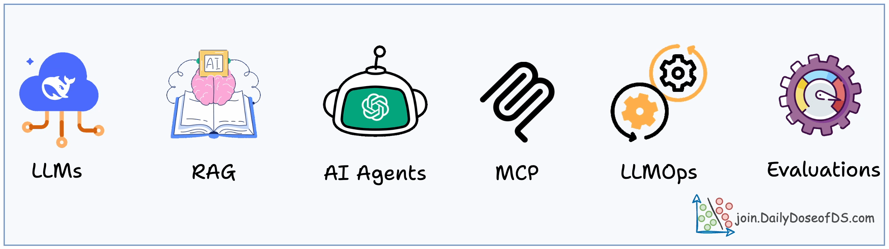
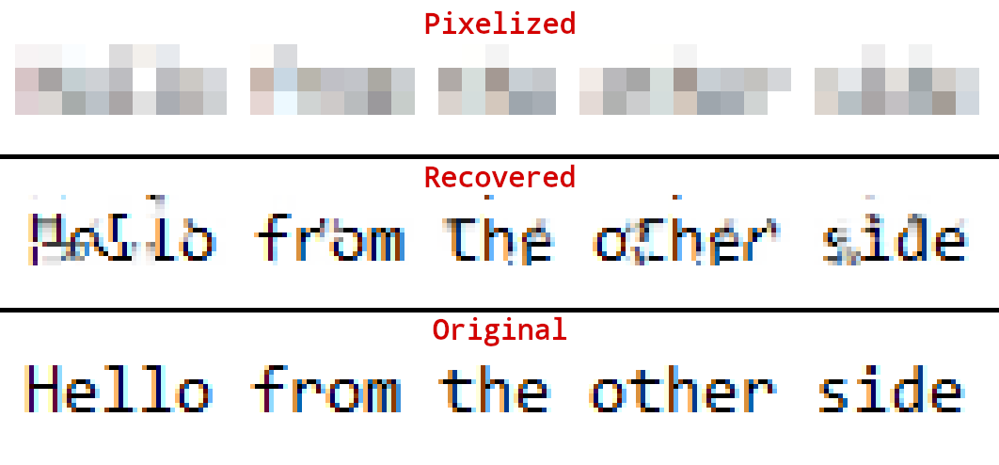
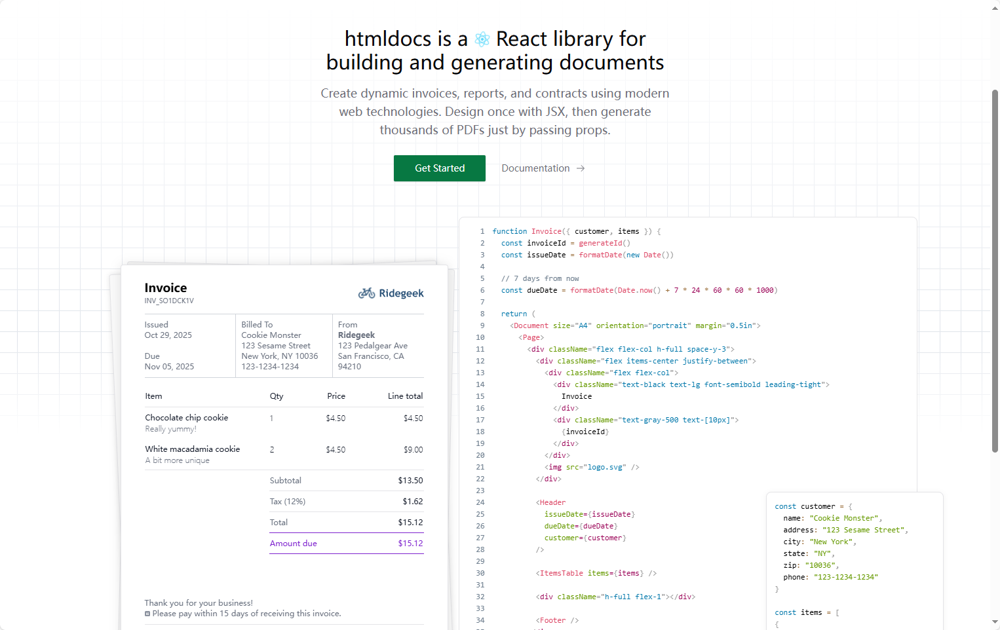

## [AI Engineering Hub](https://github.com/patchy631/ai-engineering-hub)

这是一个专注于AI工程实践的GitHub仓库，提供关于大语言模型（LLMs）、检索增强生成（RAGs）和真实AI应用场景的详细教程。无论你是初学者还是专业人士，都能在这里找到实用的代码示例和资源，帮助你快速上手和扩展AI项目。仓库鼓励大家参与贡献，还提供免费的数据科学电子书和最新资讯订阅。所有内容采用MIT开源协议，欢迎一起交流学习！

地址：https://github.com/patchy631/ai-engineering-hub

## [Depixelization_poc](https://github.com/spipm/Depixelization_poc)

这是一个能够从马赛克图片中还原出原始文字的工具。它的原理是利用马赛克生成时相邻像素块之间的颜色关联性，通过比对特殊字符序列的样本图片，来推测被模糊的文字内容。这个项目特别适用于处理用简单马赛克方式模糊的文字截图，比如聊天记录或文档中被打码的部分。

地址：https://github.com/spipm/Depixelization_poc

## [Gooey](https://github.com/cookiengineer/gooey)

它是一个用 Go 语言编写的 WebAssembly 框架，主要用于构建 Web 应用。

地址：https://github.com/cookiengineer/gooey

## [htmldocs.js](https://github.com/htmldocs-js/htmldocs)

一个现代化的 LaTeX 替代方案，使用 React、JSX 和 Tailwind CSS 来创建 PDF 文档模板

地址：https://github.com/htmldocs-js/htmldocs