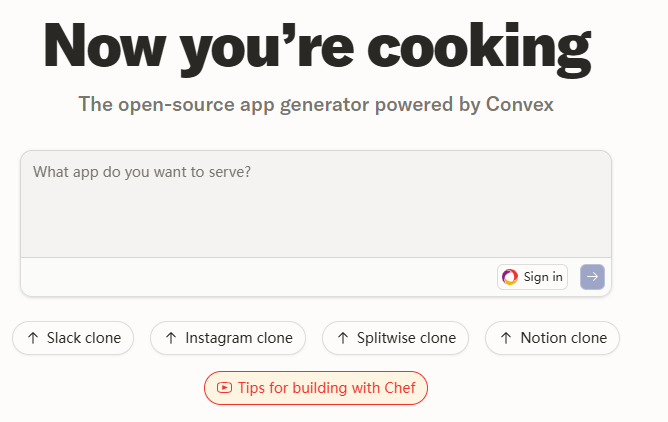
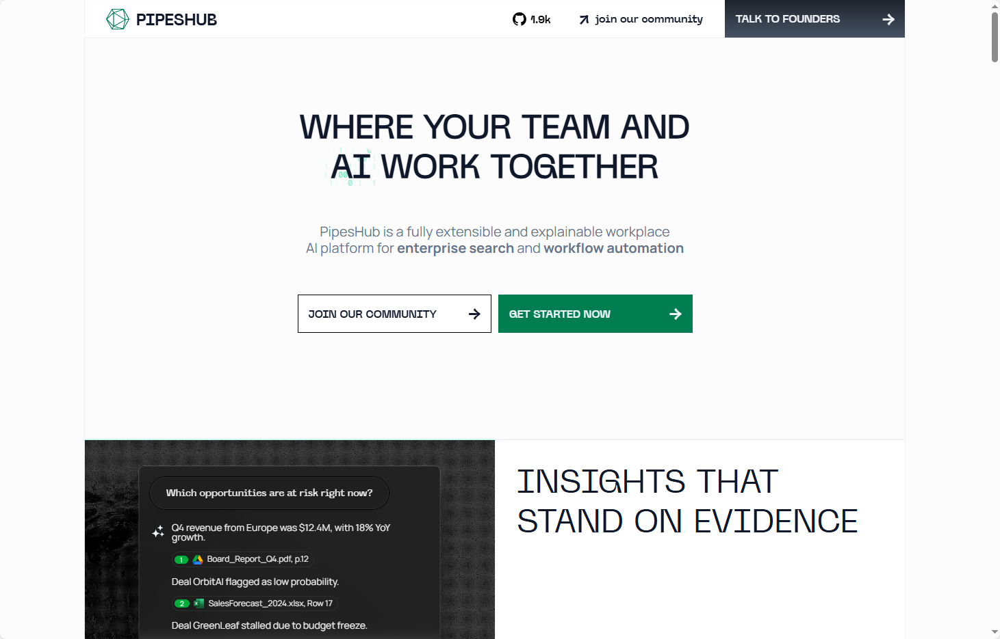

## [Chef](https://github.com/get-convex/chef)

Chef是一个懂后端的AI应用构建工具，它能帮你快速搭建全栈网页应用，内置数据库、用户认证、文件上传、实时界面和后台工作流。它基于Convex数据库开发，让代码生成变得简单高效。你可以直接使用官方托管服务，也可以按照指南在本地运行，只需配置好API密钥就能开始用AI生成应用了。

地址：https://github.com/get-convex/chef

## [Deep-Live-Cam](https://github.com/hacksider/Deep-Live-Cam)

Deep-Live-Cam 是一款能实时进行人脸替换的AI工具，只需要一张照片就能快速制作视频换脸效果。你可以用它来实时直播换脸、制作搞笑表情包，或者在视频里把自己的脸放到电影角色上。操作也很简单，选张人脸图片、选择摄像头，点击开始就能看到实时换脸效果。不过使用时要注意遵守道德规范，获得他人同意并标注是深度伪造内容。

地址：https://github.com/hacksider/Deep-Live-Cam

## [Pipehub](https://github.com/pipeshub-ai/pipeshub-ai)

PipesHub 是一个可扩展且可解释的企业级工作场所 AI 平台，专注于企业搜索与工作流自动化。

地址：https://github.com/pipeshub-ai/pipeshub-ai