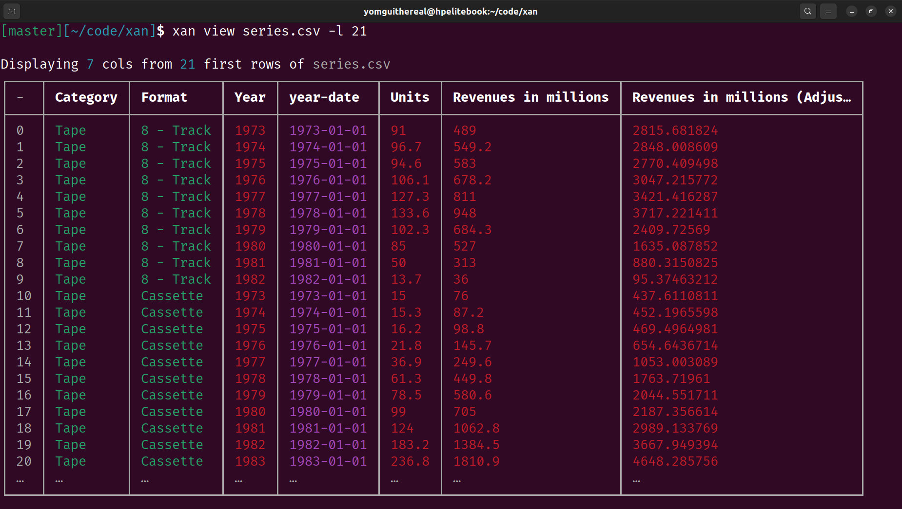
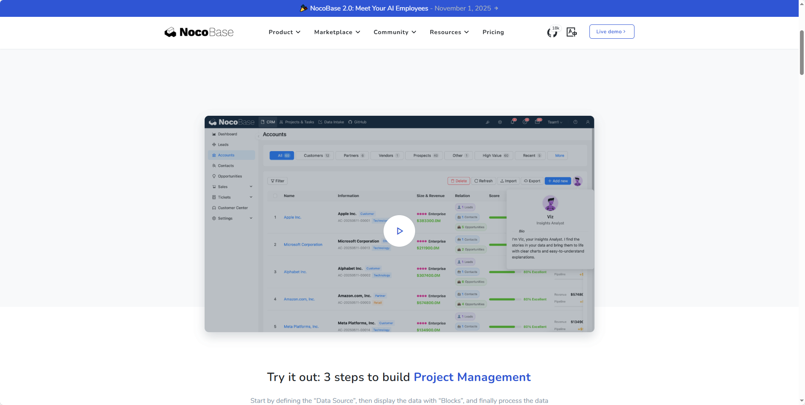
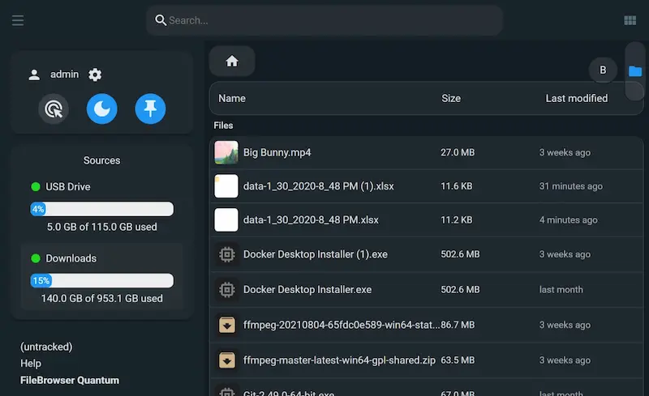
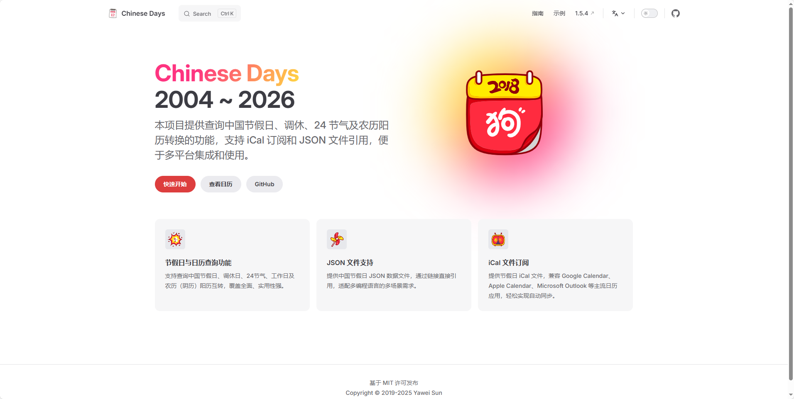
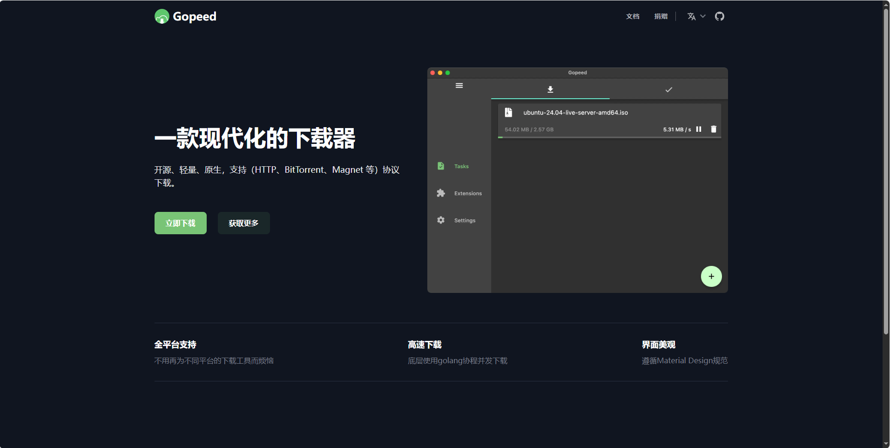
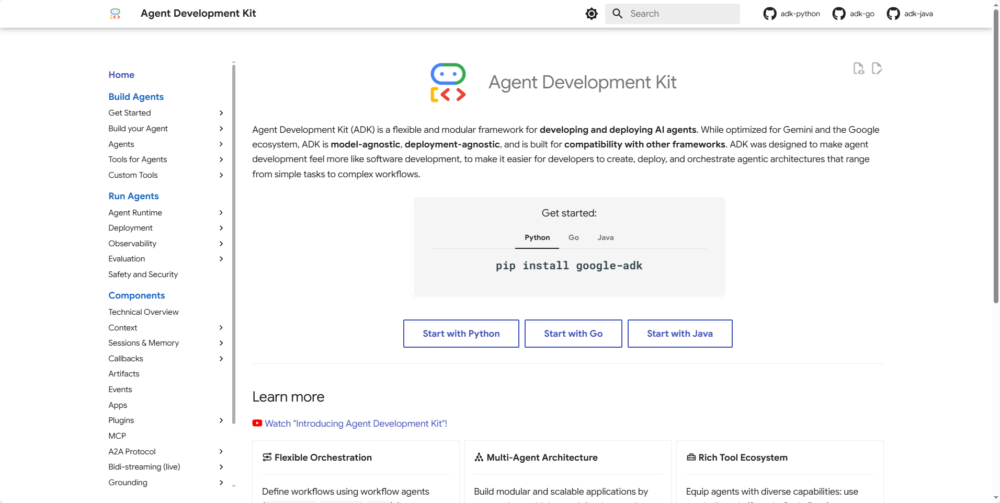
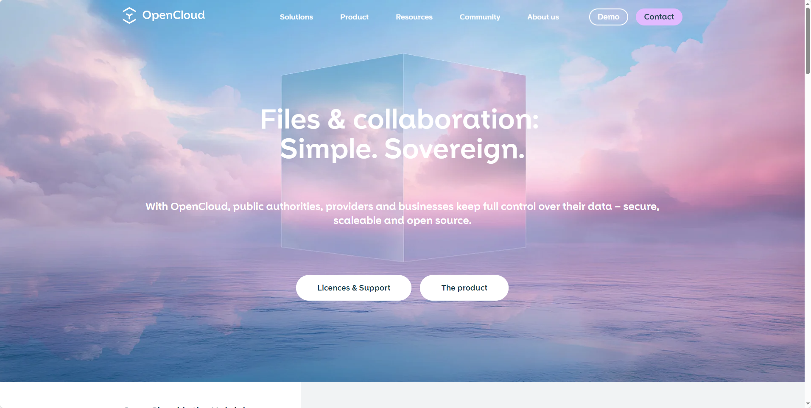

## [Chef](https://github.com/get-convex/chef)

Chef是一个懂后端的AI应用构建工具，它能帮你快速搭建全栈网页应用，内置数据库、用户认证、文件上传、实时界面和后台工作流。它基于Convex数据库开发，让代码生成变得简单高效。你可以直接使用官方托管服务，也可以按照指南在本地运行，只需配置好API密钥就能开始用AI生成应用了。

地址：https://github.com/get-convex/chef

## [Deep-Live-Cam](https://github.com/hacksider/Deep-Live-Cam)

Deep-Live-Cam 是一款能实时进行人脸替换的AI工具，只需要一张照片就能快速制作视频换脸效果。你可以用它来实时直播换脸、制作搞笑表情包，或者在视频里把自己的脸放到电影角色上。操作也很简单，选张人脸图片、选择摄像头，点击开始就能看到实时换脸效果。不过使用时要注意遵守道德规范，获得他人同意并标注是深度伪造内容。

地址：https://github.com/hacksider/Deep-Live-Cam

## [Pipehub](https://github.com/pipeshub-ai/pipeshub-ai)

PipesHub 是一个可扩展且可解释的企业级工作场所 AI 平台，专注于企业搜索与工作流自动化。

地址：https://github.com/pipeshub-ai/pipeshub-ai

##[Xan](https://github.com/medialab/xan)

xan 是由法国 Sciences Po 大学下属的 medialab 实验室开发的开源终端工具，专为 高效浏览和分析大型表格数据 而设计。它基于 Rust 编写，使用 TUI（终端用户界面）构建，可在终端中流畅查看数十万行甚至百万行的 CSV 文件而不卡顿。

地址：https://github.com/medialab/xan

## [NocoBase](https://github.com/nocobase/nocobase)

NocoBase 是一个极易扩展的 AI 无代码开发平台。

完全掌控，无限扩展，AI 协同。
让你的团队快速响应变化，大幅降低成本。
无需多年研发，无需数百万投入。
花几分钟部署 NocoBase，立即拥有一切。

地址：https://github.com/nocobase/nocobase?tab=readme-ov-file

## [Filebrowser](https://github.com/gtsteffaniak/filebrowser)

一个自搭建的、基于 Web 的文件管理器

地址：https://github.com/gtsteffaniak/filebrowser

## [Tdesign-uniapp](https://github.com/novlan1/tdesign-uniapp)

腾讯 TDesign 组件库的非官方 uniapp 适配，兼容 H5/微信小程序/支付宝小程序/APP 等。

地址：https://github.com/novlan1/tdesign-uniapp

## [Chinese-days](https://github.com/vsme/chinese-days)

中国法定节假日、调休和工作日、24节气查询，农历阳历互转，支持 TS、CommonJS、UMD 模块化使用，对非开发者，提供 iCal 日历订阅，可供 Google Calendar、Apple Calendar、Microsoft Outlook 等客户端使用。

地址：https://github.com/vsme/chinese-days

## [Qiluo Admin](https://github.com/chelunfu/qiluo_admin)

地址：https://github.com/chelunfu/qiluo_admin

## [gopeed](https://github.com/GopeedLab/gopeed)

一个支持多源下载的开源软件，支持 HTTP/HTTPS、FTP、SFTP、Magnet、BitTorrent、Youtube 等源，支持多线程下载，支持断点续传。

地址：https://github.com/GopeedLab/gopeed

## [ADK-Go](https://github.com/google/adk-go)

ADK-Go 是一个用 Go 语言开发 AI 智能体的开源工具包。它采用代码优先的设计理念，让你能像搭积木一样灵活地构建、测试和部署复杂的 AI 应用。无论你是想创建单个智能体还是组装多智能体系统，这个工具包都能充分利用 Go 语言的高并发特性，帮助你轻松打造云原生的智能应用。

地址：https://github.com/google/adk-go

## [Call-Center-AI](https://github.com/microsoft/call-center-ai)

这是一个AI智能客服电话系统，让你通过简单的API调用就能让AI客服给任何人打电话。它就像个虚拟客服代表，能处理保险理赔、IT技术支持、客户服务等各种场景，通话内容会实时记录并生成工单信息。系统基于微软Azure和OpenAI技术构建，支持多语言和个性化声音，还能在复杂情况下转接给人工客服。

地址：https://github.com/microsoft/call-center-ai

## [OpenCloud](https://github.com/opencloud-eu/opencloud)

OpenCloud是一个开源的后端服务器项目，使用Go语言编写，主要用于构建云服务相关的后端功能。它不需要数据库，所有数据都直接存储在文件系统中。项目内置了身份验证功能，支持OpenID Connect协议，既可以用外部身份提供商，也可以使用自带的身份服务。任何人都可以参与贡献代码、报告问题或完善文档，项目采用友好的Apache 2.0开源协议。

地址：https://github.com/opencloud-eu/opencloud