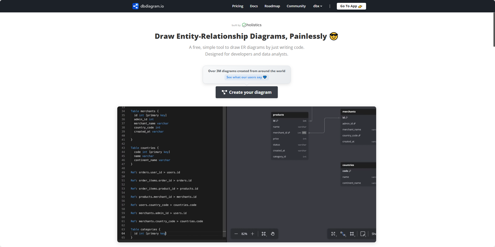

## [react-devtools-plus](https://github.com/wzc520pyfm/react-devtools-plus)

React DevTools Plus：一个面向开发者的调试工具，专注于提升开发体验（DX）。

地址：https://react-devtools-plus.netlify.app/

## [dbdiagram](https://dbdiagram.io/home)

dbdiagram.io —— 一个在线绘制数据库关系图（ER 图）的工具。

主要功能：

通过编写 DBML 代码快速生成 ER 图。

支持 实时协作，多人同时编辑，类似 Google Docs。

提供 折叠表组、定制视图、颜色标记，便于处理大型数据库。

可用 AI 辅助设计，用自然语言描述数据库需求即可生成图表。

支持 SQL 导入/导出，能直接生成建表语句。

可导出为 图片或 PDF，并支持一键分享。

提供 版本历史，可回溯和比较不同版本。

可嵌入到 Notion、Confluence 等文档平台。

地址：https://dbdiagram.io/home