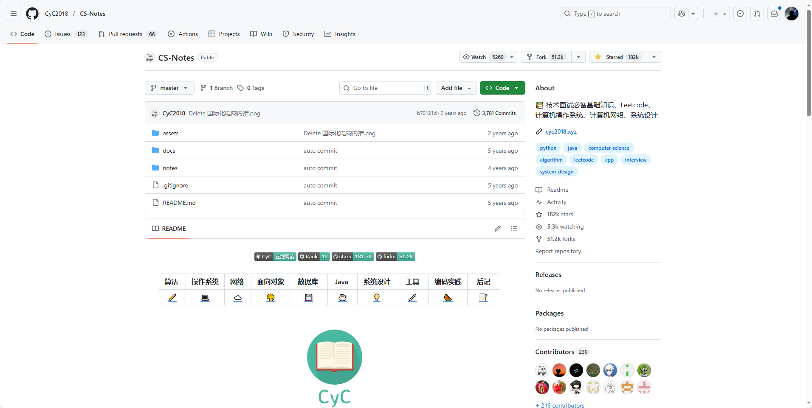
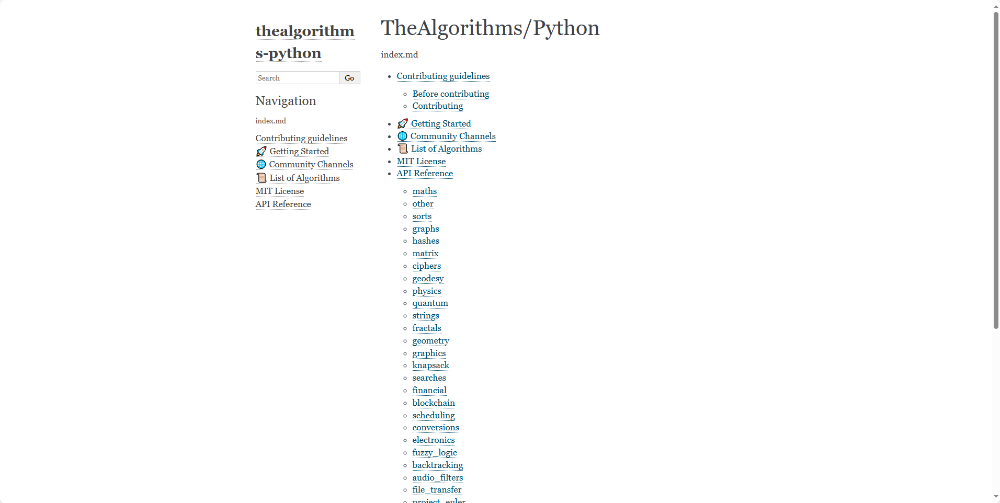
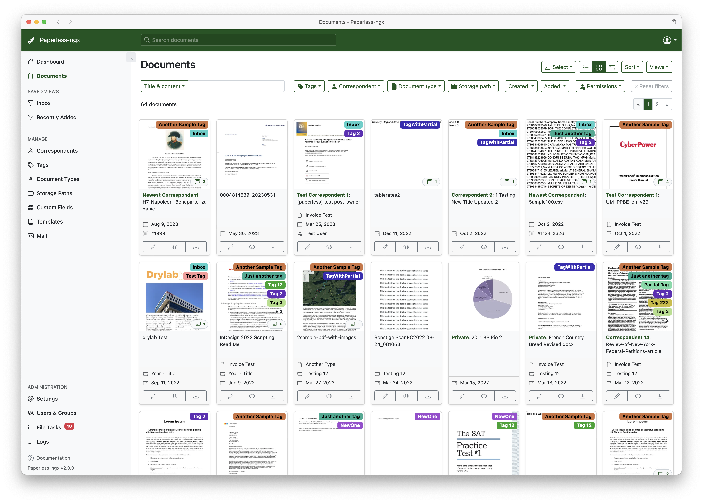
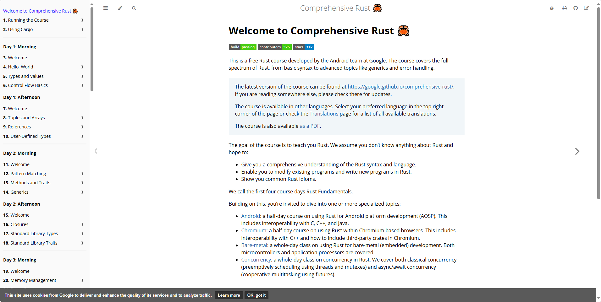

## [CS-Notes](https://github.com/CyC2018/CS-Notes?tab=readme-ov-file)

地址：https://github.com/CyC2018/CS-Notes?tab=readme-ov-file

## [TheAlgorithms/Python](https://github.com/TheAlgorithms/Python)

这是一个用Python实现各种算法的开源项目，涵盖了从排序、搜索到机器学习等众多经典算法，非常适合编程新手学习和参考。所有代码都以教育为目的，注重可读性而非性能优化，你可以自由使用但需要注意它们可能不如Python标准库的效率高

地址：https://github.com/TheAlgorithms/Python

## [paperless-ngx](https://github.com/paperless-ngx/paperless-ngx)

Paperless-ngx 是一个文档管理系统，它能帮你把纸质文件扫描、整理成可搜索的电子档案，让你告别堆积如山的纸张。它是原版 Paperless 项目的升级版，由社区共同维护，支持多语言和多种安装方式（比如用 Docker 一键部署）。你可以用它存档发票、合同等重要文件，但官方提醒敏感信息最好只在本地家庭服务器上使用，确保安全。

地址：https://github.com/paperless-ngx/paperless-ngx

## [Comprehensive-Rust](https://google.github.io/comprehensive-rust/index.html)

这是一个由谷歌安卓团队开发的 Rust 语言课程项目，名字叫“Comprehensive Rust”。它提供了从基础语法到高级主题（如泛型、错误处理）的完整学习材料，还包括针对 Android 开发、并发等场景的深入内容。适合用来快速学习或团队培训，尤其适合有 C++ 或 Java 背景的开发者。课程以课堂形式设计，注重互动和实操，你可以在线阅读或本地部署学习。

地址：https://google.github.io/comprehensive-rust/index.html