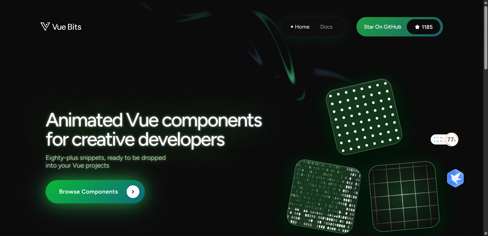
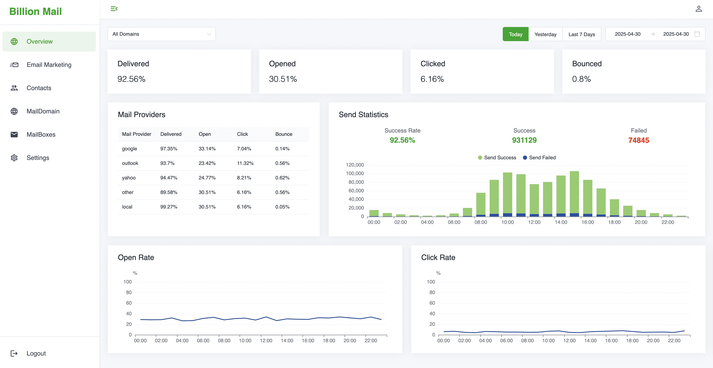
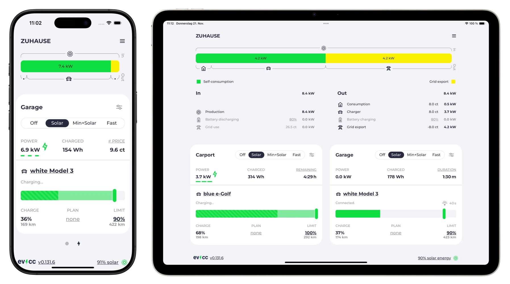
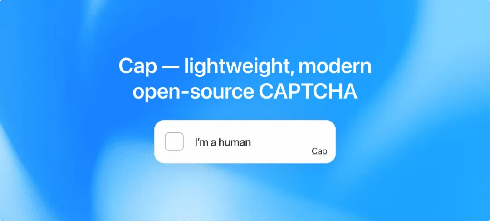
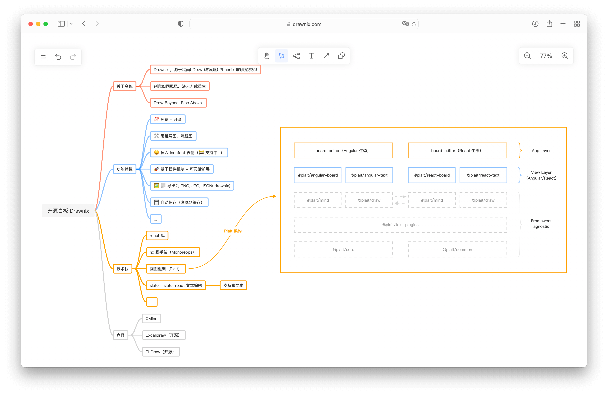

### [Vue Bits](https://vue-bits.dev/)

一个超棒的Vue UI 动效库

地址：https://vue-bits.dev/

## BillionMail

BillionMail 是一个未来的开源邮件服务器和电子邮件营销平台，旨在帮助企业和个人轻松管理他们的电子邮件营销活动。无论您是发送新闻通讯、促销邮件还是交易消息，这个工具都将为您的电子邮件营销工作提供完全控制。通过高级分析和客户管理等功能，您将能够像专业人士一样创建、发送和跟踪电子邮件。

地址：https://github.com/aaPanel/BillionMail

### [evcc](https://github.com/evcc-io/evcc)

EVCC 是一个开源的家用电动汽车充电控制器/充电桩解决方案，使用 Go 语言编写，内置一个 web ui 和一组 API 用来远程控制和监控
它适用于 12 - 53kw 的家用充电桩，也支持 5g 与 4g 网络远程控制。

地址: https://github.com/evcc-io/evcc

### [base-ui](https://github.com/mui/base-ui)

轻松定制的无样式 React 组件库。该项目提供了一套基础、无样式的 React 组件，仅包含必要的功能逻辑，不附带任何预设样式。帮助开发者摆脱传统 UI 库的样式束缚，无需耗费大量精力覆盖和修改默认样式。

地址: https://github.com/mui/base-ui

### [cap](https://github.com/tiagorangel1/cap)

轻量级的 CAPTCHA 替代方案。这是一个轻量级、开源的验证码方案，适用于防止机器人滥用和数据抓取等场景。它基于 SHA-256 工作量证明（Proof-of-Work）技术，易于集成、即插即用，为网站提供自托管的防滥用验证机制。

地址: https://github.com/tiagorangel1/cap

### [Drawnix](https://github.com/plait-board/drawnix)

开源白板工具（SaaS），一体化白板，包含思维导图、流程图、自由画等。

地址: https://github.com/plait-board/drawnix

### [500+ AI Agent Projects](https://github.com/ashishpatel26/500-AI-Agents-Projects)
这个项目收集了500多个AI智能体在不同行业的实际应用案例，覆盖医疗、金融、教育、零售等多个领域。它整理了各种AI代理的具体用途，比如医疗报告分析、股票自动交易、个性化教学等，还提供了开源项目的代码链接，方便开发者直接参考或实现。无论你是想找灵感、学习还是落地AI解决方案，这个仓库都能帮你快速找到相关案例和资源。

地址:https://github.com/ashishpatel26/500-AI-Agents-Projects

### [SongGeneration](https://github.com/tencent-ailab/songgeneration/)

腾讯开源的歌词生成模型，基于大规模歌词数据集训练而成。该项目提供了一个简单易用的接口，可以快速生成高质量的歌词文本。它支持多种语言和风格，能够满足不同场景下的需求。目前已经应用于音乐创作、歌词自动填充等多个领域，受到了广泛的关注和应用

地址：https://github.com/tencent-ailab/songgeneration/
