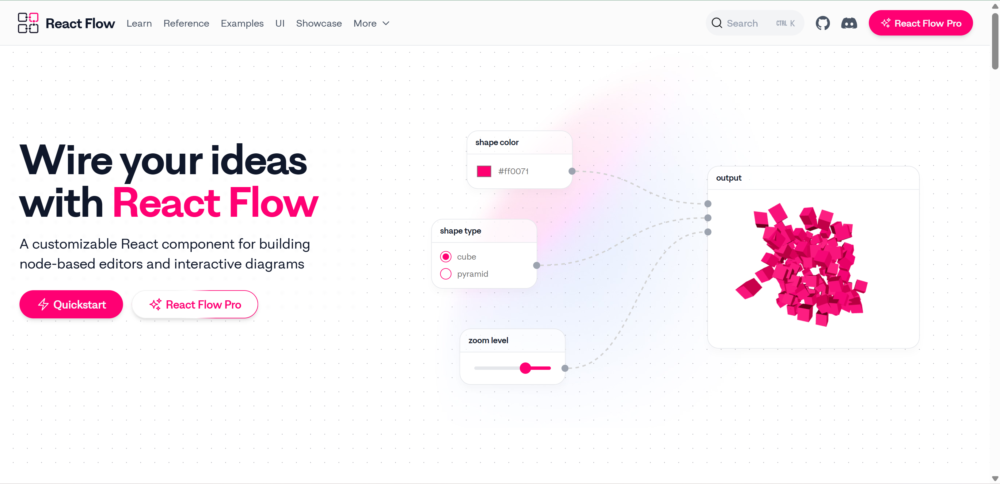
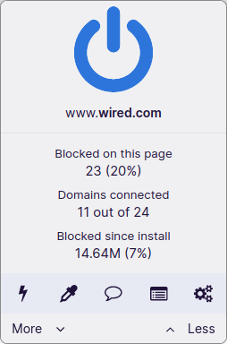
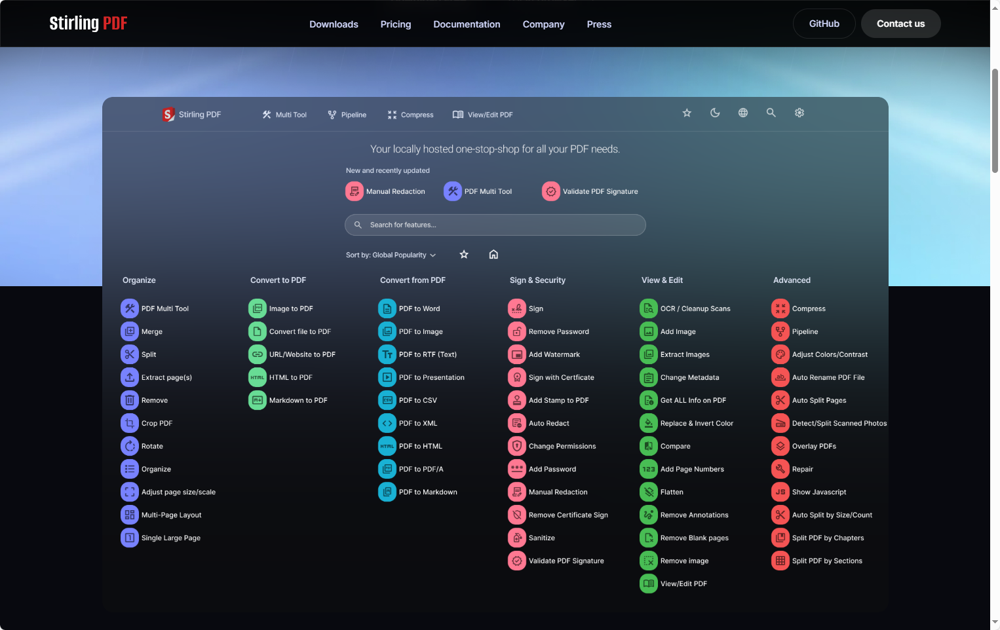

### [Python 脚本运行器uv教程](https://docs.astral.sh/uv/guides/scripts/)

uv 可以用来运行 Python 脚本，本文是一篇初学者教程。

地址：https://docs.astral.sh/uv/guides/scripts/

### [Kelp](https://kelpui.com/docs/getting-started/installation/)

地址：https://kelpui.com/docs/getting-started/installation/

### [filebrowser](https://github.com/filebrowser/filebrowser)
filebrowser/filebrowser 是一个流行的开源文件管理器项目，允许你通过 Web 浏览器方便地管理、上传、下载和分享服务器或本地电脑上的文件。它支持多种平台（Linux、Windows、macOS、Docker 等），拥有现代化的 Web UI，适合个人和团队使用。

地址：https://github.com/filebrowser/filebrowser

### [React Flow](https://reactflow.dev/)
React Flow 是一个基于 React 的流程图库，用于创建交互式的流程图应用。它提供了丰富的功能和灵活的 API，允许你自定义节点和连接的样式、行为以及交互方式。

地址：https://reactflow.dev/

### [uBlock Origin (uBO)](https://github.com/gorhill/uBlock)

uBlock Origin (uBO) ——一个功能强大且高效的内容屏蔽器，适用于 Chromium 和 Firefox 浏览器。

地址：https://github.com/gorhill/uBlock

### [React Bits ](https://reactbits.dev/)

React Bits 是一组由 React 核心团队成员开发的 UI 组件，用于构建用户界面。这些组件都是独立可复用的，可以单独引入，也可以根据自己的需求进行定制和组合。

地址：https://reactbits.dev/

### [ForesightJS](https://foresightjs.com/)
![alt text]./static/imgs/ForesightJS.png)

- ForesightJS 是一个轻量级 JavaScript 库，旨在通过用户的鼠标轨迹和键盘导航预测其意图，实现智能预取内容，从而提升页面加载速度。
- 支持 桌面和移动设备，且可无配置直接使用。
- 适用于任意 JavaScript 框架，已提供对 Next.js 和 React Router 的集成。

地址：https://github.com/spaansba/ForesightJS

### [Stirling-PDF](https://github.com/Stirling-Tools/Stirling-PDF)

- Stirling-PDF 是一个基于 Docker 的 本地托管网页应用，专注于各种 PDF 操作。

- 支持 50+ 种功能，如分割、合并、压缩、转换、旋转、编辑、添加图像或水印等。

- 高度注重隐私 —— 文件仅在客户端或任务执行期间短暂存在服务端内存中。

地址：https://github.com/Stirling-Tools/Stirling-PDF

### [node-modules-inspector](https://github.com/antfu/node-modules-inspector)

- node-modules-inspector 是一个交互式 UI 工具，用于本地 node_modules 的可视化检查。
- 支持 pnpm 与 npm 项目（暂不支持 yarn 等其它包管理器）。
- 提供 命令行工具 和 在线版本（通过 WebContainer 提供服务）。

地址：https://github.com/antfu/node-modules-inspector