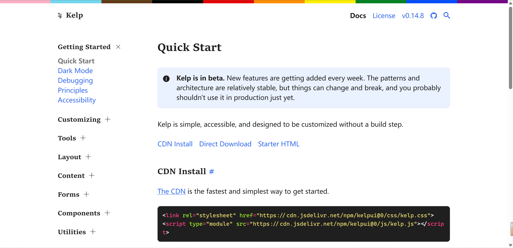

### [Python 脚本运行器uv教程](https://docs.astral.sh/uv/guides/scripts/)

uv 可以用来运行 Python 脚本，本文是一篇初学者教程。

地址：https://docs.astral.sh/uv/guides/scripts/

### [Kelp](https://kelpui.com/docs/getting-started/installation/)

地址：https://kelpui.com/docs/getting-started/installation/

