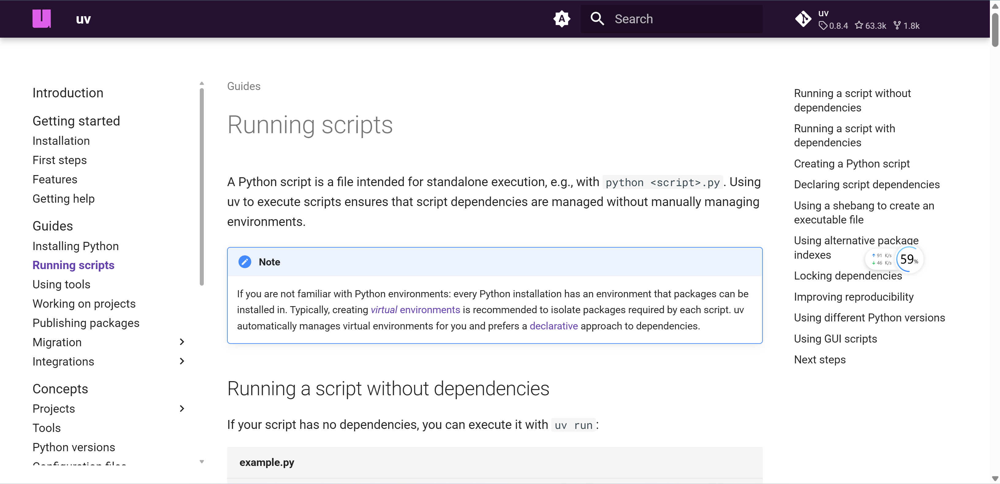

### [Python 脚本运行器uv教程](https://docs.astral.sh/uv/guides/scripts/)

uv 可以用来运行 Python 脚本，本文是一篇初学者教程。

地址：https://docs.astral.sh/uv/guides/scripts/

### [Kelp](https://kelpui.com/docs/getting-started/installation/)

地址：https://kelpui.com/docs/getting-started/installation/

### [filebrowser](https://github.com/filebrowser/filebrowser)
filebrowser/filebrowser 是一个流行的开源文件管理器项目，允许你通过 Web 浏览器方便地管理、上传、下载和分享服务器或本地电脑上的文件。它支持多种平台（Linux、Windows、macOS、Docker 等），拥有现代化的 Web UI，适合个人和团队使用。

地址：https://github.com/filebrowser/filebrowser