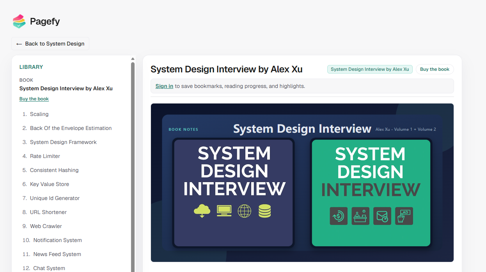

## [system-design-notes](https://github.com/liquidslr/system-design-notes)

liquidslr/system-design-notes 是一个开源系统设计学习笔记库，基于《System Design Interview》整理，涵盖扩展性、缓存、消息队列、数据库、分布式系统、监控等，并通过 YouTube、Google Drive、支付系统等案例讲解架构设计，适合系统学习和面试复习。

