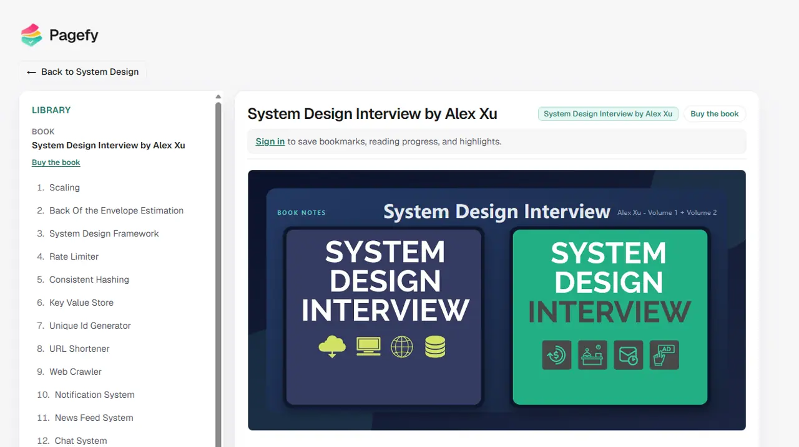
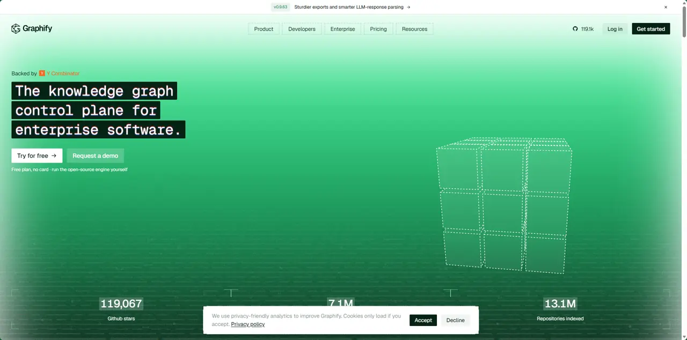

## [system-design-notes](https://github.com/liquidslr/system-design-notes)

liquidslr/system-design-notes 是一个开源系统设计学习笔记库，基于《System Design Interview》整理，涵盖扩展性、缓存、消息队列、数据库、分布式系统、监控等，并通过 YouTube、Google Drive、支付系统等案例讲解架构设计，适合系统学习和面试复习。

## [graphify](https://github.com/Graphify-Labs/graphify)

Graphify 是一个把整个代码库转换成可查询知识图谱的工具。

它不仅解析源码，还能把 代码、Markdown 文档、SQL Schema、配置文件、PDF 等内容统一建立关系。项目采用本地 AST（抽象语法树）解析，记录函数、类、模块、依赖、调用关系等，并且每条关系都可以追溯和解释。

它还提供 /graphify Skill，可直接配合 Claude Code、Cursor、Codex、Gemini CLI 使用。

核心特点是：本地解析、确定性构建、关系可解释、不依赖 Vector DB。

简单理解：Graphify = 把代码库从“文件集合”变成一张可以让 AI 查询和推理的知识图谱。
