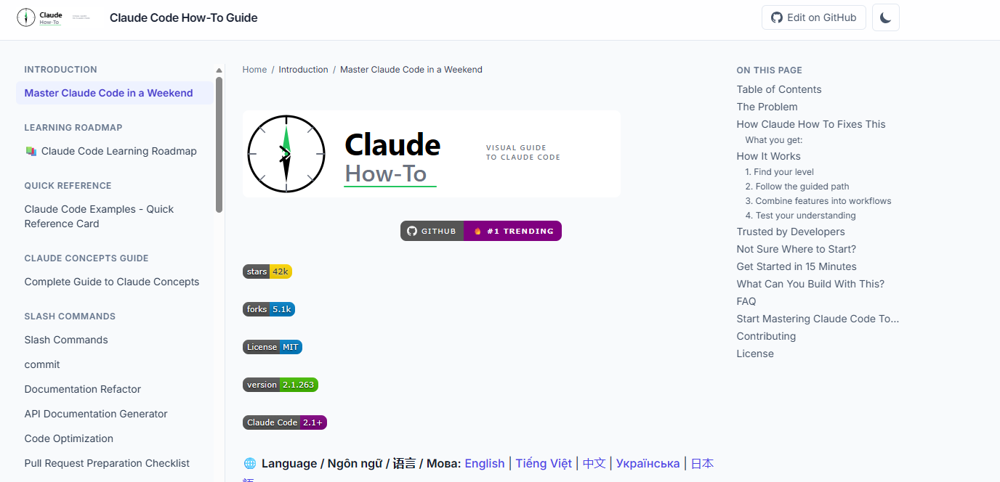
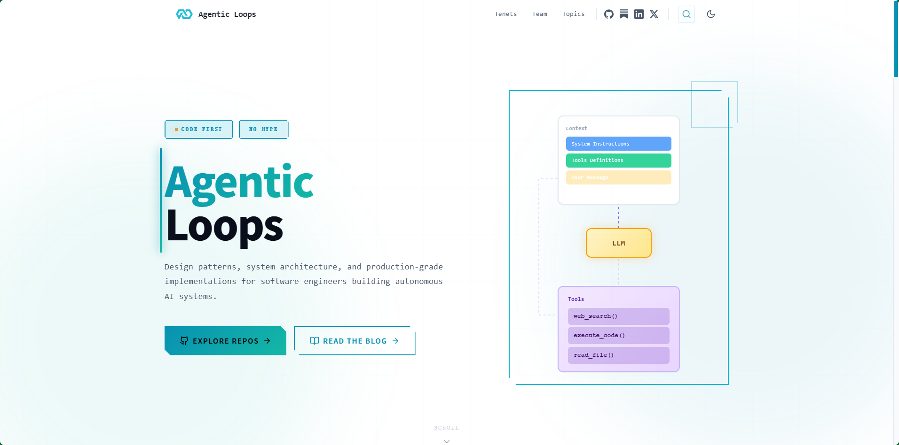

## [Agent Reach](https://github.com/Panniantong/Agent-Reach)

Agent-Reach 是一个面向 AI Agent 的开源互联网访问工具。它把 Twitter/X、Reddit、YouTube、GitHub、Bilibili、小红书等平台的信息获取统一成 CLI 接口，让 Agent 可以直接搜索、读取和提取网页内容。

核心思路是：不依赖官方 API，而是通过网页访问、解析等方式获取数据，从而降低 API 使用成本，并减少不同平台接口差异对 Agent 的影响。

简单来说，它相当于给 AI Agent 装了一套“互联网眼睛”：Agent 负责思考和决策，Agent-Reach 负责连接外部互联网、获取真实信息。

## [claude-howto](https://github.com/luongnv89/claude-howto)

claude-howto 是一个面向 Claude Code 的实战教程项目，通过图示、示例和可复制模板，帮助开发者从基础使用逐步掌握高级 Agent 能力。

内容覆盖 Claude Code 的核心概念、常用工作流、Prompt 编写、Agent/子 Agent、工具调用、自动化以及复杂任务实践，并提供大量 Copy & Paste 示例，降低上手门槛。

简单来说，它不是单纯介绍 Claude Code 的文档，而更像一本 “Claude Code 实战手册”：告诉你不仅“怎么用”，还包括如何把 Claude Code 组织成更高效的 AI 编程工作流。

## [agentic-ai-engineering](https://github.com/agenticloops-ai/agentic-ai-engineering)

Agentic Loops 是一个围绕 AI Agent / Agentic Coding 的学习与实践平台，主要介绍如何让 AI 从“一次性回答问题”转变为“自主循环完成任务”。

它重点关注 Agent Loop（智能体循环）：AI 根据目标进行规划 → 调用工具 → 执行操作 → 检查结果 → 根据反馈继续执行，直到任务完成。

项目内容更偏向实践方法论和工作流，适合了解 Claude Code、Cursor、Codex 等 Coding Agent 背后的运行模式，以及如何设计更可靠的 Agent 工作流程。

简单理解：Agentic Loops = 学习如何让 AI 自己规划、执行、验证和迭代。