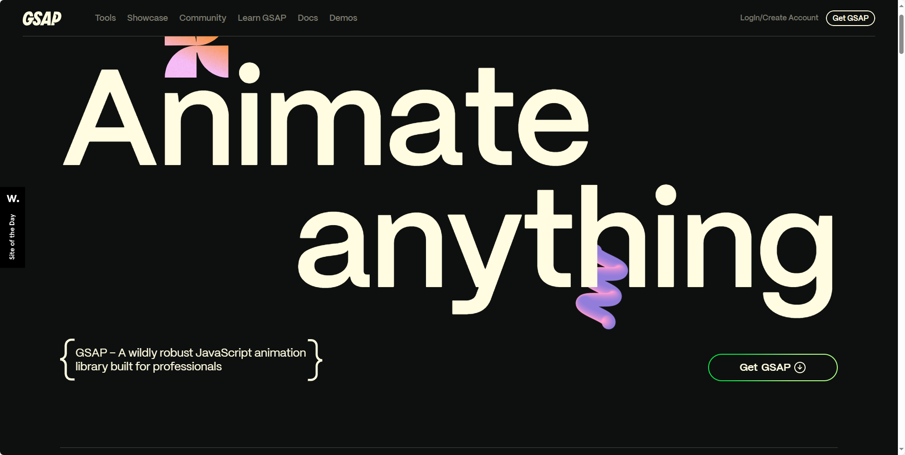
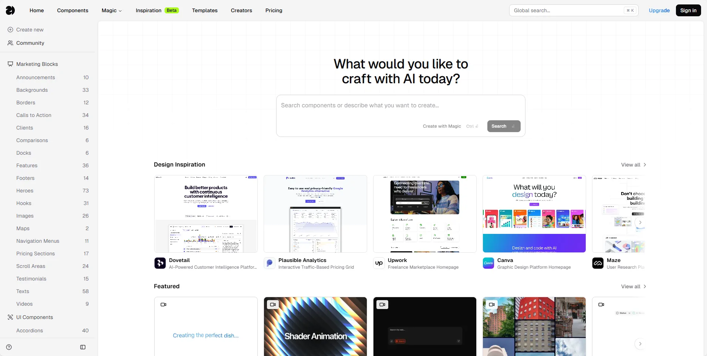
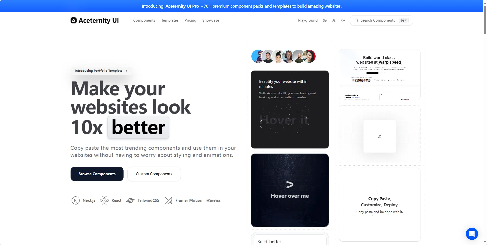
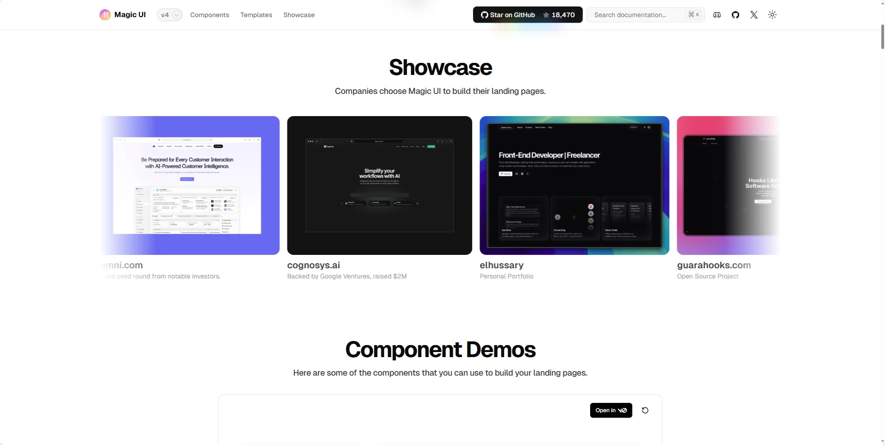
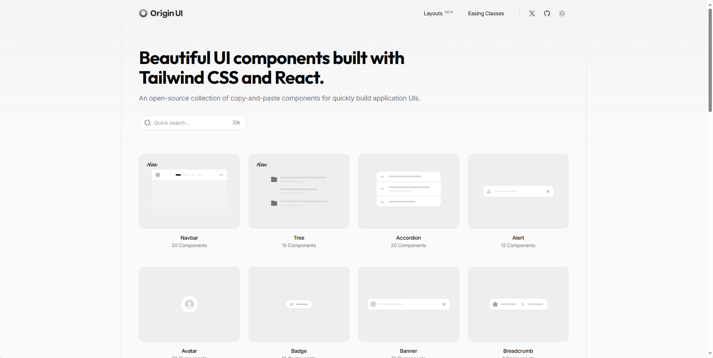
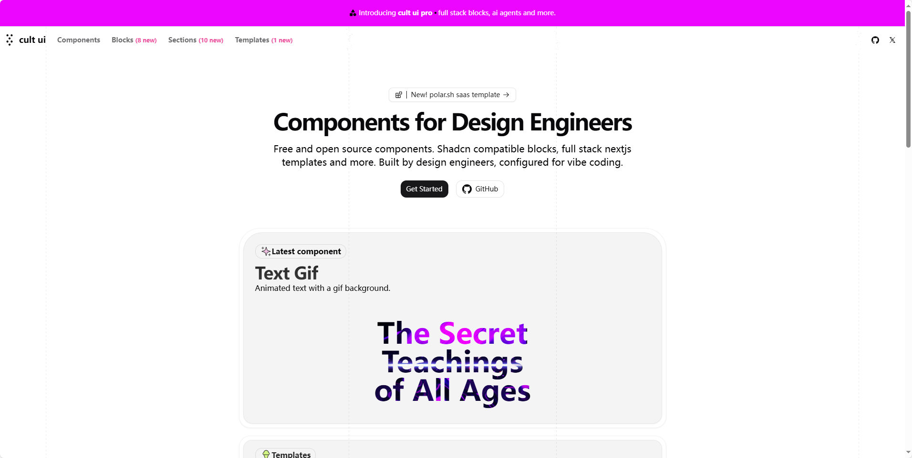
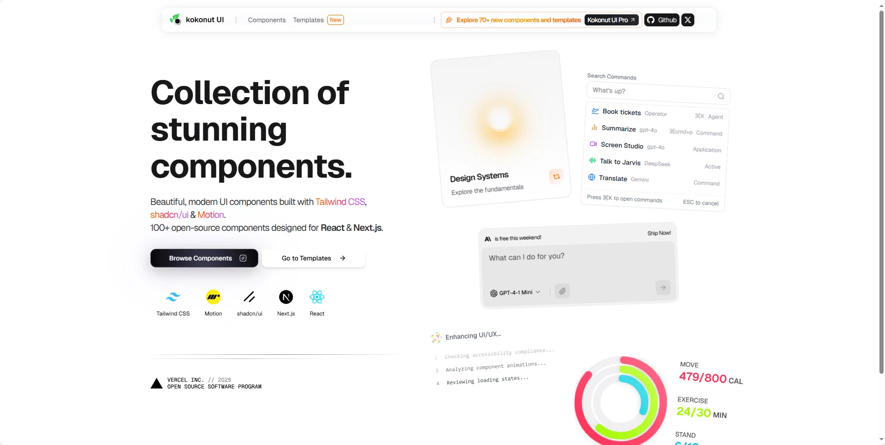
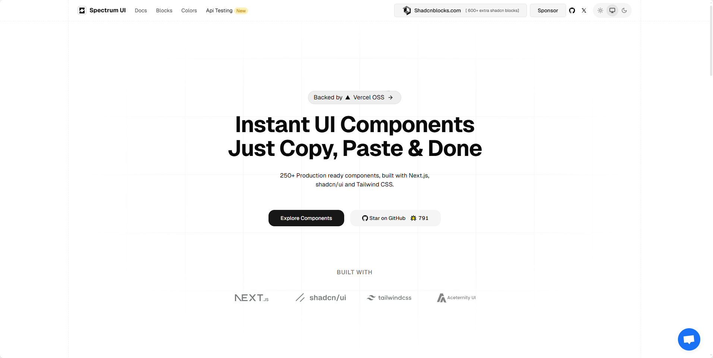
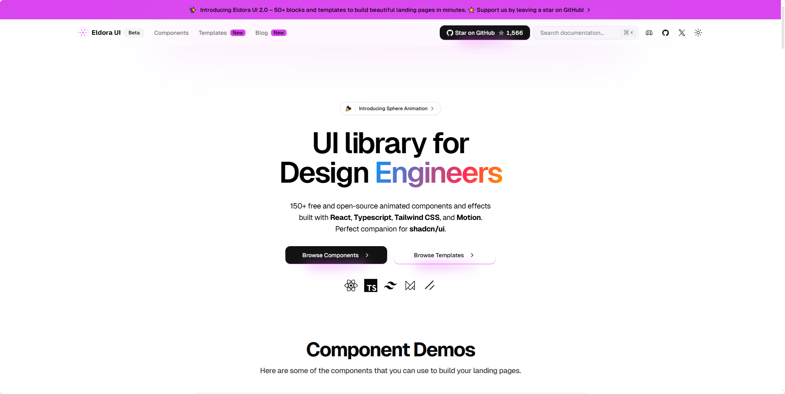

## [gsap](https://gsap.com/)

🌟 GSAP 是一个 JavaScript 动画库，用于创建高性能、平滑的动画效果。

地址：https://gsap.com/

## [21st](https://21st.dev/home)

地址：https://21st.dev/home

## [aceternity](https://ui.aceternity.com/)

地址：https://ui.aceternity.com/

## [animista](https://animista.net/)

地址：https://magicui.design/

## [originui](https://originui.com/)

地址：https://originui.com/

## [cult-ui](https://www.cult-ui.com/)

   

地址：https://www.cult-ui.com/

## [kokonutui](https://kokonutui.com/)

地址：https://kokonutui.com/

## [spectrumhq](https://ui.spectrumhq.in/)

地址：https://ui.spectrumhq.in/

## [eldoraui](https://www.eldoraui.site/)

地址：https://www.eldoraui.site/

