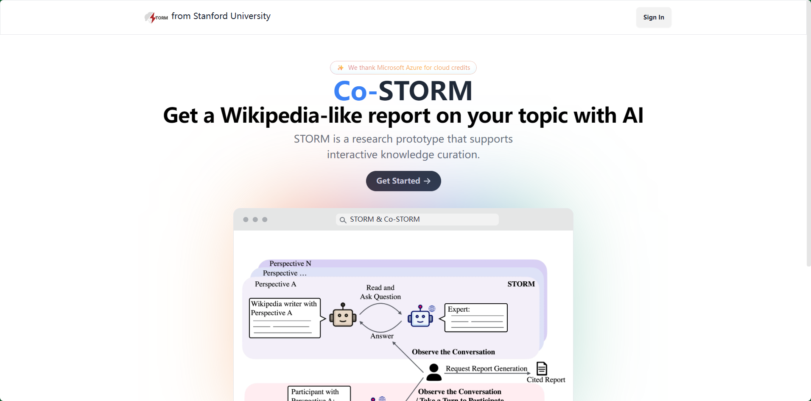
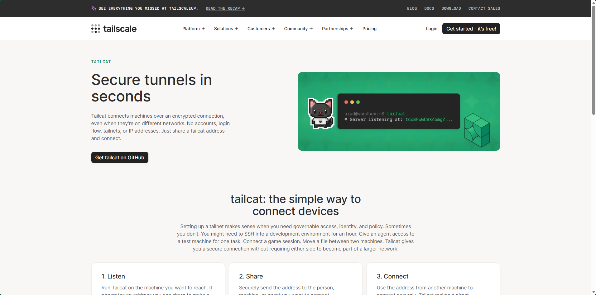

## [rlhfbook](https://rlhfbook.com/)

RLHF Book 是一本系统讲解 RLHF（人类反馈强化学习）和 LLM 后训练（Post-Training） 的在线技术书籍。

内容从 SFT（监督微调） 开始，逐步介绍 Reward Model、RLHF、PPO、DPO 等训练方法，并进一步涉及 Preference Learning、奖励建模、推理模型训练、模型评估等内容。

它的特点是理论结合工程实践，不仅解释算法原理，还关注训练流程、数据构建和实际实现。

简单理解：RLHF Book = 一份从 SFT → 偏好学习 → RLHF → LLM 后训练的系统学习路线。

## [storm](https://github.com/stanford-oval/storm)

STORM 是斯坦福 OVAL 开源的一个 LLM 驱动知识研究与报告生成系统。

它的核心思路是让 AI 像研究员一样完成任务：先理解主题 → 自动搜索互联网 → 从多个来源收集资料 → 进行多轮研究与观点扩展 → 整理知识结构 → 最终生成一篇带引用的完整长篇报告。

相比普通 RAG，它更强调主动研究（Research）和多视角信息收集，而不是简单地从已有知识库检索答案。

简单理解：STORM = 让 LLM 自动完成“搜索资料 → 研究分析 → 整理知识 → 写带引用的报告”整个流程。

## [Lead-Generation](https://github.com/Madi-S/Lead-Generation)

Lead-Generation 是一个基于 Python 的批量线索（Lead）生成工具，目标是让没有编程基础的用户也能进行自动化获客。

项目整理了多种 Lead Generation 技术，可以批量从公开网络信息中发现潜在客户，并对数据进行收集、筛选和整理，从而减少人工搜索客户的工作量。

它更像是一个线索采集技术集合/脚本工具箱，而不是完整的 CRM 系统。

简单理解：Lead-Generation = 用 Python 自动寻找、收集和整理潜在客户信息。

## [tailcat](https://github.com/tailscale/tailcat)

tailcat 是 Tailscale 开源的一个轻量级网络工具，可以理解为 “运行在 Tailscale 网络上的 netcat”。

它允许两台设备之间直接建立 TCP/UDP 数据连接，用于测试网络连通性、传输数据、调试服务等。与普通 netcat 不同，它利用 Tailscale 的数据平面进行通信，不依赖 Tailscale Control Plane 来完成连接建立。

简单理解：

netcat 解决“怎么在网络上通信”，tailcat 则解决“怎么通过 Tailscale 的加密网络直接通信”。