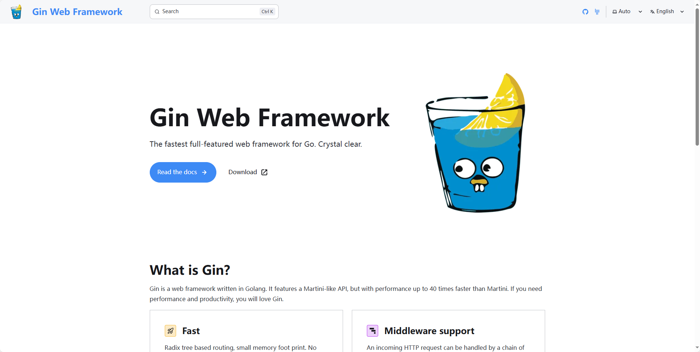
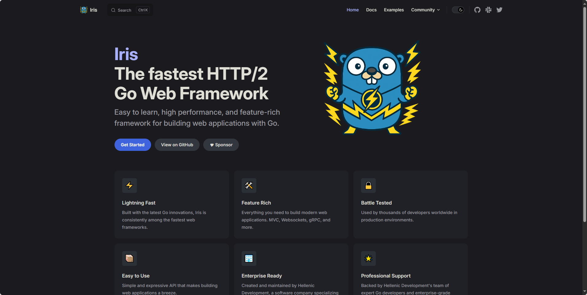

## [Gin](https://github.com/gin-gonic/gin)

Gin 框架提供了多种功能，包括请求/响应处理、路由、中间件、验证、日志记录等。

与 Martini 相比，Gin 在性能上提升了最多 40 倍，是开发高性能应用程序的理想选择。其简洁直观的语法让开发人员能够快速构建复杂的 Web 应用程序。

地址：https://github.com/gin-gonic/gin

## [beego](https://github.com/beego/beego)

Beego 是一个开源的 Golang Web 框架，以卓越的性能和遵循 MVC（模型-视图-控制器）设计模式为特点。它支持开发 Web 应用程序、API 和后端服务，并内置了路由、ORM、日志记录和 HTTP 处理工具。

Beego 的一个重要优势是其模块化设计，开发人员可以根据需要选择使用特定的组件。其内置的库使得数据库访问、请求处理和日志记录等任务变得更加简单和高效。

地址：https://github.com/beego/beego

## [iris](https://iris-go.com/)

Iris 内置了对 MVC（模型-视图-控制器）架构的支持，非常适合管理大型应用程序。它提供了会话处理、路由、缓存中间件等基本功能。

此外，Iris 还支持多个第三方库，如 Passport、Express-Session、Body-Parser 和 Morgan，允许开发人员将这些工具无缝集成到项目中。

地址：https://iris-go.com/

