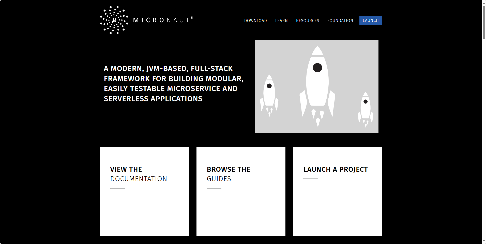
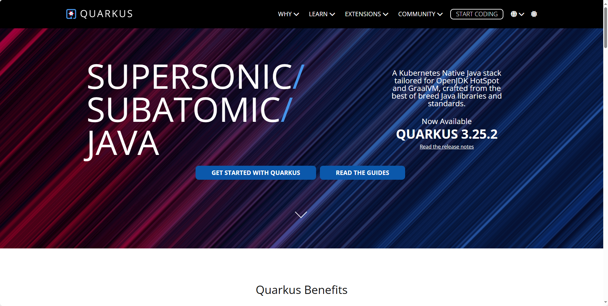

## [Micronaut](https://micronaut.io/)

Micronaut是一个轻量级的微服务框架，强调模块化和灵活性。它通过编译时注入和AOP（面向切面编程）技术，实现了高性能和低内存占用。Micronaut注重模块化和依赖注入，提供了高度的可定制性和灵活性。

地址：https://micronaut.io/

## [Quarkus](https://quarkus.io/)

Quarkus是由Red Hat推出的新一代Java微服务框架，主打高性能和低资源消耗。它通过GraalVM原生编译和高效的代码生成技术，实现了微服务的极致优化。Quarkus专为云原生应用设计，能够很好地适应现代开发环境的需求。

地址：https://quarkus.io/