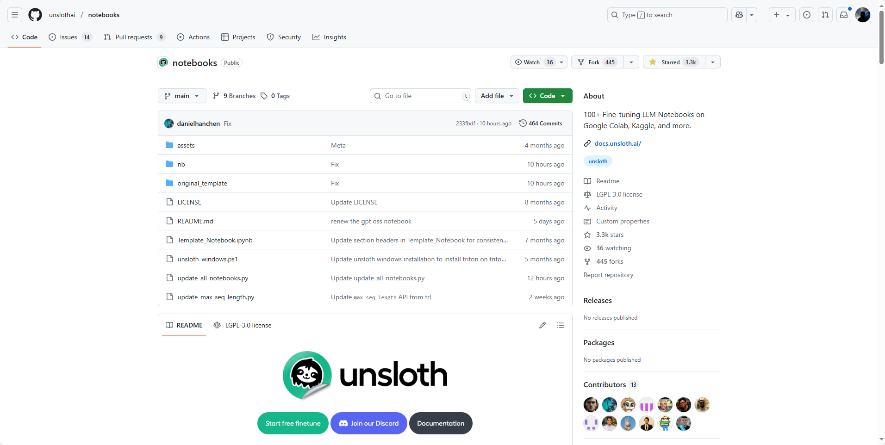

## [notebooks](https://github.com/unslothai/notebooks)

这是一个提供各种AI模型微调教程的GitHub仓库，主要包含在Google Colab、Kaggle等平台上运行的Jupyter笔记本。这些笔记本涵盖了多种热门模型如Llama、Qwen、Gemma、Mistral等，适用于对话、视觉、文本生成等不同任务。项目提供了详细的指导，帮助用户准备数据、训练模型和保存结果，同时也欢迎社区贡献新的笔记本。

地址：https://github.com/unslothai/notebooks

