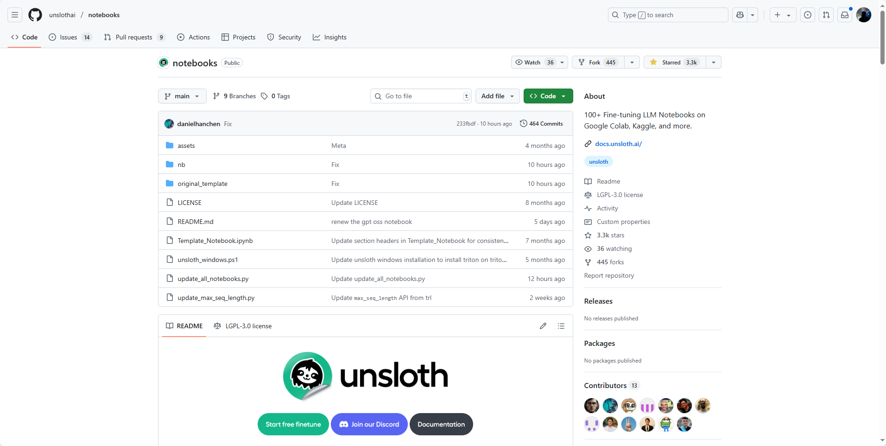
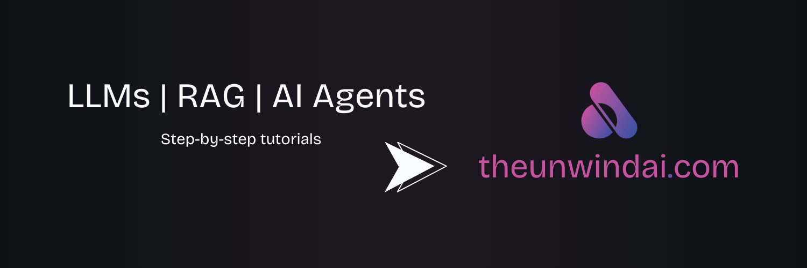

## [notebooks](https://github.com/unslothai/notebooks)

这是一个提供各种AI模型微调教程的GitHub仓库，主要包含在Google Colab、Kaggle等平台上运行的Jupyter笔记本。这些笔记本涵盖了多种热门模型如Llama、Qwen、Gemma、Mistral等，适用于对话、视觉、文本生成等不同任务。项目提供了详细的指导，帮助用户准备数据、训练模型和保存结果，同时也欢迎社区贡献新的笔记本。

地址：https://github.com/unslothai/notebooks

## [awesome-llm-apps](https://www.zdoc.app/zh/Shubhamsaboo/awesome-llm-apps)

精选整理的使用 RAG、AI 智能体、多智能体团队、MCP、语音智能体等技术构建的 Awesome LLM 应用集合。本仓库收录的 LLM 应用使用了来自 openai logoOpenAI、anthropic logoAnthropic、google logoGoogle、X logoxAI 的模型，以及如 alibaba logoQwen 或 meta logoLlama 等可在本地计算机上运行的开源模型。

地址：https://www.zdoc.app/zh/Shubhamsaboo/awesome-llm-apps

