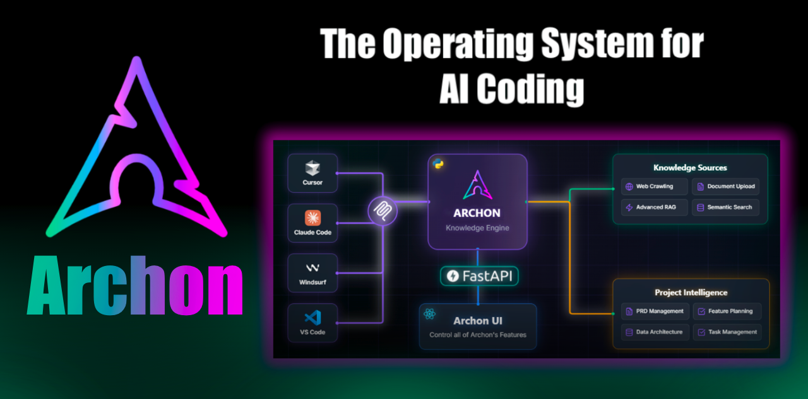

## [Archon](https://github.com/coleam00/Archon)

Archon是一个能自动创建其他AI智能体的AI工具，就像一个"AI造物主"。它拥有先进的编程工作流程和知识库，可以构建、优化各种AI助手。最新版本提供了预置工具库和集成开发环境支持，能快速组装新AI并减少错误。开发者可以用它高效构建智能体，同时它本身也是展示AI进化过程的活教材。

地址：https://github.com/coleam00/Archon