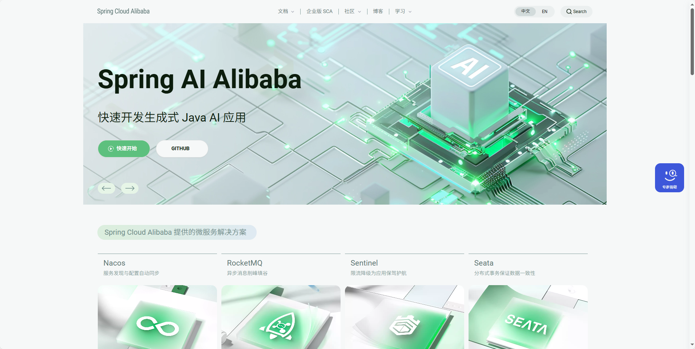
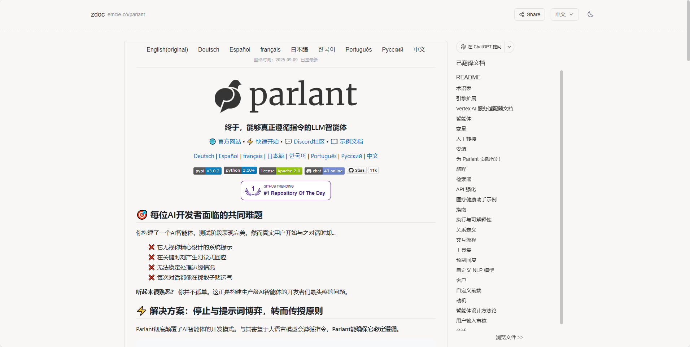
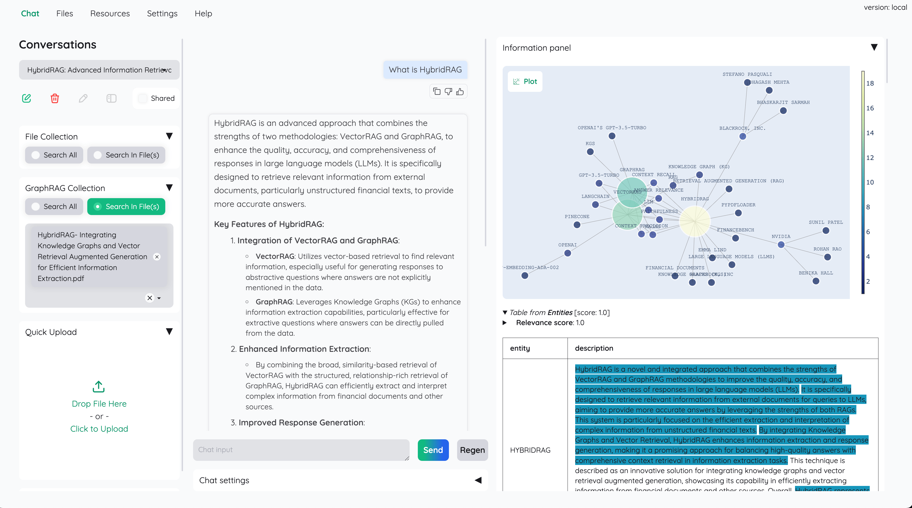

## [Spring AI Alibaba](https://sca.aliyun.com/?spm=7145af80.321ad293.0.0.72aa5e63eptpsW)

Spring Cloud Alibaba 为分布式应用开发提供一站式解决方案。它包含开发分布式应用程序所需的所有组件，使您可以轻松地使用 Spring Cloud 微服务框架开发应用程序。

地址：https://github.com/alibaba/spring-ai-alibaba?spm=5176.29160081.0.0.10f85c722hpR8N

## [Parlant](https://github.com/emcie-co/parlant?tab=readme-ov-file)

Parlant是一个专门为实际应用设计的LLM智能体开发框架，主打"指令必从"的可靠特性。它解决了传统AI代理常见的问题——比如无视系统提示、胡言乱语或表现不稳定，通过创新的规则定义方式让开发者能用自然语言明确指定AI在各种情境下的行为规范。这个框架特别适合需要精准控制的金融、医疗、电商等场景，提供企业级功能如对话流程引导、动态规则匹配和内置安全防护，号称60秒就能让一个遵守规则的AI代理跑起来。

地址：https://github.com/emcie-co/parlant?tab=readme-ov-file

## [KiloCode](https://github.com/Kilo-Org/kilocode)

Kilo Code 是一款开源的 VS Code AI 编程助手，能帮你用自然语言生成代码、自动化重复任务，还能自动重构和调试代码。它整合了多个开源项目的特性，内置了包括 GPT-5、Claude 和 Gemini 等 400+ 最新 AI 模型，无需额外配置 API 密钥即可使用。你还可以通过 MCP 服务器市场扩展它的功能，让它更贴合你的开发 workflow。

地址：https://github.com/Kilo-Org/kilocode

## [system-prompts-and-models-of-ai-tools](https://github.com/x1xhlol/system-prompts-and-models-of-ai-tools)

这个项目收集了多个热门AI工具（如Cursor、Devin、Replit Agent等）的系统提示词和内部模型，包含超过7000行代码和配置信息，帮助开发者了解这些工具的工作原理。所有内容由作者手动提取或整理自开源项目，部分来自官方版本。项目还提供了安全建议，并支持通过捐款或加密货币来持续更新和维护。

地址：https://github.com/x1xhlol/system-prompts-and-models-of-ai-tools

## [n8n-workflows](https://github.com/Zie619/n8n-workflows)

这是一个收集了大量n8n自动化工作流的项目，就像是一个现成的"自动化菜谱大全"。它包含了2000多个开箱即用的工作流模板，覆盖了从消息通讯到数据处理的各类场景，还提供了智能搜索和分类功能，让你能快速找到适合自己需求的自动化方案。

地址： https://github.com/Zie619/n8n-workflowsn8n-workflows

## [kotaemon](https://github.com/Cinnamon/kotaemon)

kotaemon 是一个开源的文档对话工具，让你能用自然语言和自己的文件聊天。它基于 RAG 技术搭建，提供了一个干净简洁的界面，既适合普通用户直接使用，也方便开发者二次开发。你可以上传文档、用多种大模型（包括本地或云端模型）进行问答，还支持多模态文件和复杂推理。简单来说，它就是帮你轻松从文档里提取信息的智能助手。

地址：https://github.com/Cinnamon/kotaemon